# Chuyên đề: Kiến thức Toán học Nền tảng & Đại số Rời rạc (Essential Math Foundations)

> **Tác giả:** Duc-Minh Vu | **Đơn vị:** SLSCM Lab — Faculty of Data Science and Artificial Intelligence (FDA), Đại học Kinh tế Quốc dân (NEU)  
> **Soạn thảo:** Được hỗ trợ và soạn thảo bởi Agentic AI tool  
> **Bản quyền © 2026 Duc-Minh Vu.** Mọi quyền được bảo lưu. Tài liệu đào tạo và bồi dưỡng sinh viên Olympic Tin học / ICPC.

---


> **Cấp độ**: ⭐ One-star (Nền tảng cho CP cấp Đại học / ICPC / OLP SV)  
> **Chủ đề chính**: Đại số rời rạc, Cấp số cộng & nhân, Làm tròn trần/sàn, Tổ hợp Euler, Khoảng cách Manhattan, Bất đẳng thức  
> **Mục tiêu**: Làm chủ các công cụ toán học thực dụng xuất hiện trong hơn 70% bài toán CP, từ kỹ thuật làm tròn số nguyên không dùng số thực, các hằng đẳng thức tổng lũy thừa, đến nguyên lý Dirichlet và bài toán chia kẹo Euler.

---

## 📌 Lộ trình & Bản đồ tư duy chuyên đề

```mermaid
flowchart TD
    Root["Toán học Nền tảng trong CP"]
    
    Root --> Arithmetic["1. Số học & Phép tính nguyên"]
    Arithmetic --> DivRounding["Phép chia trần/sàn: ceil(a/b) = (a + b - 1) / b"]
    Arithmetic --> AP_GP["Cấp số cộng (AP), Cấp số nhân (GP) & Tổng Faulhaber"]
    Arithmetic --> Parity["Bất biến chẵn lẻ (Parity Invariant)"]

    Root --> Combinatorics["2. Tổ hợp rời rạc cơ sở"]
    Combinatorics --> StarsBars["Bài toán chia kẹo Euler (Stars and Bars)"]
    Combinatorics --> Dirichlet["Nguyên lý chuồng bồ câu (Dirichlet)"]
    Combinatorics --> InclusionExclusion["Nguyên lý bù trừ 2-3 tập hợp"]

    Root --> GeometryMetric["3. Hình học tọa độ & Độ đo"]
    GeometryMetric --> ManhattanChebyshev["Khoảng cách Manhattan & Biến đổi Chebyshev"]
    GeometryMetric --> ShoelacePick["Công thức dây giày (Shoelace) & Định lý Pick"]

    Root --> NumericalLog["4. Logarit & Tối ưu số học"]
    NumericalLog --> DigitCounting["Đếm chữ số: floor(log10 N) + 1"]
    NumericalLog --> LogComparison["So sánh tích qua tổng logarit: tránh tràn số"]

    style Root fill:#f9f,stroke:#333,stroke-width:2px;
    style Arithmetic fill:#bbf,stroke:#333;
    style Combinatorics fill:#bfb,stroke:#333;
    style GeometryMetric fill:#fbb,stroke:#333;
    style NumericalLog fill:#ffd,stroke:#333;
```



---

# 📖 PHẦN I: CƠ SỞ LÝ THUYẾT & CÔNG THỨC TOÁN CHUẨN

## 1. Phép chia nguyên & Kỹ thuật làm tròn Trần/Sàn (Floor & Ceil)

Trong ngôn ngữ lập trình C++, toán tử chia `/` giữa hai số nguyên là phép **cắt cụt về phía số 0 (truncation towards zero)**:
- `7 / 3` cho kết quả `2`.
- `-7 / 3` cho kết quả `-2` (trong khi sàn toán học $\lfloor -7/3 \rfloor = -3$).

### 1.1. Công thức làm tròn trần (Ceiling) với số dương ($a \ge 0, b > 0$)
Để tính $\lceil \frac{a}{b} \rceil$ mà **tuyệt đối không dùng số thực `double`** (để tránh sai số dấu phẩy động):
$$\left\lceil \frac{a}{b} \right\rceil = \left\lfloor \frac{a + b - 1}{b} \right\rfloor = \frac{a + b - 1}{b}$$

```cpp
// Làm tròn lên an toàn cho số không âm:
inline long long ceil_div(long long a, long long b) {
    return (a + b - 1) / b;
}
```

### 1.2. Công thức tổng quát cho số nguyên bất kỳ ($a, b \in \mathbb{Z}, b \ne 0$)
Khi $a$ hoặc $b$ có thể nhận giá trị âm:
$$\lfloor a / b \rfloor = \frac{a}{b} - ((a \bmod b \ne 0) \land ((a < 0) \oplus (b < 0)))$$
$$\lceil a / b \rceil = \frac{a}{b} + ((a \bmod b \ne 0) \land ((a > 0) == (b > 0)))$$

```cpp
// Sàn toán học chuẩn xác cho mọi số nguyên:
inline long long floor_div(long long a, long long b) {
    long long res = a / b;
    long long rem = a % b;
    if (rem != 0 && ((a < 0) ^ (b < 0))) res--;
    return res;
}

// Trần toán học chuẩn xác cho mọi số nguyên:
inline long long ceil_div_general(long long a, long long b) {
    long long res = a / b;
    long long rem = a % b;
    if (rem != 0 && ((a > 0) == (b > 0))) res++;
    return res;
}
```

---

## 2. Cấp số cộng (AP), Cấp số nhân (GP) & Tổng lũy thừa Faulhaber

### 2.1. Cấp số cộng (Arithmetic Progression - AP)
Dãy số $u_1, u_2, \dots, u_n$ với công sai $d$: $u_i = u_{i-1} + d$.
- Số hạng thứ $n$:
  $$u_n = u_1 + (n - 1)d$$
- Tổng $n$ số hạng đầu tiên (Công thức Gauss mở rộng):
  $$S_n = \sum_{i=1}^n u_i = \frac{n(u_1 + u_n)}{2} = \frac{n[2u_1 + (n-1)d]}{2}$$

### 2.2. Các công thức tổng lũy thừa kinh điển (Faulhaber's Formulas)
1. **Tổng các số tự nhiên liên tiếp**:
   $$1 + 2 + 3 + \dots + n = \frac{n(n+1)}{2}$$
2. **Tổng bình phương**:
   $$1^2 + 2^2 + 3^2 + \dots + n^2 = \frac{n(n+1)(2n+1)}{6}$$
3. **Tổng lập phương** (Đẳng thức Nicomachus):
   $$1^3 + 2^3 + 3^3 + \dots + n^3 = \left(\frac{n(n+1)}{2}\right)^2 = (1 + 2 + \dots + n)^2$$

> [!WARNING]
> Khi $n = 10^9$, $n(n+1) \approx 10^{18}$ (vừa chạm ngưỡng `long long`). Nhưng $n(n+1)(2n+1) \approx 2 \cdot 10^{27}$ (tràn hoàn toàn `long long`)!  
> **Giải pháp**: Nếu tính theo modulo $M$, áp dụng nghịch đảo modulo: nhân với $6^{-1} \pmod M$. Nếu không có modulo, dùng `__int128_t` hoặc rút gọn chia trước cho 2 và 3.

### 2.3. Cấp số nhân (Geometric Progression - GP)
Dãy số $u_1, u_2, \dots, u_n$ với công bội $q$: $u_i = u_{i-1} \cdot q$.
- Số hạng thứ $n$: $u_n = u_1 \cdot q^{n-1}$.
- Tổng $n$ số hạng đầu:
  $$S_n = u_1 \frac{q^n - 1}{q - 1} \quad (q \ne 1)$$

---

## 3. Bài toán chia kẹo Euler (Stars and Bars Theorem)

Đây là một trong những định lý tổ hợp được ứng dụng nhiều nhất trong các bài toán quy hoạch động và đếm cấu hình:

### 3.1. Dạng 1: Số nghiệm nguyên KHÔNG ÂM ($x_i \ge 0$)
Số cách chia $n$ chiếc kẹo giống nhau cho $k$ đứa trẻ (mỗi đứa trẻ có thể nhận 0 chiếc kẹo):
$$x_1 + x_2 + \dots + x_k = n \quad (x_i \in \mathbb{N})$$
$$\text{Số nghiệm} = \binom{n + k - 1}{k - 1} = \binom{n + k - 1}{n}$$

*Trực giác*: Ta có $n$ ngôi sao (kẹo) và $k-1$ thanh chắn chia thành $k$ phần. Tổng cộng có $n + k - 1$ vị trí, ta chỉ cần chọn $k-1$ vị trí để đặt thanh chắn.

### 3.2. Dạng 2: Số nghiệm nguyên DƯƠNG ($x_i \ge 1$)
Số cách chia $n$ chiếc kẹo cho $k$ đứa trẻ sao cho **mỗi đứa trẻ có ít nhất 1 chiếc kẹo** ($n \ge k$):
$$x_1 + x_2 + \dots + x_k = n \quad (x_i \ge 1)$$
$$\text{Số nghiệm} = \binom{n - 1}{k - 1}$$

*Trực giác*: Giữa $n$ ngôi sao có $n-1$ khe trống. Ta chọn $k-1$ khe trống để đặt thanh chắn sao cho không có 2 thanh chắn nào trùng nhau.

---

## 4. Nguyên lý Dirichlet (Pigeonhole Principle) & Bất biến Chẵn lẻ

### 4.1. Nguyên lý Dirichlet
> **Phát biểu**: Nếu nhốt $n$ đồ vật vào $k$ cái hộp ($n > k$), thì luôn tồn tại ít nhất một cái hộp chứa từ $\lceil \frac{n}{k} \rceil$ đồ vật trở lên.

**Ứng dụng thực chiến trong CP**:
1. **Tìm chu kỳ trong trạng thái hữu hạn**: Nếu một thuật toán biến đổi một tập trạng thái có kích thước tối đa $S$, thì sau không quá $S + 1$ bước chắc chắn thuật toán sẽ lặp lại một trạng thái đã từng xuất hiện $\implies$ tạo thành chu kỳ!
2. **Tổng tiền tố chia hết (Subarray divisible by $K$)**: Cho mảng $N$ số. Xét $N+1$ giá trị tổng tiền tố $P_0, P_1, \dots, P_N \pmod N$. Vì chỉ có $N$ số dư khả dĩ $\{0, 1, \dots, N-1\}$, theo Dirichlet chắc chắn tồn tại ít nhất 2 tổng tiền tố có cùng số dư: $P_R \equiv P_L \pmod N \implies \sum_{i=L+1}^R A_i \ \vdots\ N$. Luôn tồn tại ít nhất 1 đoạn con có tổng chia hết cho $N$!

### 4.2. Bất biến Chẵn lẻ (Parity Invariant)
- Tổng/hiệu của hai số cùng tính chẵn lẻ luôn là số **CHẴN**:
  $$\text{chẵn} \pm \text{chẵn} = \text{chẵn}, \quad \text{lẻ} \pm \text{lẻ} = \text{chẵn}$$
- Tổng/hiệu của hai số khác tính chẵn lẻ luôn là số **LẺ**.
- Phép đổi dấu $x \to -x$ hay cộng/trừ $2$ không làm thay đổi tính chẵn lẻ:
  $$a \equiv -a \pmod 2, \quad a \equiv a \pm 2 \pmod 2$$

---

## 5. Hình học Tọa độ: Khoảng cách Manhattan vs Chebyshev

Cho hai điểm $A(x_1, y_1)$ và $B(x_2, y_2)$:
- **Khoảng cách Euclid (đường chim bay)**:
  $$d_{\text{Euclid}} = \sqrt{(x_1 - x_2)^2 + (y_1 - y_2)^2}$$
- **Khoảng cách Manhattan (đường lưới ô cờ / taxi)**:
  $$d_{\text{Manhattan}} = |x_1 - x_2| + |y_1 - y_2|$$
- **Khoảng cách Chebyshev (bước đi của quân Vua)**:
  $$d_{\text{Chebyshev}} = \max(|x_1 - x_2|, |y_1 - y_2|)$$

### 5.1. Phép biến đổi vàng: Manhattan $\leftrightarrow$ Chebyshev
Phép tính khoảng cách Manhattan có chứa dấu giá trị tuyệt đối $|x_1 - x_2| + |y_1 - y_2|$ rất khó tìm $\max$ trực tiếp trên nhiều điểm vì hai chiều $x$ và $y$ bị ràng buộc phụ thuộc lẫn nhau.

> [!IMPORTANT]
> **Định lý biến đổi tọa độ 45 độ**:
> Ta chuyển đổi mỗi điểm $(x, y)$ thành tọa độ mới $(x', y')$:
> $$\begin{cases} x' = x + y \\ y' = x - y \end{cases}$$
> Khi đó:
> $$|x_1 - x_2| + |y_1 - y_2| = \max(|x'_1 - x'_2|, |y'_1 - y'_2|)$$
> **Khoảng cách Manhattan giữa hai điểm ban đầu chính bằng khoảng cách Chebyshev giữa hai điểm sau khi biến đổi!**

**Ứng dụng siêu cấp**: Tìm cặp điểm có khoảng cách Manhattan lớn nhất trong $N$ điểm:
- Sau khi đổi tọa độ $(x'_i, y'_i)$, khoảng cách giữa 2 điểm là $\max(|x'_i - x'_j|, |y'_i - y'_j|)$.
- Hai chiều $x'$ và $y'$ bây giờ hoàn toàn **độc lập**!
- Ta chỉ cần tìm $\max(x') - \min(x')$ và $\max(y') - \min(y')$.
- Đáp án là: $\max(\max x' - \min x', \max y' - \min y')$ trong thời gian $O(N)$ thay vì $O(N^2)$!

---

## 6. Công thức Dây giày (Shoelace Formula) & Định lý Pick

### 6.1. Công thức Dây giày (Gauss's Area Formula)
Tính diện tích của đa giác lồi hoặc lõm không tự cắt có tọa độ các đỉnh theo chiều kim đồng hồ hoặc ngược chiều: $(x_1, y_1), (x_2, y_2), \dots, (x_n, y_n)$.
$$S = \frac{1}{2} \left| \sum_{i=1}^n (x_i y_{i+1} - x_{i+1} y_i) \right| \quad (\text{với } x_{n+1} = x_1, y_{n+1} = y_1)$$

```cpp
// Tính 2 lần diện tích đa giác (trả về số nguyên 2*S để tránh số thực)
long long double_signed_area(const vector<pair<long long, long long>>& p) {
    int n = p.size();
    long long total = 0;
    for (int i = 0; i < n; i++) {
        int j = (i + 1) % n;
        total += p[i].first * p[j].second - p[j].first * p[i].second;
    }
    return std::abs(total);
}
```

### 6.2. Định lý Pick cho đa giác có tọa độ nguyên
Cho đa giác đơn có tất cả các đỉnh nằm trên lưới điểm nguyên:
$$S = I + \frac{B}{2} - 1$$
Trong đó:
- $S$: Diện tích đa giác.
- $I$: Số điểm nguyên nằm **hoàn toàn bên trong** đa giác.
- $B$: Số điểm nguyên nằm **ngay trên cạnh/biên** của đa giác.
  *(Số điểm nguyên trên đoạn thẳng nối $(x_1, y_1)$ và $(x_2, y_2)$ là $\gcd(|x_1 - x_2|, |y_1 - y_2|)$).*

---

# 🎓 PHẦN II: BÀI GIẢNG SƯ PHẠM, TRACE & CASE STUDIES

## Case Study 1: Chia kẹo Euler (CSES - Distributing Apples)
- **Đề bài**: Có $N$ đứa trẻ và $M$ quả táo giống hệt nhau. Hỏi có bao nhiêu cách chia hết $M$ quả táo cho $N$ đứa trẻ (mỗi đứa trẻ có thể nhận 0 quả)? In kết quả theo modulo $10^9 + 7$.
- **Mô hình hóa**:
  $$x_1 + x_2 + \dots + x_N = M \quad (x_i \ge 0)$$
  Áp dụng trực tiếp Định lý Stars and Bars dạng 1:
  $$\text{Số cách} = \binom{M + N - 1}{N - 1} = \binom{M + N - 1}{M} \pmod{10^9+7}$$
- **Cài đặt**: Dùng mảng tiền xử lý giai thừa $O(N + M)$ và tính nghịch đảo giai thừa trong $O(1)$.

---

## Case Study 2: Khoảng cách Manhattan lớn nhất (Codeforces / AtCoder)
- **Đề bài**: Cho $N$ điểm trên mặt phẳng tọa độ ($N \le 2 \cdot 10^5, |x_i|, |y_i| \le 10^9$). Tìm hai điểm có khoảng cách Manhattan lớn nhất:
  $$\max_{1 \le i < j \le N} (|x_i - x_j| + |y_i - y_j|)$$
- **Giải pháp tối ưu $O(N)$**:
  1. Chuyển đổi tọa độ: $u_i = x_i + y_i$ và $v_i = x_i - y_i$.
  2. Tìm $\max(u), \min(u), \max(v), \min(v)$ qua một vòng lặp duyệt $N$ điểm.
  3. Kết quả là $\max(\max u - \min u, \max v - \min v)$.

---

## Case Study 3: So sánh tích các số lớn không dùng BigInt
- **Đề bài**: Cho hai danh sách số nguyên dương $A = [a_1, a_2, \dots, a_n]$ và $B = [b_1, b_2, \dots, b_m]$ ($a_i, b_j \le 10^9, n, m \le 10^5$). Hãy so sánh xem $\prod a_i$ lớn hơn, nhỏ hơn hay bằng $\prod b_j$.
- **Bế tắc**: Tích có thể lên tới $10^{9 \times 10^5} = 10^{900\,000}$, không kiểu dữ liệu cơ bản nào chứa nổi!
- **Đột phá bằng Logarit**:
  $$\prod a_i > \prod b_j \iff \ln\left(\prod a_i\right) > \ln\left(\prod b_j\right) \iff \sum_{i=1}^n \ln(a_i) > \sum_{j=1}^m \ln(b_j)$$
  Ta chỉ cần tính tổng các giá trị $\ln(a_i)$ và $\ln(b_j)$ bằng kiểu `double` (hoặc `long double` với sai số epsilon $10^{-9}$) để so sánh trong $O(N + M)$!

---

# ⚠️ PHẦN III: 7 CẠM BẪY PHÒNG THI & LỖI NGỚ NGẨN (COMMON PITFALLS)

### ⚠️ Bẫy 1: Sai số dấu phẩy động khi dùng `ceil()`
```cpp
// ❌ SAI: Ép kiểu double bị mất độ chính xác với số nguyên 64-bit lớn (> 2^53)
long long ans = ceil((double)a / b);

// ✅ ĐÚNG: Chia nguyên hoàn toàn
long long ans = (a + b - 1) / b; // khi a >= 0, b > 0
```

### ⚠️ Bẫy 2: Tràn số khi nhân trước chia trong Cấp số cộng
```cpp
// ❌ SAI: n * (n + 1) có thể tràn int hoặc long long trước khi chia 2!
long long sum = n * (n + 1) / 2; // Nếu n là int, n * (n + 1) sẽ tính theo int => TRÀN!

// ✅ ĐÚNG: Ép kiểu 1LL
long long sum = 1LL * n * (n + 1) / 2;
```

### ⚠️ Bẫy 3: Phép chia lấy dư với số âm trong C++
Trong C++, `-7 % 3` cho kết quả `-1` chứ không phải `2`.  
Luôn dùng hàm chuẩn: `(a % m + m) % m`.

### ⚠️ Bẫy 4: Bất đẳng thức tam giác suy biến
Khi kiểm tra 3 đoạn thẳng có tạo thành tam giác hay không:
$a + b > c$ và $a + c > b$ và $b + c > a$.  
Nếu đề bài cho phép tam giác suy biến thành đường thẳng thì điều kiện là $\ge$, hãy đọc kỹ đề!

---

# 📚 PHẦN IV: TÀI LIỆU THAM KHẢO (REFERENCES)

1. **Concrete Mathematics (2nd Edition)** — *Ronald L. Graham, Donald E. Knuth, Oren Patashnik*:
   - *Chapter 2: Sums* — Kỹ thuật tính tổng cấp số và tổng Faulhaber.
   - *Chapter 3: Integer Functions* — Tính chất giải tích của sàn $\lfloor x \rfloor$ và trần $\lceil x \rceil$.
2. **Guide to Competitive Programming** — *Antti Laaksonen*:
   - *Chapter 21: Number Theory & Combinatorics*.
3. **CP-Algorithms**:
   - [Stars and Bars](https://cp-algorithms.com/combinatorics/stars_and_bars.html)
   - [Pick's Theorem & Polygon Area](https://cp-algorithms.com/geometry/picks-theorem.html)

---

<div align="center">

<a href="https://www.neu.edu.vn" target="_blank"></a>
&nbsp;&nbsp;&nbsp;&nbsp;&nbsp;&nbsp;&nbsp;&nbsp;&nbsp;&nbsp;&nbsp;&nbsp;
<a href="https://www.fda.neu.edu.vn" target="_blank"></a>
&nbsp;&nbsp;&nbsp;&nbsp;&nbsp;&nbsp;&nbsp;&nbsp;&nbsp;&nbsp;&nbsp;&nbsp;
<a href="https://www.facebook.com/slscm.lab" target="_blank"></a>

<br/><br/>

**Competitive Programming Handbook**  
*SLSCM Lab — Faculty of Data Science and Artificial Intelligence (FDA) — National Economics University (NEU)*  
*Tài liệu được soạn thảo và tối ưu bởi Agentic AI tool*  
© 2026 Duc-Minh Vu. Toàn bộ bản quyền được bảo lưu.

</div>

