# Chuyên đề: Tìm kiếm Nhị phân & Tìm kiếm Tam phân (Binary Search & Ternary Search)

> **Tác giả:** Duc-Minh Vu | **Đơn vị:** SLSCM Lab — Faculty of Data Science and Artificial Intelligence (FDA), Đại học Kinh tế Quốc dân (NEU)  
> **Soạn thảo:** Được hỗ trợ và soạn thảo bởi Agentic AI tool  
> **Bản quyền © 2026 Duc-Minh Vu.** Mọi quyền được bảo lưu. Tài liệu đào tạo và bồi dưỡng sinh viên Olympic Tin học / ICPC.

---

> **Cấp độ**: ⭐ One-star (Nền tảng cho CP cấp Đại học / ICPC / OLP SV)  
> **Chủ đề chính**: Bản chất tính đơn điệu, Chặt nhị phân mảng rời rạc (`lower_bound` / `upper_bound`), Chặt nhị phân trên không gian nghiệm (Binary Search on Answer), Chặt nhị phân trên miền số thực, Tìm kiếm tam phân (Ternary Search) trên hàm đơn đỉnh (Unimodal Functions).  
> **Mục tiêu**: Làm chủ tư duy chuyển đổi từ bài toán tối ưu sang bài toán quyết định (Decision Problem), tự tin cài đặt không bao giờ bị vòng lặp vô hạn (Infinite Loop), tối ưu hóa thời gian thực thi từ $O(N) \to O(\log N)$.

---

## 📌 Lộ trình & Bản đồ tư duy chuyên đề

```mermaid
flowchart TD
    Root["Tìm kiếm Nhị phân & Tam phân"]
    
    Root --> Monotonicity["1. Cơ sở Toán học: Tính Đơn điệu"]
    Monotonicity --> Predicate["Hàm vị từ P(x): {0, 1} đơn điệu"]
    Monotonicity --> Complexity["Độ phức tạp O(log N): Chia để trị"]

    Root --> DiscreteBS["2. Chặt nhị phân Rời rạc"]
    DiscreteBS --> ArraySearch["Tìm kiếm trên mảng đã sắp xếp"]
    DiscreteBS --> Bounds["lower_bound vs upper_bound chuẩn mực"]
    DiscreteBS --> LoopTemplates["Mẫu lặp an toàn: Tránh vòng lặp vô hạn"]

    Root --> BSOnAnswer["3. Chặt nhị phân trên Không gian Nghiệm"]
    BSOnAnswer --> MinMax["Cực tiểu hóa giá trị cực đại (Min-Max)"]
    BSOnAnswer --> MaxMin["Cực đại hóa giá trị cực tiểu (Max-Min)"]
    BSOnAnswer --> GreedyCheck["Hàm kiểm tra khả thi check(mid) kết hợp Tham lam"]

    Root --> RealBS["4. Chặt nhị phân Số thực"]
    RealBS --> FixedIters["Kỹ thuật lặp số vòng cố định (60-100 vòng)"]
    RealBS --> EpsilonPitfalls["Tránh bẫy sai số dấu phẩy động (eps)"]

    Root --> Ternary["5. Tìm kiếm Tam phân (Ternary Search)"]
    Ternary --> Unimodal["Hàm đơn đỉnh (Unimodal) / Hàm lồi (Convex)"]
    Ternary --> GoldenRatio["Chia 3 miền: Loại bỏ 1/3 không gian mỗi bước"]
    Ternary --> DiscreteTernary["Tam phân trên số nguyên: Co khoảng an toàn"]

    style Root fill:#0B3C68,stroke:#333,stroke-width:2px,color:#fff;
    style Monotonicity fill:#ddf4ff,stroke:#0969da;
    style DiscreteBS fill:#dafbe1,stroke:#1a7f37;
    style BSOnAnswer fill:#fff8c5,stroke:#9a6700;
    style RealBS fill:#fbefff,stroke:#8250df;
    style Ternary fill:#ffebe9,stroke:#cf222e;
```



---

# 📖 PHẦN I: CƠ SỞ TOÁN HỌC & NGUYÊN LÝ ĐƠN ĐIỆU

## 1. Bản chất của Tìm kiếm Nhị phân (Binary Search Principle)

Tìm kiếm nhị phân không chỉ đơn thuần là thuật toán tìm một phần tử trên mảng đã sắp thứ tự. Ở cấp độ Lập trình thi đấu (CP), Tìm kiếm nhị phân là một **phương pháp luận giải quyết bài toán** dựa trên cấu trúc không gian nghiệm có **tính đơn điệu (Monotonicity)**.

### 1.1. Hàm vị từ (Predicate Function) & Tính đơn điệu
Cho một tập hợp có thứ tự $S$ (thường là khoảng số nguyên $[L, R]$ hoặc số thực) và một hàm vị từ logic:
$$P: S \to \{\text{false}, \text{true}\} \quad (\text{hay } \{0, 1\})$$

Hàm $P(x)$ được gọi là **đơn điệu tăng (Monotonically Increasing)** nếu:
$$\forall x \le y \implies P(x) \le P(y)$$
Khi đó, giá trị của $P(x)$ trên miền $S$ sẽ có dạng chuỗi nhị phân chuyển trạng thái duy nhất một lần:
$$[0, 0, 0, \dots, 0, 1, 1, \dots, 1]$$

Tương tự, hàm $P(x)$ là **đơn điệu giảm (Monotonically Decreasing)** nếu có dạng:
$$[1, 1, 1, \dots, 1, 0, 0, \dots, 0]$$

> [!IMPORTANT]
> **Định lý cốt lõi của Tìm kiếm nhị phân**:  
> Nếu hàm vị từ $P(x)$ có tính chất đơn điệu trên đoạn $[L, R]$, ta luôn có thể tìm được vị trí chuyển đổi trạng thái đầu tiên (ranh giới giữa $0$ và $1$) trong đúng:
> $$\lceil \log_2(R - L + 1) \rceil \text{ lần gọi hàm } P(x)$$

### 1.2. Phân tích độ phức tạp thời gian
Tại mỗi bước lặp, ta tính phần tử trung vị $\text{mid}$ và đánh giá $P(\text{mid})$. Dựa vào kết quả, ta loại bỏ chính xác một nửa không gian tìm kiếm:
$$N_{k} = \frac{N_{k-1}}{2} = \frac{N}{2^k}$$
Thuật toán kết thúc khi không gian tìm kiếm giảm về $1$, tức là $\frac{N}{2^k} \le 1 \iff k \ge \log_2 N$.
- Nếu mỗi lần kiểm tra $P(x)$ tốn thời gian $O(f(N))$, tổng độ phức tạp là:
  $$O(f(N) \cdot \log(\text{Range}))$$
- Với $\text{Range} \le 10^{18}$, $\log_2(10^{18}) \approx 60$ phép tính! Đây là tốc độ siêu việt biến các bài toán từ không thể chạy kịp thành thực thi dưới $0.05$ giây.

---

# 💻 PHẦN II: CÁC MẪU CÀI ĐẶT CHUẨN MỰC & TRÁNH VÒNG LẶP VÔ HẠN

## 2. Tìm kiếm nhị phân trên miền Rời rạc (Discrete Domain)

Một trong những sai lầm phổ biến nhất của lập trình viên là viết Binary Search bị treo (Time Limit Exceeded do vòng lặp vô hạn) khi đoạn tìm kiếm chỉ còn 2 phần tử kề nhau ($R - L = 1$). Dưới đây là 2 khuôn mẫu chuẩn mực đã được kiểm chứng an toàn tuyệt đối.

### 2.1. Mẫu 1: Tìm vị trí ĐẦU TIÊN thỏa mãn điều kiện (First True / Lower Bound Style)
Dãy trạng thái có dạng: `[0, 0, 0, ..., 1, 1, 1]`. Ta cần tìm chỉ số nhỏ nhất có giá trị `1`.

```cpp
// Tìm x nhỏ nhất trong [low, high] sao cho check(x) == true
long long binary_search_first_true(long long low, long long high) {
    long long ans = -1; // Hoặc high + 1 nếu không tồn tại
    while (low <= high) {
        long long mid = low + (high - low) / 2;
        if (check(mid)) {
            ans = mid;       // Ghi nhận nghiệm tiềm năng
            high = mid - 1;  // Thu hẹp về bên trái để tìm nghiệm nhỏ hơn
        } else {
            low = mid + 1;   // Bắt buộc phải tìm ở bên phải
        }
    }
    return ans;
}
```

### 2.2. Mẫu 2: Tìm vị trí CUỐI CÙNG thỏa mãn điều kiện (Last True / Upper Bound Style)
Dãy trạng thái có dạng: `[1, 1, 1, ..., 0, 0, 0]`. Ta cần tìm chỉ số lớn nhất có giá trị `1`.

```cpp
// Tìm x lớn nhất trong [low, high] sao cho check(x) == true
long long binary_search_last_true(long long low, long long high) {
    long long ans = -1; // Hoặc low - 1 nếu không tồn tại
    while (low <= high) {
        long long mid = low + (high - low) / 2;
        if (check(mid)) {
            ans = mid;       // Ghi nhận nghiệm tiềm năng
            low = mid + 1;   // Thu hẹp về bên phải để tìm nghiệm lớn hơn
        } else {
            high = mid - 1;  // Bắt buộc phải tìm ở bên trái
        }
    }
    return ans;
}
```

> [!TIP]
> **Quy tắc tính `mid` an toàn chống tràn số**:  
> Tuyệt đối **không viết** `mid = (low + high) / 2` vì khi $\text{low}, \text{high} \ge 10^9$ (với `int`) hoặc $\ge 10^{18}$ (với `long long`), phép cộng `low + high` sẽ gây tràn số số học sinh ra số âm!  
> Luôn dùng:
> $$\text{mid} = \text{low} + \frac{\text{high} - \text{low}}{2}$$

---

### 2.3. Bảng phân biệt `std::lower_bound` và `std::upper_bound` trong C++ STL

C++ Standard Library cung cấp 2 hàm tìm kiếm nhị phân cực mạnh trên mảng/vector đã sắp xếp tăng dần:

| Hàm | Điều kiện tìm kiếm | Bản chất toán học | Kết quả trả về khi không tìm thấy |
| :--- | :--- | :--- | :--- |
| **`std::lower_bound`** | Phần tử đầu tiên $\ge X$ | $\min \{i \mid A[i] \ge X\}$ | Iterator trỏ tới `end()` |
| **`std::upper_bound`** | Phần tử đầu tiên $> X$ | $\min \{i \mid A[i] > X\}$ | Iterator trỏ tới `end()` |

*Ứng dụng đếm số lần xuất hiện của phần tử $X$ trong mảng đã sắp xếp trong $O(\log N)$*:
```cpp
int count_X = upper_bound(a.begin(), a.end(), X) - lower_bound(a.begin(), a.end(), X);
```

---

## 3. Tìm kiếm nhị phân trên miền Số thực (Continuous Domain)

Khi giải các bài toán hình học, vật lý hoặc tối ưu hàm số liên tục, không gian nghiệm là tập số thực $\mathbb{R}$.

### Kỹ thuật Vàng: Lặp số vòng cố định (Fixed Number of Iterations)
Thay vì dùng điều kiện dừng `while (high - low > EPS)` (dễ bị chạy vô tận do sai số biểu diễn nhị phân dấu phẩy động `double`), trong thi đấu chuẩn quốc tế, ta **luôn chạy vòng lặp với số lần cố định**:

```cpp
double binary_search_real(double low, double high) {
    // 60 đến 100 vòng lặp là chuẩn vàng trong ICPC
    for (int iter = 0; iter < 100; ++iter) {
        double mid = low + (high - low) / 2.0;
        if (check(mid)) {
            high = mid; // hoặc low = mid tùy mô hình bài toán
        } else {
            low = mid;
        }
    }
    return low;
}
```

*Tại sao lại là 100 vòng?*  
Sau 100 lần lặp, độ dài khoảng nghiệm ban đầu giảm đi một lượng:
$$\frac{\text{high} - \text{low}}{2^{100}} \approx \frac{\text{Range}}{1.26 \times 10^{30}}$$
Sai số tuyệt đối đạt mức $10^{-30}$, vượt xa độ chính xác 53-bit của kiểu `double` ($10^{-16}$) mà chỉ tốn đúng 100 phép tính!

---

# 🎯 PHẦN III: CHẶT NHỊ PHÂN TRÊN KHÔNG GIAN NGHIỆM (BINARY SEARCH ON ANSWER)

Đây là kỹ thuật xuất hiện trong hơn **40% bài toán mức độ Div.2C / Div.2D trên Codeforces và ICPC Regional**.

## 1. Dấu hiệu Nhận diện Bài toán
Hãy nghĩ ngay đến Chặt nhị phân trên lời giải khi đề bài có các đặc điểm:
1. Yêu cầu:
   - **"Tìm giá trị nhỏ nhất sao cho..." (Minimize the maximum - Min-Max)**
   - **"Tìm giá trị lớn nhất sao cho..." (Maximize the minimum - Max-Min)**
2. Bài toán thuận rất khó: Nếu cố gắng tính toán trực tiếp giá trị tối ưu, ta rơi vào bế tắc (quy hoạch động quá nhiều chiều hoặc tổ hợp bùng nổ).
3. **Bài toán nghịch lại rất dễ**: Nếu một "vị thần" cho trước một giá trị cụ thể $\text{Ans} = M$, ta có thể dễ dàng kiểm tra xem giá trị $M$ đó có **khả thi (Feasible)** hay không bằng thuật toán Tham lam (Greedy) hoặc duyệt $O(N)$.

---

## 2. Các Case Studies Kinh điển & Mẫu Tư duy

### 📌 Case Study 1: Bài toán chia mảng thành $K$ đoạn con liên tiếp (CSES Array Division)
- **Đề bài**: Cho mảng $A$ gồm $N$ số nguyên dương. Hãy chia mảng thành $K$ đoạn con liên tiếp sao cho **tổng của đoạn con lớn nhất là nhỏ nhất có thể**.
- **Phân tích tính đơn điệu**:
  - Gọi $P(M)$ là mệnh đề: *"Có thể chia mảng thành tối đa $K$ đoạn con sao cho tổng mỗi đoạn đều $\le M$ hay không?"*
  - Nếu với ngưỡng $M$ mà ta chia được $\implies$ Với bất kỳ ngưỡng $M' > M$ ta cũng hiển nhiên chia được!
  - Dãy chân trị của $P(M)$: `[false, false, ..., false, true, true, true]`.
  - Đây là mô hình **First True** (tìm $M$ nhỏ nhất thỏa mãn $P(M) = \text{true}$).
- **Miền nghiệm $[L, R]$**:
  - $L = \max(A_i)$ (tổng đoạn không thể nhỏ hơn phần tử lớn nhất).
  - $R = \sum A_i$ (trường hợp chia làm $1$ đoạn).
- **Hàm `check(M)` bằng Tham lam $O(N)$**: Duyệt qua mảng, gom các phần tử vào đoạn hiện tại cho đến khi vượt quá $M$ thì ngắt sang đoạn mới. Nếu số đoạn cần dùng $\le K \implies \text{true}$.

```cpp
bool check(long long max_sum, const vector<long long>& a, int k) {
    int segments = 1;
    long long current_sum = 0;
    for (long long x : a) {
        if (x > max_sum) return false;
        if (current_sum + x > max_sum) {
            segments++;
            current_sum = x;
        } else {
            current_sum += x;
        }
    }
    return segments <= k;
}
```

---

### 📌 Case Study 2: Bài toán máy móc sản xuất (CSES Factory Machines)
- **Đề bài**: Có $N$ chiếc máy, máy thứ $i$ mất $k_i$ giây để làm ra $1$ sản phẩm. Các máy hoạt động đồng thời và độc lập. Cần tạo ra ít nhất $T$ sản phẩm trong thời gian ngắn nhất.
- **Phân tích**:
  - Trong thời gian $X$ giây, máy thứ $i$ làm được $\lfloor X / k_i \rfloor$ sản phẩm.
  - Tổng số sản phẩm làm được trong $X$ giây:
    $$f(X) = \sum_{i=1}^N \left\lfloor \frac{X}{k_i} \right\rfloor$$
  - Vì $k_i > 0$, hàm $f(X)$ là hàm **đơn điệu tăng ngặt** theo thời gian $X$.
  - Ta chỉ cần chặt nhị phân thời gian $X \in [1, \min(k_i) \cdot T]$: Kiểm tra xem $f(X) \ge T$ hay không trong $O(N)$.
  - Tổng thời gian: $O(N \log(\min(k_i) \cdot T))$.

---

# 🔺 PHẦN IV: TÌM KIẾM TAM PHÂN (TERNARY SEARCH)

Khi hàm mục tiêu không có tính đơn điệu trên toàn miền mà có **tính đơn đỉnh (Unimodal)**, Binary Search sẽ thất bại. Đây là lúc ta cần tới **Tìm kiếm Tam phân (Ternary Search)**.

## 1. Định nghĩa Hàm Đơn đỉnh (Unimodal Function)
Hàm số $f(x)$ được gọi là đơn đỉnh trên đoạn $[L, R]$ nếu:
- Nó tăng nghiêm ngặt đến một điểm cực đại duy nhất $x^*$, sau đó giảm nghiêm ngặt (tìm cực đại).
- Hoặc nó giảm nghiêm ngặt đến một điểm cực tiểu duy nhất $x^*$, sau đó tăng nghiêm ngặt (tìm cực tiểu / hàm lồi).

```text
       f(x)
        ^          Cực đại duy nhất (Peak)
        |                 *
        |               *   *
        |             *       *
        |           *           *
        +--------[L]----m1----m2----[R]-----> x
```

## 2. Nguyên lý Chia ba Không gian (Trisecting the Range)
Tại mỗi bước lặp trên đoạn $[L, R]$, ta chọn **hai điểm phân chia** $m_1$ và $m_2$ chia đoạn làm 3 phần bằng nhau:
$$m_1 = L + \frac{R - L}{3}, \quad m_2 = R - \frac{R - L}{3}$$

So sánh giá trị $f(m_1)$ và $f(m_2)$ (giả sử bài toán tìm **Cực đại**):
1. **Nếu $f(m_1) < f(m_2)$**: Điểm cực đại chắc chắn **không thể** nằm trong đoạn $[L, m_1]$. Ta loại bỏ $1/3$ không gian bên trái $\implies L = m_1$.
2. **Nếu $f(m_1) > f(m_2)$**: Điểm cực đại chắc chắn **không thể** nằm trong đoạn $[m_2, R]$. Ta loại bỏ $1/3$ không gian bên phải $\implies R = m_2$.
3. **Nếu $f(m_1) == f(m_2)$**: Điểm cực đại nằm trong khoảng $[m_1, m_2]$. Ta có thể thu hẹp cả hai đầu $L = m_1, R = m_2$.

Tại mỗi bước, kích thước không gian còn lại là $\frac{2}{3}$ kích thước cũ:
$$O(\log_{1.5}(\text{Range}))$$

---

## 3. Cài đặt Mẫu Ternary Search

### 3.1. Trên miền số thực (Continuous Domain)
```cpp
// Tìm điểm x* trong [low, high] để f(x) đạt giá trị cực đại
double ternary_search_real(double low, double high) {
    for (int iter = 0; iter < 100; ++iter) {
        double m1 = low + (high - low) / 3.0;
        double m2 = high - (high - low) / 3.0;
        if (f(m1) < f(m2)) {
            low = m1;  // Loại bỏ [low, m1]
        } else {
            high = m2; // Loại bỏ [m2, high]
        }
    }
    return (low + high) / 2.0;
}
```

### 3.2. Trên miền số nguyên (Discrete Domain - Kỹ thuật Co khoảng An toàn)
Trên số nguyên, khi đoạn $[L, R]$ quá nhỏ ($R - L < 3$), phép chia nguyên `(high - low) / 3` có thể dẫn tới $m_1 == m_2$ hoặc làm vòng lặp bị treo.  
**Cách xử lý chuẩn xác nhất**: Chạy Ternary Search cho đến khi $R - L \le 5$, sau đó dừng lại và dùng một vòng lặp tuyến tính quét qua từng phần tử trong khoảng nhỏ đó để tìm giá trị tối ưu tuyệt đối!

```cpp
long long ternary_search_integer(long long low, long long high) {
    while (high - low > 4) {
        long long m1 = low + (high - low) / 3;
        long long m2 = high - (high - low) / 3;
        if (f(m1) < f(m2)) {
            low = m1;
        } else {
            high = m2;
        }
    }
    // Quét cạn đoạn nhỏ còn lại để đảm bảo an toàn tuyệt đối
    long long best_x = low;
    long long max_val = f(low);
    for (long long x = low + 1; x <= high; ++x) {
        long long cur = f(x);
        if (cur > max_val) {
            max_val = cur;
            best_x = x;
        }
    }
    return best_x;
}
```

---

# ⚠️ PHẦN V: 7 CẠM BẪY PHÒNG THI & LỖI NGỚ NGẨN (COMMON PITFALLS)

### ⚠️ Bẫy 1: Tràn số khi nhân trong hàm `check(mid)`
Trong bài toán kiểm tra xem $A \cdot B \le M$ hay không, nếu tính trực tiếp $A \cdot B$ thì phép nhân có thể tràn kiểu `long long` ($> 9 \times 10^{18}$) dẫn đến số âm và trả về sai kết quả!
```cpp
// ❌ SAI: Tràn số nếu mid * mid vượt quá 9e18
if (mid * mid <= target) ...

// ✅ ĐÚNG: Chia để kiểm tra
if (mid <= target / mid) ...
```

### ⚠️ Bẫy 2: Chọn miền biên ban đầu $[L, R]$ không bao phủ nghiệm
Nếu bài toán có nghiệm tối đa lên tới $10^{18}$ mà ta đặt `high = 1e9` hoặc `high = 2e9` $\implies$ Sai kết quả ở các test lớn. Luôn phân tích kỹ giá trị biên lớn nhất trên lý thuyết.

### ⚠️ Bẫy 3: Treo vòng lặp do gán `low = mid` khi chỉ còn 2 phần tử
Nếu viết `low = mid` với phép chia làm tròn xuống mặc định `mid = (low + high) / 2`:  
Khi `low = 2, high = 3` $\implies \text{mid} = 2$. Nếu `check(mid)` đúng, `low = mid = 2`. Khoảng tìm kiếm $[2, 3]$ giữ nguyên mãi mãi $\implies$ **TLE vô tận**!  
*Giải pháp*: Luôn tuân thủ mẫu `low = mid + 1` và `high = mid - 1` với biến `ans` độc lập như hướng dẫn ở Phần II.

### ⚠️ Bẫy 4: Sai lầm về tính đơn điệu (Giả định sai)
Nhiều bài toán thoạt nhìn có vẻ đơn điệu nhưng thực tế lại có các điểm "lồi lõm" cục bộ (ví dụ bài toán có ràng buộc số dư modulo hoặc bitwise XOR). Trước khi áp dụng Binary Search on Answer, luôn phải chứng minh chặt chẽ: $P(x) \implies P(x+1)$ hoặc ngược lại.

### ⚠️ Bẫy 5: Đoạn bằng phẳng (Plateau) trong Ternary Search
Ternary Search **chỉ đúng khi hàm tăng nghiêm ngặt và giảm nghiêm ngặt**. Nếu hàm có một đoạn ngang bằng phẳng $f(x) = C$ trên nhiều điểm liên tiếp, $f(m_1) == f(m_2)$ có thể loại bỏ nhầm đỉnh cực trị!

---

# 📚 PHẦN VI: TÀI LIỆU THAM KHẢO (REFERENCES)

1. **Competitive Programmer's Handbook** — *Antti Laaksonen*:
   - *Chapter 3: Sorting & Binary Search*.
2. **Guide to Competitive Programming (2nd Edition)** — *Antti Laaksonen*:
   - *Section 3.3: Binary Search on Answer*.
3. **Topcoder Data Science Tutorials**:
   - [Binary Search: How to Write Bug-free Binary Search Code](https://www.topcoder.com/thrive/articles/Binary%20Search).
4. **CP-Algorithms**:
   - [Binary Search](https://cp-algorithms.com/num_methods/binary_search.html)
   - [Ternary Search](https://cp-algorithms.com/num_methods/ternary_search.html)
5. **CSES Problem Set**:
   - [Introductory Problems & Sorting and Searching Track](https://cses.fi/problemset/) (Factory Machines, Array Division, Multiplication Table).

---

<div align="center">

<a href="https://www.neu.edu.vn" target="_blank"></a>
&nbsp;&nbsp;&nbsp;&nbsp;&nbsp;&nbsp;&nbsp;&nbsp;&nbsp;&nbsp;&nbsp;&nbsp;
<a href="https://www.fda.neu.edu.vn" target="_blank"></a>
&nbsp;&nbsp;&nbsp;&nbsp;&nbsp;&nbsp;&nbsp;&nbsp;&nbsp;&nbsp;&nbsp;&nbsp;
<a href="https://www.facebook.com/slscm.lab" target="_blank"></a>

<br/><br/>

**Competitive Programming Handbook**  
*SLSCM Lab — Faculty of Data Science and Artificial Intelligence (FDA) — National Economics University (NEU)*  
*Tài liệu được soạn thảo và tối ưu bởi Agentic AI tool*  
© 2026 Duc-Minh Vu. Toàn bộ bản quyền được bảo lưu.

</div>
