```mermaid
flowchart TD
    Root["Phép toán Bit & Cấu trúc Dữ liệu Bitset"]
    
    Root --> Ops["1. Toán tử cơ bản"]
    Ops --> OpAND["AND (&): Giao hai tập hợp"]
    Ops --> OpOR["OR (|): Hợp hai tập hợp"]
    Ops --> OpXOR["XOR (^): Cộng mod 2 & Tự nghịch đảo"]
    Ops --> OpNOT["NOT (~): Bù bit"]
    Ops --> OpShift["Shift (<<, >>): Nhân/Chia lũy thừa 2"]
    
    Root --> Hacks["2. Kỹ thuật Bit Hacks"]
    Hacks --> LSB["Lowest Set Bit: x & (-x)"]
    Hacks --> ClearLSB["Xóa bit 1 cuối: x & (x - 1)"]
    Hacks --> Pow2["Kiểm tra lũy thừa 2: x & (x - 1) == 0"]
    Hacks --> Submask["Duyệt toàn bộ Submask trong O(3^N)"]
    
    Root --> Intrinsics["3. GCC Intrinsics & C++20"]
    Intrinsics --> Popcount["popcount: Đếm số lượng bit 1"]
    Intrinsics --> ClzCtz["clz / ctz: Đếm số 0 ở đầu / đuôi"]
    Intrinsics --> BitWidth["bit_width: Độ dài nhị phân"]
    
    Root --> Bitset["4. CTDL std::bitset & Tăng tốc 64x"]
    Bitset --> Knapsack["Knapsack / Subset Sum O(NW / 64)"]
    Bitset --> Reachability["Bao đóng bắc cầu Transitive Closure O(V^3 / 64)"]
    Bitset --> Triangles["Đếm tam giác đồ thị O(V^3 / 64)"]
    
    Root --> Traps["5. Cạm bẫy phòng thi"]
    Traps --> OverflowShift["Tràn số dịch bit (1ULL << k)"]
    Traps --> Precedence["Độ ưu tiên: Toán tử cộng trừ > Bitwise"]
    Traps --> ClzZero["clz(0) và ctz(0) là Undefined Behavior"]
```

# ⚡ Chuyên đề: Phép toán Bit (Bitwise Operations) & Cấu trúc dữ liệu Bitset

> **Tác giả:** Duc-Minh Vu | **Đơn vị:** SLSCM Lab — Faculty of Data Science and Artificial Intelligence (FDA), Đại học Kinh tế Quốc dân (NEU)  
> **Biên soạn:** Được hỗ trợ và soạn thảo bởi Agentic AI tool  
> **Bản quyền © 2026 Duc-Minh Vu.** Mọi quyền được bảo lưu. Tài liệu đào tạo và bồi dưỡng sinh viên Olympic Tin học / ICPC.

---



---

# 📖 PHẦN I: CƠ SỞ TOÁN HỌC & CÁC TOÁN TỬ BIT CƠ BẢN

Mỗi số nguyên trong máy tính được biểu diễn dưới dạng một chuỗi các bit nhị phân (0 hoặc 1). Một số nguyên không âm $X$ có biểu diễn nhị phân:
$$X = \sum_{i=0}^{B-1} b_i \cdot 2^i, \quad b_i \in \{0, 1\}$$
Trong đó $b_i$ là giá trị của bit tại vị trí thứ $i$ (tính từ phải sang trái, bắt đầu từ vị trí $0$ — gọi là Least Significant Bit - LSB).

---

## 1. Bảng chân trị các toán tử Bitwise

| Toán tử C++ | Tên gọi | Ký hiệu Toán học | Định nghĩa giá trị bit | Ý nghĩa tập hợp |
| :---: | :--- | :---: | :---: | :--- |
| `&` | **AND** | $\cap$ hoặc $\land$ | $1$ khi cả hai bit đều là $1$ | Giao của hai tập hợp |
| `\lvert` | **OR** | $\cup$ hoặc $\lor$ | $1$ khi ít nhất một bit là $1$ | Hợp của hai tập hợp |
| `^` | **XOR** | $\oplus$ | $1$ khi hai bit có giá trị khác nhau | Hiệu đối xứng (Symmetric Difference) |
| `~` | **NOT** | $\neg$ | Đảo $0 \leftrightarrow 1$ | Bù của tập hợp (Toàn bộ phần tử đảo) |
| `<<` | **Left Shift** | $\cdot 2^k$ | Dịch toàn bộ bit sang trái $k$ vị trí | Nhân với $2^k$ (thêm $k$ bit $0$ vào đuôi) |
| `>>` | **Right Shift** | $\lfloor \cdot / 2^k \rfloor$ | Dịch toàn bộ bit sang phải $k$ vị trí | Chia nguyên cho $2^k$ |

---

## 2. Tính chất Đại số Độc đáo của Phép toán XOR ($\oplus$)

Phép toán XOR là một trong những công cụ toán học biến hóa nhất trong Competitive Programming nhờ cấu trúc đại số của một **Nhóm Abel (Abelian Group)**:

1. **Giao hoán (Commutative):** $a \oplus b = b \oplus a$.
2. **Kết hợp (Associative):** $(a \oplus b) \oplus c = a \oplus (b \oplus c)$.
3. **Phần tử trung hòa (Identity):** $a \oplus 0 = a$.
4. **Tự nghịch đảo (Self-Inverse):**
   $$a \oplus a = 0$$
   $$\implies a \oplus b = c \iff a = b \oplus c \iff b = a \oplus c$$
5. **Cộng không nhớ (Addition without Carry):**
   $$a + b = (a \oplus b) + 2 \cdot (a \ \& \ b)$$

> [!TIP]
> **Ứng dụng kinh điển của XOR:**
> - **Tìm số xuất hiện 1 lần duy nhất trong mảng**: Khi tất cả các số khác đều xuất hiện đúng 2 lần (hoặc số chẵn lần), XOR toàn bộ mảng sẽ triệt tiêu các cặp trùng lặp: $x \oplus x \oplus y \oplus z \oplus z = y$.
> - **Mảng tiền tố XOR (Prefix XOR)**: $P[i] = A[1] \oplus A[2] \oplus \dots \oplus A[i]$. Tổng XOR trên đoạn $[L, R]$ được tính trong $O(1)$:
>   $$\bigoplus_{k=L}^{R} A[k] = P[R] \oplus P[L-1]$$

---

# 🛠️ PHẦN II: CÁC THỦ THUẬT THAO TÁC BIT (BIT HACKS) KINH ĐIỂN

## 1. Thao tác trên từng Bit cụ thể (Bit-Level Manipulation)

Giả sử làm việc trên số nguyên $x$, các thao tác trên bit thứ $k$ ($0 \le k < 64$):

```cpp
// 1. Kiểm tra bit thứ k có bật (bằng 1) hay không:
bool is_set = (x >> k) & 1ULL;
// Hoặc: (x & (1ULL << k)) != 0;

// 2. Bật bit thứ k lên 1 (Set bit):
x |= (1ULL << k);

// 3. Tắt bit thứ k về 0 (Clear bit):
x &= ~(1ULL << k);

// 4. Lật bit thứ k (Toggle bit: 0 -> 1, 1 -> 0):
x ^= (1ULL << k);
```

---

## 2. Bí mật của Bù 2 và Bit 1 thấp nhất (`x & (-x)`)

Trong kiến trúc máy tính hiện đại, số nguyên âm được lưu trữ dưới dạng **Bù 2 (Two's Complement)**:
$$-x = \sim x + 1$$

Khi ta thực hiện phép toán $\sim x$, toàn bộ các bit bị đảo ngược. Khi cộng thêm $1$:
- Toàn bộ các bit $0$ ở cuối (sau bit $1$ thấp nhất) bị đảo thành $1$, cộng thêm $1$ sẽ nhớ và biến thành các bit $0$.
- Bit $1$ thấp nhất của $x$ vốn bị đảo thành $0$, khi nhận bit nhớ từ phép cộng $1$ sẽ trở lại thành $1$.
- Toàn bộ các bit ở phía trước bit $1$ thấp nhất đều bị đảo ngược và không bị ảnh hưởng bởi bit nhớ.

$$\implies \mathbf{x \ \& \ (-x)} \text{ sẽ giữ lại duy nhất bit 1 có trọng số nhỏ nhất (Lowest Set Bit - LSB)!}$$

```text
Ví dụ với x = 12 (nhị phân 8-bit):
   x    =  00001100
  ~x    =  11110011
  -x    =  11110100  (~x + 1)
-----------------------
x & (-x)=  00000100  (Giá trị = 4 = 2^2, tương ứng bit thứ 2)
```

> [!IMPORTANT]
> Công thức `x & (-x)` chính là **trái tim của Cấu trúc Dữ liệu Fenwick Tree (Binary Indexed Tree - BIT)** dùng để nhảy chỉ số cha/con trong thời gian $O(1)$.

---

## 3. Thuật toán Brian Kernighan: Xóa Bit 1 thấp nhất (`x & (x - 1)`)

Khi trừ $x$ đi $1$, bit $1$ thấp nhất của $x$ sẽ biến thành $0$, và tất cả các bit $0$ sau nó biến thành $1$:
```text
   x       =  00001100 (12)
   x - 1   =  00001011 (11)
-----------------------
x & (x - 1)=  00001000 (8)  -> Bit 1 thấp nhất đã bị xóa sạch!
```

### Hai ứng dụng mang tính nền tảng:
1. **Kiểm tra một số có phải là lũy thừa của 2 hay không ($2^k$)?**
   Một số là lũy thừa của 2 khi và chỉ khi nó là số dương và có đúng $1$ bit $1$ duy nhất:
   ```cpp
   bool isPowerOfTwo(long long x) {
       return x > 0 && (x & (x - 1)) == 0;
   }
   ```
2. **Đếm số lượng bit 1 trong $O(K)$ bước** (với $K$ là số lượng bit 1, không phụ thuộc vào tổng số bit):
   ```cpp
   int countSetBits(long long x) {
       int count = 0;
       while (x > 0) {
           x &= (x - 1); // Xóa từng bit 1 từ phải sang trái
           count++;
       }
       return count;
   }
   ```

---

## 4. Biểu diễn Tập hợp bằng Bitmask (Set Representation)

Một số nguyên $N$-bit có thể xem như một tập con của tập hợp vũ trụ $U = \{0, 1, \dots, N-1\}$:
- Phần tử $i \in S \iff \text{bit thứ } i \text{ của Mask là } 1$.
- Số lượng phần tử của tập hợp $|S|$: Số bit $1$ trong Mask.

| Phép toán Tập hợp | Công thức Toán học | Cú pháp Bitwise C++ |
| :--- | :---: | :---: |
| **Tập rỗng $\emptyset$** | $\emptyset$ | `0` |
| **Tập đầy đủ $U$** | $\{0, 1, \dots, N-1\}$ | `(1ULL << N) - 1` |
| **Hợp hai tập hợp (Union)** | $A \cup B$ | `A | B` |
| **Giao hai tập hợp (Intersection)** | $A \cap B$ | `A & B` |
| **Hiệu hai tập hợp (Difference)** | $A \setminus B$ | `A & (~B)` |
| **Phần bù (Complement)** | $\overline{A} = U \setminus A$ | `((1ULL << N) - 1) ^ A` |
| **Kiểm tra tập con (Subset Check)** | $A \subseteq B$ | `(A & B) == A` |

---

## 5. Kỹ thuật Duyệt toàn bộ Tập con của một Mask (Submask Enumeration)

Để duyệt qua tất cả các tập con $S \subseteq M$ của một bitmask $M$:

```cpp
// Duyệt mọi submask khác rỗng của mask M theo thứ tự giảm dần
for (int sub = M; sub > 0; sub = (sub - 1) & M) {
    // Xử lý tập con sub
}
// Nếu cần xử lý cả tập rỗng (sub == 0): xử lý riêng ngoài vòng lặp
```

### 🧠 Chứng minh Độ phức tạp $O(3^N)$ khi duyệt tất cả submask của mọi mask
Nếu ta có $N$ phần tử, số mask là $2^N$. Nếu duyệt ngây thơ mọi cặp $(\text{mask}, \text{submask})$ thì mất $O(4^N)$.  
Tuy nhiên, dùng kỹ thuật `(sub - 1) & M` ở trên:
- Với một mask có đúng $k$ bit $1$, số tập con của nó là $2^k$.
- Số lượng mask có đúng $k$ bit $1$ là tổ hợp $\binom{N}{k}$.
- Tổng số bước thực hiện trên toàn bộ các mask:
$$\sum_{k=0}^{N} \binom{N}{k} 2^k \cdot 1^{N-k} = (2 + 1)^N = \mathbf{3^N}$$
Với $N = 15$: $3^{15} \approx 1.43 \times 10^7$ (chạy dưới $0.05$ giây trong C++).

---

# 🚀 PHẦN III: HÀM NỘI TẠI GCC BUILT-IN & CHUẨN C++20 `<bit>`

Trình biên dịch GCC (g++) tích hợp các hàm phần cứng ánh xạ trực tiếp sang các chỉ thị hợp ngữ (Assembly instructions như `POPCNT`, `TZCNT`, `LZCNT`, `BSR`) thực thi chỉ trong **1 chu kỳ xung nhịp (1 clock cycle)**:

```cpp
// 1. Đếm số bit 1 (__builtin_popcount / __builtin_popcountll):
int cnt32 = __builtin_popcount(x);        // Cho unsigned int 32-bit
int cnt64 = __builtin_popcountll(x);      // Cho unsigned long long 64-bit

// 2. Đếm số bit 0 ở đầu tính từ MSB (Count Leading Zeros):
// Lưu ý: undefined behavior nếu x == 0!
int lz = __builtin_clzll(x); 
// Ứng dụng: Tính floor(log2(x)) = 63 - __builtin_clzll(x) cho x > 0

// 3. Đếm số bit 0 ở cuối tính từ LSB (Count Trailing Zeros):
// Lưu ý: undefined behavior nếu x == 0!
int tz = __builtin_ctzll(x); 
// Ứng dụng: Vị trí của bit 1 thấp nhất (chính xác bằng chỉ số k mà 2^k = x & (-x))

// 4. Tính tính chẵn lẻ của số bit 1 (Parity):
// Trả về 1 nếu số bit 1 là số lẻ, 0 nếu là số chẵn
int parity = __builtin_parityll(x);
```

### Chuẩn mới C++20 Header `<bit>`
Từ C++20, thư viện chuẩn cung cấp các hàm không phụ thuộc compiler và an toàn với số 0:
```cpp
#include <bit>

int cnt = std::popcount(x);           // Không gây lỗi tràn
int lz  = std::countl_zero(x);        // Trả về 64 nếu x == 0
int tz  = std::countr_zero(x);        // Trả về 64 nếu x == 0
bool p2 = std::has_single_bit(x);     // Kiểm tra lũy thừa của 2
int w   = std::bit_width(x);          // Số bit cần thiết để biểu diễn x (log2(x) + 1)
```

---

# 📦 PHẦN IV: CẤU TRÚC DỮ LIỆU `std::bitset` & BIT-PARALLELISM

## 1. Nguyên lý Bit-Parallelism: Tăng tốc 64 lần

`std::bitset<N>` là một mảng tĩnh gồm $N$ phần tử boolean. Điểm kỳ diệu của `std::bitset`:
- Không lưu mỗi phần tử `bool` trong $1$ byte bộ nhớ ($8$ bits) như mảng thường.
- Nó nén $64$ phần tử boolean liên tiếp vào **một thanh ghi nguyên 64-bit (`uint64_t`) duy nhất**.
- Mọi phép toán logic bitwise (`&`, `|`, `^`, `<<`, `>>`) trên `std::bitset` được bộ xử lý CPU thực thi trên từng khối 64-bit cùng lúc (Song song mức bit — **Bit-Parallelism**).

$$\implies \mathbf{\text{Tốc độ tăng vọt gấp } 64 \text{ lần!}}$$
Một thuật toán có độ phức tạp $O(N^3)$ với $N = 2000$ thường mất $\approx 8 \times 10^9$ phép tính (TLE nặng). Nhờ `std::bitset`, số phép tính giảm xuống chỉ còn:
$$\frac{N^3}{64} \approx \frac{8 \times 10^9}{64} = 1.25 \times 10^8 \text{ thao tác} \implies \text{Vượt qua Time Limit 1.0s dễ dàng!}$$

---

## 2. Bảng phương thức cốt lõi của `std::bitset`

```cpp
#include <bitset>
const int MAXN = 100005;
bitset<MAXN> bs; // Mặc định toàn bộ là 0 lúc khởi tạo

bs[k] = 1;          // Truy cập và gán như mảng bool thông thường: O(1)
bs.set(k);          // Bật bit thứ k: O(1)
bs.reset(k);        // Tắt bit thứ k: O(1)
bs.flip(k);         // Đảo bit thứ k: O(1)

bs.set();           // Bật tất cả N bit thành 1: O(N / 64)
bs.reset();         // Tắt tất cả N bit thành 0: O(N / 64)
bs.count();         // Đếm tổng số bit 1 trong toàn bộ bitset: O(N / 64)

bool has_one = bs.any();   // Có ít nhất 1 bit 1 hay không? O(N / 64)
bool all_zero = bs.none(); // Toàn bộ là 0 hay không? O(N / 64)
bool all_one = bs.all();   // Toàn bộ là 1 hay không? O(N / 64)

bs._Find_first();          // Vị trí bit 1 đầu tiên (GCC intrinsic, rất nhanh!)
bs._Find_next(k);          // Vị trí bit 1 tiếp theo sau vị trí k
```

---

## 3. Case Study 1: Bài toán Knapsack / Subset Sum trong $O\left(\frac{N \times W}{64}\right)$

### Bài toán:
Cho mảng $N$ số nguyên dương $A = [w_1, w_2, \dots, w_n]$ và số nguyên $W \le 10^6$. Hãy xác định tất cả các giá trị tổng trọng số trong đoạn $[0, W]$ có thể tạo ra từ một tập con của $A$.

### Thuật toán Quy hoạch động ngây thơ:
$$dp[j] = dp[j] \lor dp[j - w_i] \implies O(N \times W)$$
Với $N = 1000, W = 10^6$, số phép tính là $10^9 \implies$ **TLE chắc chắn**.

### Đột phá với `std::bitset`:
Gọi `dp[j]` là bit thứ $j$ trong `bitset<W + 1> dp`.
- Khởi tạo: `dp[0] = 1`.
- Khi xét đồ vật có trọng số $w$: Ta chỉ việc lấy toàn bộ các trạng thái cũ và dịch sang phải $w$ vị trí, rồi OR vào mảng ban đầu:
$$\mathbf{dp \ \vert= (dp \ll w)}$$

```cpp
const int MAXW = 1000005;
bitset<MAXW> dp;

void solve_knapsack(const vector<int>& weights, int W) {
    dp.reset();
    dp[0] = 1; // Tổng bằng 0 luôn tạo được (tập rỗng)
    for (int w : weights) {
        dp |= (dp << w);
    }
    // dp[k] == 1 nghĩa là tồn tại tập con có tổng trọng số bằng k
}
```
**Độ phức tạp:** $O\left(\frac{N \times W}{64}\right)$. Với $N = 1000, W = 10^6$, thời gian chạy giảm từ $10^9 \to 1.5 \times 10^7$ phép tính $\approx \mathbf{0.03 \text{ giây}}$!

---

## 4. Case Study 2: Bao đóng bắc cầu (Transitive Closure / Reachability)

### Bài toán:
Cho đồ thị có hướng $G = (V, E)$ gồm $V \le 2000$ đỉnh. Hãy xác định với mọi cặp $(u, v)$, từ $u$ có đường đi đến $v$ hay không.

### Thuật toán Floyd-Warshall nguyên bản:
```cpp
// O(V^3) = 2000^3 = 8 * 10^9 operations -> TLE!
for (int k = 1; k <= V; ++k)
    for (int i = 1; i <= V; ++i)
        for (int j = 1; j <= V; ++j)
            reach[i][j] |= (reach[i][k] & reach[k][j]);
```

### Tối ưu bằng `std::bitset`:
Ta biểu diễn hàng thứ $i$ của ma trận kề dưới dạng một `bitset<MAXV>`:
```cpp
const int MAXV = 2005;
bitset<MAXV> reach[MAXV];

void transitive_closure(int V) {
    for (int k = 1; k <= V; ++k) {
        for (int i = 1; i <= V; ++i) {
            // Nếu i đến được k, thì mọi đỉnh k đến được cũng sẽ đến được từ i
            if (reach[i].test(k)) {
                reach[i] |= reach[k]; // Thực hiện phép OR trên 2000 bits cùng lúc!
            }
        }
    }
}
```
**Độ phức tạp:** $O\left(\frac{V^3}{64}\right) \approx 1.25 \times 10^8$ thao tác máy $\implies$ Chạy trong **~0.12 giây**!

---

## 5. Case Study 3: Đếm số Tam giác trong Đồ thị vô hướng (Counting Triangles)

### Bài toán:
Cho đồ thị vô hướng $G = (V, E)$ với $V \le 2500$. Đếm số bộ ba đỉnh $(u, v, w)$ sao cho tồn tại các cạnh $(u, v), (v, w), (w, u)$.

### Thuật toán:
Cặp $(u, v)$ có cạnh nối tạo thành tam giác với đỉnh $w$ khi và chỉ khi $w$ là **hàng xóm chung** của cả $u$ và $v$:
$$\text{Số lượng đỉnh } w = \lvert \text{adj}[u] \cap \text{adj}[v] \rvert = \mathbf{(adj[u] \ \& \ adj[v]).count()}$$

```cpp
const int MAXV = 2505;
bitset<MAXV> adj[MAXV];

long long count_triangles(int V) {
    long long triangles_times_3 = 0;
    for (int u = 1; u <= V; ++u) {
        for (int v = u + 1; v <= V; ++v) {
            if (adj[u].test(v)) {
                // Đếm số đỉnh w kề với cả u và v
                triangles_times_3 += (adj[u] & adj[v]).count();
            }
        }
    }
    // Mỗi tam giác (u, v, w) được đếm đúng 3 lần (qua 3 cạnh của nó)
    return triangles_times_3 / 3;
}
```
**Độ phức tạp:** $O\left(\frac{V^3}{64}\right)$ thay vì $O(V^3)$.

---

# ⚠️ PHẦN V: 7 CẠM BẪY PHÒNG THI & LỖI NGỚ NGẨN (COMMON PITFALLS)

### ⚠️ Bẫy 1: Tràn số khi dịch bit 32-bit (`1 << k` thay vì `1ULL << k`)
Trong C++, số nguyên `1` mặc định có kiểu `int` ($32\text{-bit}$).  
Nếu viết `1 << 35`, kết quả bị **Undefined Behavior (UB)** hoặc tràn số thành số âm/0!
```cpp
// ❌ SAI NGHIÊM TRỌNG:
long long mask = 1 << 40;     // 1 là 32-bit int -> Tràn số/UB

// ✅ ĐÚNG: Luôn dùng hậu tố ULL (unsigned long long) hoặc 1LL
long long mask = 1ULL << 40;  // 64-bit an toàn tuyệt đối
```

### ⚠️ Bẫy 2: Lỗi độ ưu tiên toán tử (Operator Precedence)
Toán tử cộng trừ (`+`, `-`) có **độ ưu tiên cao hơn** các toán tử dịch bit (`<<`, `>>`) và toán tử logic bit (`&`, `^`, `|`).
```cpp
// ❌ SAI:
int val = 1 << 2 + 1; 
// Máy tính sẽ hiểu là: 1 << (2 + 1) = 1 << 3 = 8 (thay vì (1 << 2) + 1 = 5)!

// ❌ SAI:
if (x & 1 == 0) ... 
// Máy tính sẽ hiểu là: if (x & (1 == 0)) -> luôn bằng 0!

// ✅ ĐÚNG: Luôn dùng dấu ngoặc đơn bọc kín mọi biểu thức bit:
if ((x & 1) == 0) ...
int val = (1 << 2) + 1;
```

### ⚠️ Bẫy 3: Gọi `__builtin_clz(0)` hoặc `__builtin_ctz(0)`
Trình biên dịch quy định: Số $0$ không có bit $1$ nào, do đó hàm đếm số $0$ đứng trước/sau của số $0$ là **Undefined Behavior (UB)**! Trên một số CPU nó có thể trả về $32/64$, nhưng trên CPU khác nó trả về rác hoặc gây crash!
```cpp
// ❌ NGUY HIỂM:
int lz = __builtin_clzll(0); // UB!

// ✅ ĐÚNG: Kiểm tra x == 0 trước khi gọi
int lz = (x == 0) ? 64 : __builtin_clzll(x);
// Hoặc dùng hàm an toàn của C++20: std::countl_zero(x);
```

### ⚠️ Bẫy 4: Kích thước của `std::bitset<N>` phải là hằng số lúc biên dịch
Bạn không thể khai báo `bitset<n> bs;` với `n` là một biến nhập từ bàn phím lúc chạy chương trình (`runtime`). `N` **bắt buộc phải là `constexpr` hoặc hằng số tĩnh (`const int`)**.
- Nếu cần bitset kích thước động linh hoạt theo input, hãy dùng `std::vector<bool>` hoặc tự quản lý mảng `vector<uint64_t>`.

### ⚠️ Bẫy 5: Dịch bit quá kích thước kiểu dữ liệu ($k \ge 64$)
Trong C++, việc thực hiện `x << k` hoặc `x >> k` với $k \ge 64$ trên biến 64-bit là **Undefined Behavior**. Trên kiến trúc x86/x64, lệnh dịch bit chỉ lấy $6$ bits cuối của số lần dịch ($k \pmod{64}$), dẫn đến kết quả hoàn toàn sai logic.

### ⚠️ Bẫy 6: Khởi tạo mảng `bitset` lớn trên Call Stack gây tràn bộ nhớ (Stack Overflow)
Khai báo `bitset<10000000> bs;` bên trong hàm `main()` hoặc các hàm đệ quy sẽ cấp phát trên Call Stack (vốn chỉ có dung lượng $1 - 8 \text{ MB}$) $\implies$ Gây **Segmentation Fault / SIGSEGV** ngay lập tức!
- **Giải pháp**: Luôn khai báo `bitset` ở phạm vi toàn cục (Global Scope) hoặc dùng `static bitset<N> bs;` để lưu trên phân vùng dữ liệu tĩnh (BSS Segment).

### ⚠️ Bẫy 7: Quên điều kiện $x > 0$ khi kiểm tra lũy thừa của 2
Biểu thức `(x & (x - 1)) == 0` trả về `true` với $x = 0$ (vì $0 \& (-1) = 0$). Nhưng số $0$ **không phải** là lũy thừa của $2$! Luôn phải kèm điều kiện: `x > 0 && (x & (x - 1)) == 0`.

---

# 📚 PHẦN VI: TÀI LIỆU THAM KHẢO (REFERENCES)

1. **Competitive Programmer's Handbook** — *Antti Laaksonen*:
   - *Chapter 10: Bit Manipulation & Bit Operations*.
2. **Guide to Competitive Programming (2nd Edition)** — *Antti Laaksonen*:
   - *Section 10.1: Bit representation and operations*.
   - *Section 10.2: Bit-parallel algorithms*.
3. **Hacker's Delight (2nd Edition)** — *Henry S. Warren, Jr.*:
   - Cuốn cẩm nang kinh điển về các giải thuật và thủ thuật nhị phân tối ưu phần cứng.
4. **CP-Algorithms**:
   - [Bit manipulation & Built-in functions](https://cp-algorithms.com/algebra/all-submasks.html).
5. **C++ Reference**:
   - [`std::bitset`](https://en.cppreference.com/w/cpp/utility/bitset) & C++20 [`<bit>`](https://en.cppreference.com/w/cpp/header/bit).

---

<div align="center">

<a href="https://www.neu.edu.vn" target="_blank"></a>
&nbsp;&nbsp;&nbsp;&nbsp;&nbsp;&nbsp;&nbsp;&nbsp;&nbsp;&nbsp;&nbsp;&nbsp;
<a href="https://www.fda.neu.edu.vn" target="_blank"></a>
&nbsp;&nbsp;&nbsp;&nbsp;&nbsp;&nbsp;&nbsp;&nbsp;&nbsp;&nbsp;&nbsp;&nbsp;
<a href="https://www.facebook.com/slscm.lab" target="_blank"></a>

<br/><br/>

**Competitive Programming Handbook**  
*SLSCM Lab — Faculty of Data Science and Artificial Intelligence (FDA) — National Economics University (NEU)*  
*Tài liệu được soạn thảo và tối ưu bởi Agentic AI tool*  
© 2026 Duc-Minh Vu. Toàn bộ bản quyền được bảo lưu.

</div>
