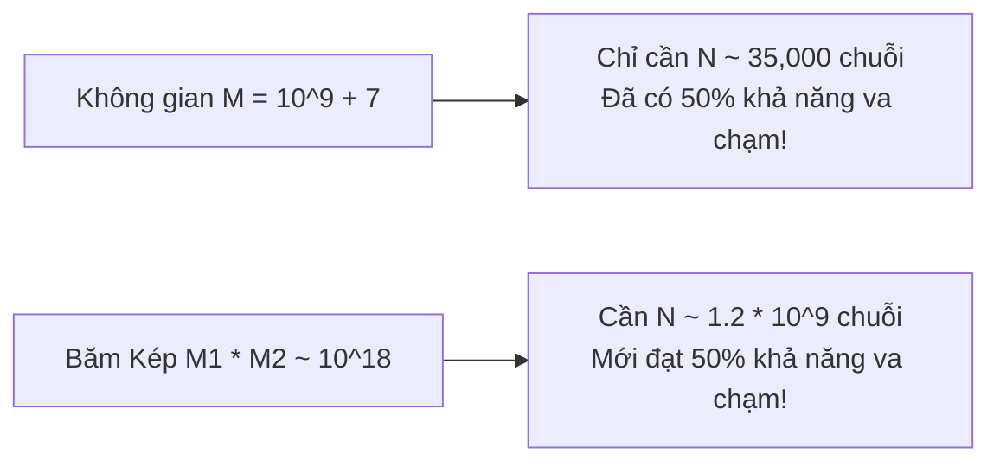
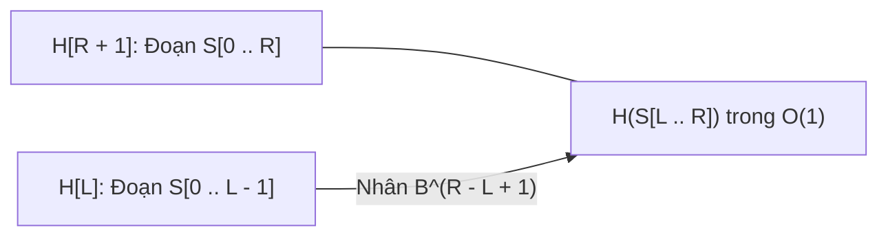

```mermaid
flowchart TD
    Root["Hệ thống Kiến thức: Hashing Techniques & Anti-Hash"]

    Root --> MathCore["1. Cơ sở Toán học & Nghịch lý Ngày sinh"]
    MathCore --> Birthday["Nghịch lý Ngày sinh (Birthday Paradox): Va chạm khi N ~ sqrt(M)"]
    MathCore --> SingleFail["Vì sao Single Hash Modulo 10^9+7 dễ dàng bị đánh sập"]
    MathCore --> DoubleHash["Băm Kép (Double Hashing): Tỷ lệ va chạm cực nhỏ 1 / (M1 * M2)"]
    MathCore --> Mersenne["Số nguyên tố Mersenne 2^61 - 1: Tối ưu nhân bitwise siêu tốc"]

    Root --> StringHash["2. Băm Cuộn trên Xâu (Rolling Hash & Rabin-Karp)"]
    StringHash --> PolyHash["Công thức đa thức băm tiền tố H[i] = (H[i-1] * B + S[i]) mod M"]
    StringHash --> SubstrO1["Tính giá trị băm đoạn con S[L..R] trong O(1)"]
    StringHash --> Palindrome["Kiểm tra Palindrome bằng Băm Xuôi & Băm Ngược"]
    StringHash --> RabinKarp["Thuật toán So khớp Mẫu Rabin-Karp O(N + M)"]

    Root --> AntiHashHacks["3. Nghệ thuật Anti-Hash & Phòng thủ Codeforces"]
    AntiHashHacks --> ThueMorse["Tấn công Single Hash bằng Chuỗi Thue-Morse"]
    AntiHashHacks --> UnorderedHack["Tấn công std::unordered_map bằng Anti-Hash Test Cases O(N^2)"]
    AntiHashHacks --> RandomBase["Phòng thủ 1: Sinh Base ngẫu nhiên bằng std::chrono"]
    AntiHashHacks --> SplitMix["Phòng thủ 2: Custom Hash splitmix64 cho Bảng băm"]

    Root --> AdvancedHash["4. Các Kỹ thuật Băm Nâng cao"]
    AdvancedHash --> TreeHash["Băm Cây (Tree Hashing): Nhận diện Cây Đẳng cấu (Isomorphism)"]
    AdvancedHash --> XORHash["Băm Tập hợp bằng XOR (XOR Hashing / Zobrist Hashing)"]
    AdvancedHash --> MatrixHash["Băm Ma trận 2D (2D Rolling Hash)"]
```

# ⚡ Chuyên đề: Kỹ thuật Băm (Hashing) & Chiến thuật Phòng thủ Anti-Hash

> **Tác giả:** Duc-Minh Vu | **Đơn vị:** SLSCM Lab — Faculty of Data Science and Artificial Intelligence (FDA), Đại học Kinh tế Quốc dân (NEU)  
> **Biên soạn:** Được hỗ trợ và soạn thảo bởi Agentic AI tool  
> **Bản quyền © 2026 Duc-Minh Vu.** Mọi quyền được bảo lưu. Tài liệu đào tạo và bồi dưỡng sinh viên Olympic Tin học / ICPC.

---



---

# 📖 PHẦN I: CƠ SỞ TOÁN HỌC & NGHỊCH LÝ NGÀY SINH (BIRTHDAY PARADOX)

## 1. Bản chất của Hàm Băm (Hash Function)

Hàm băm là ánh xạ từ một không gian dữ liệu kích thước khổng lồ (hoặc vô hạn, ví dụ: tập hợp mọi chuỗi văn bản) về một không gian số nguyên hữu hạn $[0, M - 1]$:
$$H: \mathcal{S} \longrightarrow \{0, 1, \dots, M - 1\}$$

- **Tính chất lý tưởng**: Phân phối đều (Uniform Distribution) và độc lập (Independence).
- **Hiện tượng Đụng độ (Collision)**: Vì $|\mathcal{S}| \gg M$, theo nguyên lý Dirichlet (Pigeonhole Principle), **chắc chắn tồn tại** hai dữ liệu khác nhau $A \neq B$ sao cho:
  $$H(A) = H(B)$$

---

## 2. Nghịch lý Ngày sinh (Birthday Paradox) & Thảm họa Single Hash $10^9$

> [!WARNING]
> Nhiều lập trình viên lầm tưởng: *"Vì modulo $M \approx 10^9$, xác suất để một chuỗi va chạm là $1 / 10^9$, nên bài toán có $N = 10^5$ chuỗi thì không bao giờ va chạm!"*  
> **Đây là sai lầm chết người!**

### Định lý Nghịch lý Ngày sinh:
Nếu ta chọn ngẫu nhiên $N$ giá trị băm trong không gian kích thước $M$, xác suất để **tồn tại ít nhất một cặp bị trùng lặp (va chạm)** vượt quá $50\%$ khi:
$$N \approx \sqrt{2 M \ln 2} \approx 1.177 \sqrt{M}$$



- Với Single Hash modulo $M = 10^9 + 7$:
  $$N \approx \sqrt{10^9} \approx 31,622$$
  Chỉ cần xử lý khoảng **$35,000$ chuỗi con khác nhau**, xác suất lời giải của bạn bị dính Wrong Answer (WA) do va chạm băm đã là **$> 50\%$**!
- Trong các bài toán tìm xâu con chung, mảng con phân biệt có $N = 2 \cdot 10^5$, số lượng xâu con được băm lên tới hàng triệu $\implies$ **Single Hash chắc chắn thất bại**.

---

## 3. Giải pháp 1: Băm Kép (Double Hashing)

Ta tính song song hai hàm băm với hai modulo nguyên tố khác nhau $MOD_1$ và $MOD_2$ (ví dụ $10^9 + 7$ và $10^9 + 9$), với hai cơ số (base) $B_1$ và $B_2$:
$$H(S) = \Big( H_1(S) \pmod{MOD_1}, \; H_2(S) \pmod{MOD_2} \Big)$$

- Không gian trạng thái lúc này là $M = MOD_1 \times MOD_2 \approx 10^{18}$.
- Ngưỡng nghịch lý ngày sinh được nâng lên:
  $$N \approx \sqrt{10^{18}} = 10^9$$
- Với $N \le 10^6$ trong các kỳ thi CP, xác suất xảy ra va chạm là nhỏ hơn $10^{-6}$ (gần như bằng $0$).

---

## 4. Giải pháp 2: Số nguyên tố Mersenne $2^{61} - 1$ (Băm 61-bit Tối thượng)

Thay vì dùng 2 modulo $10^9$, các tuyển thủ chuyên nghiệp ưa chuộng sử dụng một modulo duy nhất nhưng cực lớn: **Số nguyên tố Mersenne thứ 9**:
$$M = 2^{61} - 1 = 2305843009213693951$$

### Ưu điểm Vượt bậc:
1. **Không gian $2^{61} \approx 2.3 \times 10^{18}$**: Đảm bảo an toàn tuyệt đối mà chỉ cần duy trì $1$ số nguyên $64$-bit (`uint64_t`).
2. **Phép Modulo bằng Thao tác Bit siêu tốc**:
   Vì $2^{61} \equiv 1 \pmod{2^{61} - 1}$, với mọi số $X = A \cdot 2^{61} + B$:
   $$X \pmod{2^{61} - 1} = (A + B) \pmod{2^{61} - 1}$$
   Phép chia dư tốn kém có thể thay thế hoàn toàn bằng phép dịch bit `>> 61` và phép AND `& ((1ULL << 61) - 1)`!

---

# 📖 PHẦN II: BĂM CUỘN TRÊN XÂU (ROLLING HASH & RABIN-KARP)

## 1. Công thức Đa thức Băm Tiền tố (Prefix Polynomial Hash)

Cho xâu $S$ độ dài $N$. Ta chọn cơ số $B$ (thường là số nguyên tố lớn hơn bảng chữ cái, ví dụ $B \approx 311$) và modulo $M$.
Giá trị băm tiền tố $H[i]$ (cho tiền tố độ dài $i$: $S[0 \dots i-1]$) được định nghĩa:
$$H[0] = 0$$
$$H[i] = (H[i - 1] \cdot B + S[i - 1]) \pmod M$$

### Bảng Lũy thừa Cơ số:
Ta tính trước mảng lũy thừa:
$$P[i] = B^i \pmod M$$

---

## 2. Tính Giá trị Băm của Đoạn con $S[L \dots R]$ trong $O(1)$



Để lấy mã băm của xâu con từ chỉ số $L$ đến $R$ (0-indexed, độ dài $len = R - L + 1$):
$$H(S[L \dots R]) = \Big( H[R + 1] - H[L] \cdot B^{len} \Big) \pmod M$$

```cpp
long long getHash(int L, int R) {
    long long res = (H[R + 1] - H[L] * P[R - L + 1]) % MOD;
    if (res < 0) res += MOD;
    return res;
}
```
*Thời gian thực thi: $O(1)$ cho mỗi truy vấn xâu con!*

---

## 3. Thuật toán So khớp Xâu Rabin-Karp trong $O(N + M)$

Để tìm mọi vị trí xuất hiện của xâu mẫu $P$ (độ dài $M$) trong xâu văn bản $T$ (độ dài $N$):
1. Tính mã băm của mẫu $P$: $hash_P = H(P)$.
2. Tiền xử lý băm tiền tố cho văn bản $T$ trong $O(N)$.
3. Quét mọi cửa sổ kích thước $M$ trên $T$: Với mỗi vị trí $i \in [0, N - M]$, so sánh:
   $$H(T[i \dots i + M - 1]) \stackrel{?}{=} hash_P$$
   Nếu bằng nhau: Ghi nhận vị trí xuất hiện $i$.
- **Độ phức tạp**: $O(N + M)$ thời gian, nhanh và dễ cài đặt hơn hẳn KMP hay Z-Algorithm!

---

# 📖 PHẦN III: NGHỆ THUẬT ANTI-HASH & CHIẾN THUẬT PHÒNG THỦ

## 1. Tấn công Single Hash bằng Chuỗi Thue-Morse

Tại sao các tác giả ra đề có thể tạo test case khiến mã nguồn Single Hash với Modulo $10^9+7$ và Base cố định bị **Wrong Answer**?

### Cơ chế Tấn công:
Xét chuỗi Thue-Morse $T_k$ sinh bởi:
- $T_0 = \text{"a"}$, $T_0' = \text{"b"}$
- $T_{k} = T_{k-1} + T_{k-1}'$
- $T_{k}' = T_{k-1}' + T_{k-1}$

Ví dụ:
- $T_1 = \text{"ab"}$, $T_1' = \text{"ba"}$
- $T_2 = \text{"abba"}$, $T_2' = \text{"baab"}$
- $T_3 = \text{"abbabaab"}$, $T_3' = \text{"baabbaba"}$

Khi ta tính hiệu giá trị đa thức băm giữa hai xâu $T_k$ và $T_k'$:
$$H(T_k) - H(T_k') = (B - 1)^k \cdot C$$
Với $k$ đủ lớn (ví dụ $k \approx 40$), $(B - 1)^k$ chia hết cho modulo hoặc trở thành bội số của modulo $\implies H(T_k) \equiv H(T_k') \pmod M$!
Hai xâu hoàn toàn khác nhau nhưng có **giá trị băm giống hệt nhau $100\%$**.

---

## 2. Tấn công Bảng Băm `std::unordered_map` trên Codeforces

Trong GNU C++ STL, hàm băm mặc định `std::hash<long long>` chỉ đơn giản là:
```cpp
size_t operator()(long long x) const { return x; }
```
Bảng băm chia dữ liệu vào các bucket theo công thức: $\text{bucket} = x \pmod{\text{prime\_table\_size}}$.  
Kẻ tấn công chỉ cần biết danh sách các số nguyên tố kích thước bucket của GCC (ví dụ: $107897, 126271$), họ sẽ sinh ra mảng gồm $N$ số là **bội số của số nguyên tố đó**:
$$0, P, 2P, 3P, 4P, \dots$$
Tất cả các số này đều rơi vào đúng **Bucket 0** $\implies$ Bảng băm suy thoái thành Danh sách liên kết $\implies$ Thời gian chạy tăng từ $O(N)$ lên **$O(N^2)$**, dính TLE ngay lập tức!

---

## 3. Bộ Đôi Lá Chắn Phòng Thủ Bất Khả Xâm Phạm (Anti-Anti-Hash)

### Lá chắn 1: Ngẫu nhiên hóa Cơ số (Randomized Base)
Thay vì dùng `const int BASE = 311;` cố định, ta sinh $B$ ngẫu nhiên trong thời gian chạy (Runtime) dựa vào đồng hồ nano-giây:

```cpp
#include <chrono>
#include <random>

mt19937_64 rng(chrono::steady_clock::now().time_since_epoch().count());

long long getRandomBase(long long minB, long long maxB) {
    uniform_int_distribution<long long> dist(minB, maxB);
    long long b = dist(rng);
    if (b % 2 == 0) ++b; // Chọn số lẻ
    return b;
}
```
*Kẻ tấn công không thể biết trước Base được sinh ngẫu nhiên khi nộp bài $\implies$ Không thể chuẩn bị test case hack!*

---

### Lá chắn 2: Custom Hash `splitmix64` cho `unordered_map`

```cpp
struct SafeHash {
    static uint64_t splitmix64(uint64_t x) {
        x += 0x9e3779b97f4a7c15;
        x = (x ^ (x >> 30)) * 0xbf58476d1ce4e5b9;
        x = (x ^ (x >> 27)) * 0x94d049bb133111eb;
        return x ^ (x >> 31);
    }

    size_t operator()(uint64_t x) const {
        static const uint64_t FIXED_RANDOM =
            chrono::steady_clock::now().time_since_epoch().count();
        return splitmix64(x + FIXED_RANDOM);
    }
};

// Luôn sử dụng alias này trong mọi bài toán:
template<typename K, typename V>
using SafeMap = unordered_map<K, V, SafeHash>;
```

---

# 📖 PHẦN IV: CÁC KỸ THUẬT BĂM NÂNG CAO TRONG CP

## 1. Băm Tập hợp bằng Phép XOR (XOR Hashing / Zobrist Hashing)

### Đặt vấn đề:
Làm thế nào để kiểm tra xem hai tập hợp con $S_1$ và $S_2$ có **chứa các phần tử giống hệt nhau** hay không mà không cần sắp xếp hay dùng `std::set` $O(K \log K)$?

### Giải pháp XOR Hashing:
Gán cho mỗi giá trị phân biệt $v$ một số ngẫu nhiên 64-bit $\text{weight}(v)$ duy nhất.  
Giá trị băm của một tập hợp $S$ là:
$$H_{\oplus}(S) = \bigoplus_{x \in S} \text{weight}(x)$$

- **Tính chất**:
  - Thứ tự xuất hiện không quan trọng: Giao hoán và kết hợp.
  - Hai tập hợp $S_1 = S_2 \iff H_{\oplus}(S_1) = H_{\oplus}(S_2)$ với xác suất sai sót cực nhỏ ($2^{-64}$).
  - Cập nhật khi thêm/xóa phần tử trong $O(1)$.

---

## 2. Băm Cây (Tree Hashing) & Nhận dạng Cây Đẳng cấu (Isomorphism)

Hai cây có gốc $T_1$ và $T_2$ được gọi là **đẳng cấu (isomorphic)** nếu có một phép đổi tên các đỉnh biến $T_1$ thành $T_2$.
Vì thứ tự các nhánh con của một nút không quan trọng, ta dùng hàm băm độc lập thứ tự con:

```cpp
long long hashSubtree(int u, int p) {
    long long h = 1;
    vector<long long> childHashes;
    for (int v : adj[u]) {
        if (v != p) childHashes.push_back(hashSubtree(v, u));
    }
    sort(childHashes.begin(), childHashes.end()); // Chuẩn hóa thứ tự
    for (long long ch : childHashes) {
        h = (h * BASE + f(ch)) % MOD;
    }
    return h;
}
```

---

# 📚 TÀI LIỆU THAM KHẢO & ĐỌC THÊM

1. **CP-Algorithms**:
   - [String Hashing](https://cp-algorithms.com/string/string-hashing.html).
   - [Rabin-Karp for String Matching](https://cp-algorithms.com/string/rabin-karp.html).
2. **Codeforces Blogs**:
   - [How to read Mersenne 61-bit hash (by Neal Wu)](https://codeforces.com/blog/entry/60442).
   - [Blowing up unordered_map and how to fix it](https://codeforces.com/blog/entry/62393).
3. **CSES Problem Set**:
   - *String Matching (CSES 1753)*.
   - *Finding Periods (CSES 1731)*.
   - *Palindrome Queries (CSES 2420)*.

---

<div align="center">

<a href="https://www.neu.edu.vn" target="_blank"></a>
&nbsp;&nbsp;&nbsp;&nbsp;&nbsp;&nbsp;&nbsp;&nbsp;&nbsp;&nbsp;&nbsp;&nbsp;
<a href="https://www.fda.neu.edu.vn" target="_blank"></a>
&nbsp;&nbsp;&nbsp;&nbsp;&nbsp;&nbsp;&nbsp;&nbsp;&nbsp;&nbsp;&nbsp;&nbsp;
<a href="https://www.facebook.com/slscm.lab" target="_blank"></a>

<br/><br/>

**Competitive Programming Handbook**  
*SLSCM Lab — Faculty of Data Science and Artificial Intelligence (FDA) — National Economics University (NEU)*  
*Tài liệu được soạn thảo và tối ưu bởi Agentic AI tool*  
© 2026 Duc-Minh Vu. Toàn bộ bản quyền được bảo lưu.

</div>
