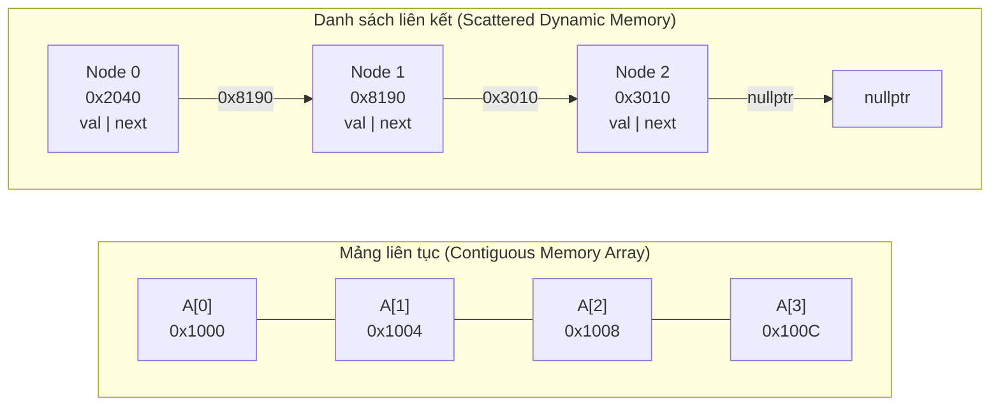
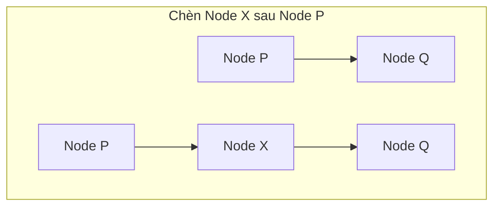
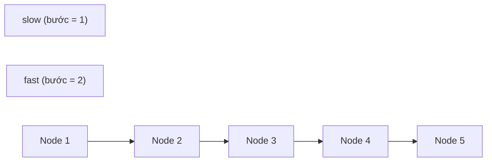
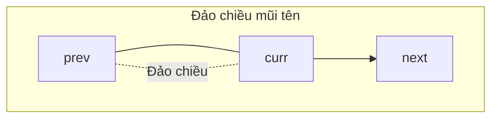
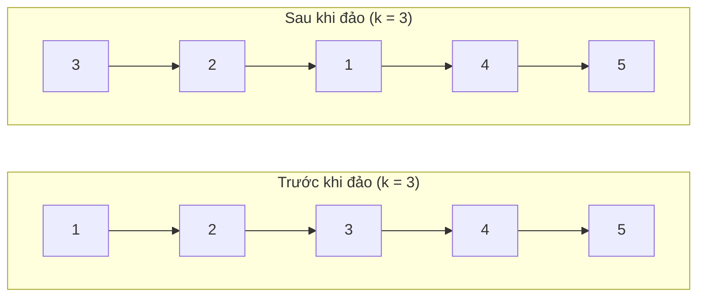
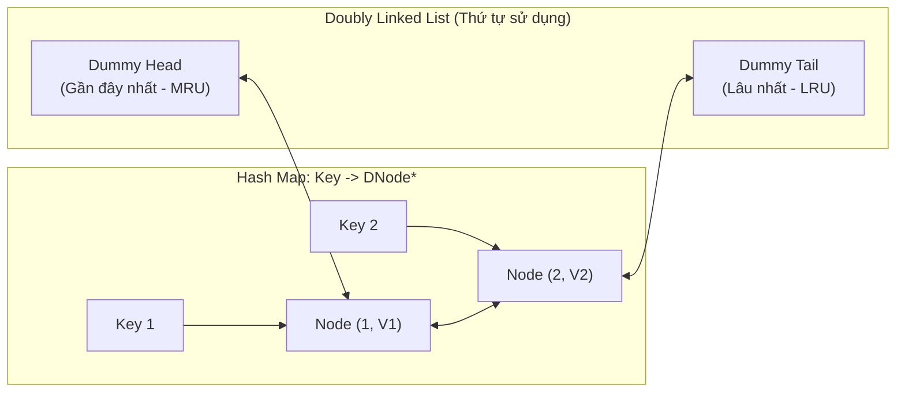
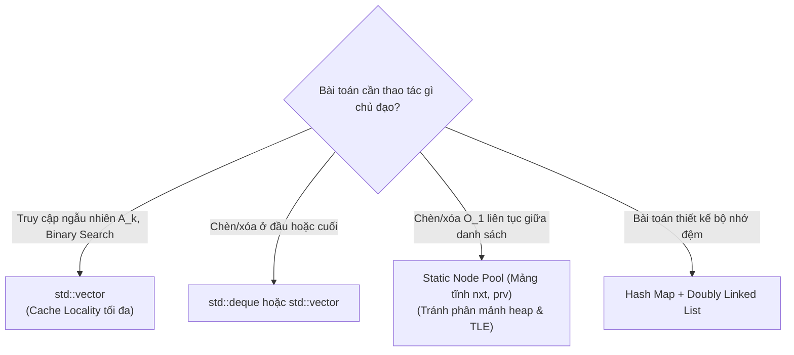

```mermaid
flowchart TD
    Root["Hệ thống Kiến thức: Danh sách Liên kết (Linked List)"]

    Root --> Mem["1. Bản chất Bộ nhớ & Đánh đổi"]
    Mem --> Cache["Phân mảnh Bộ nhớ & Cache Locality (Vector vs List)"]
    Mem --> Tradeoff["Thêm/Xóa O(1) đã biết vị trí vs Truy cập Ngẫu nhiên O(N)"]
    Mem --> Overhead["Overhead con trỏ 64-bit (8-16 bytes / node)"]

    Root --> Structs["2. Các Biến thể Danh sách"]
    Structs --> SLL["Singly Linked List (Duyệt xuôi 1 chiều)"]
    Structs --> DLL["Doubly Linked List (Duyệt 2 chiều, Xóa O(1))"]
    Structs --> CLL["Circular Linked List (Vòng khép kín, Josephus)"]
    Structs --> StaticPool["Static Node Pool: Mảng tĩnh tối ưu Cache & Chống TLE/MLE"]

    Root --> Classic["3. Kỹ thuật & Thuật toán Kinh điển"]
    Classic --> Dummy["Kỹ thuật Dummy Head: Triệt tiêu rẽ nhánh biên"]
    Classic --> FastSlow["Con trỏ Nhanh - Chậm (Floyd's Cycle Detection)"]
    Classic --> Reverse["Đảo ngược Danh sách: Toàn bộ & Nhóm K phần tử"]
    Classic --> MergeSort["Merge Two Lists O(N+M) & Merge K Lists O(N log K)"]

    Root --> Advanced["4. Ứng dụng Phức hợp & Cạm bẫy"]
    Advanced --> LRU["LRU Cache: Hash Map + Doubly Linked List O(1)"]
    Advanced --> DLX["Giới thiệu Dancing Links (DLX) của Knuth"]
    Advanced --> Pitfalls["Cạm bẫy: Null Dereference, Rò rỉ Bộ nhớ, Vòng lặp vô hạn"]
```

# ⚡ Chuyên đề: Danh sách Liên kết (Linked List)

> **Tác giả:** Duc-Minh Vu | **Đơn vị:** SLSCM Lab — Faculty of Data Science and Artificial Intelligence (FDA), Đại học Kinh tế Quốc dân (NEU)  
> **Biên soạn:** Được hỗ trợ và soạn thảo bởi Agentic AI tool  
> **Bản quyền © 2026 Duc-Minh Vu.** Mọi quyền được bảo lưu. Tài liệu đào tạo và bồi dưỡng sinh viên Olympic Tin học / ICPC.

---



---

# 📖 PHẦN I: BẢN CHẤT BỘ NHỚ & PHÂN TÍCH SO SÁNH

## 1. Khái niệm và So sánh Bộ nhớ: Mảng vs Danh sách Liên kết

Trong khoa học máy tính và lập trình thi đấu, **Mảng (Array / `std::vector`)** và **Danh sách liên kết (Linked List)** là hai cấu trúc dữ liệu nền tảng nhất để lưu trữ một tập hợp phần tử có thứ tự. Tuy nhiên, cách chúng tổ chức bộ nhớ vật lý hoàn toàn trái ngược nhau:



### So sánh Đặc tính Kỹ thuật

| Đặc tính | Mảng (`std::vector`) | Danh sách Liên kết Đơn (`SLL`) | Danh sách Liên kết Đôi (`DLL`) |
| :--- | :---: | :---: | :---: |
| **Bố trí bộ nhớ** | Liên tục trong RAM | Rời rạc, cấp phát động | Rời rạc, cấp phát động |
| **Truy cập phần tử thứ $k$** | $O(1)$ (Pointer Arithmetic) | $O(k)$ (Duyệt tuần tự) | $O(k)$ (Duyệt tuần tự) |
| **Chèn / Xóa ở đầu** | $O(N)$ (Phải dời mảng) | $O(1)$ | $O(1)$ |
| **Chèn / Xóa ở cuối** | $O(1)$ khấu hao | $O(1)$ nếu lưu `tail` | $O(1)$ nếu lưu `tail` |
| **Chèn / Xóa tại vị trí con trỏ** | $O(N)$ | $O(1)$ (Cần biết node trước) | $O(1)$ (Trực tiếp) |
| **Dung lượng bộ nhớ thêm** | $0$ byte | $8$ bytes (`next` pointer trên 64-bit) | $16$ bytes (`prev` & `next` trên 64-bit) |
| **Hiệu năng Cache (Locality)** | Cực cao (Spatial Locality) | Kém (Nhiều Cache Miss) | Kém (Nhiều Cache Miss) |

---

## 2. Vì sao `std::vector` thường đánh bại `std::list` trong CP?

Trong lý thuyết, danh sách liên kết có ưu thế $O(1)$ khi chèn và xóa. Tuy nhiên, trong môi trường kiểm thử thực tế của ICPC/Codeforces:
1. **Hiện tượng Cache Miss (Trượt bộ đệm)**:
   - CPU hiện đại đọc dữ liệu theo từng khối (Cache Line, thường là $64$ bytes). Khi duyệt `std::vector`, CPU nạp sẵn cả khối liền kề vào L1/L2 Cache, tốc độ xử lý gần như tức thời.
   - Với danh sách liên kết dựa trên con trỏ động (`new Node`), các node nằm rải rác ở những vị trí ngẫu nhiên trong Heap. Mỗi bước `curr = curr->next` buộc CPU phải truy xuất RAM chính, dẫn đến độ trễ cao (hàng trăm xung nhịp mỗi bước).
2. **Chi phí cấp phát bộ nhớ (Allocation Overhead)**:
   - Gọi `new Node` hàng triệu lần tiêu tốn thời gian gọi ngắt hệ điều hành (OS system call) và làm phân mảnh bộ nhớ (Heap Fragmentation).
3. **Giải pháp trong Lập trình thi đấu**:
   - Khi bắt buộc phải dùng thao tác chèn/xóa $O(1)$ liên tục (như trong thuật toán Josephus lớn, LRU Cache, hay Dancing Links), ta **không dùng con trỏ động `new`/`delete`**, mà sử dụng kỹ thuật **Danh sách liên kết trên Mảng tĩnh (Static Node Pool)**.

---

# 📖 PHẦN II: CÁC BIẾN THỂ VÀ KỸ THUẬT THIẾT KẾ CƠ SỞ

## 1. Danh sách Liên kết Đơn (Singly Linked List)

Mỗi node gồm một giá trị dữ liệu `val` và một con trỏ `next` trỏ đến node kế tiếp:

```cpp
struct ListNode {
    int val;
    ListNode* next;
    ListNode(int x = 0) : val(x), next(nullptr) {}
    ListNode(int x, ListNode* nxt) : val(x), next(nxt) {}
};
```

### Các Thao tác Cơ bản



- **Chèn node $X$ ngay sau node $P$**:
  ```cpp
  X->next = P->next;
  P->next = X;
  ```
  *(Lưu ý: Nếu đảo ngược thứ tự hai câu lệnh trên, ta sẽ làm mất địa chỉ của node `P->next`, gây rò rỉ bộ nhớ!)*

- **Xóa node $Q$ ngay sau node $P$**:
  ```cpp
  ListNode* temp = P->next;
  P->next = temp->next;
  delete temp; // Trong CP có thể bỏ qua delete nếu không sợ MLE
  ```

---

## 2. Danh sách Liên kết Đôi (Doubly Linked List)

Mỗi node lưu trữ hai con trỏ: `next` (trỏ về sau) và `prev` (trỏ về trước). Cấu trúc này cho phép xóa một node bất kỳ trong $O(1)$ khi chỉ có con trỏ trỏ trực tiếp vào chính node đó (không cần con trỏ node đứng trước):

```cpp
struct DNode {
    int val;
    DNode* prev;
    DNode* next;
    DNode(int v = 0) : val(v), prev(nullptr), next(nullptr) {}
};
```

### Thao tác Xóa Node $X$ trong $O(1)$:
```cpp
void removeNode(DNode* X) {
    if (X->prev != nullptr) X->prev->next = X->next;
    if (X->next != nullptr) X->next->prev = X->prev;
    // X đã được gỡ hoàn toàn khỏi chuỗi liên kết
}
```

---

## 3. Kỹ thuật Con trỏ Giả (Dummy Head / Sentinel Node)

Một trong những nguồn gây lỗi `SIGSEGV` (Segmentation Fault) phổ biến nhất khi viết danh sách liên kết là xử lý trường hợp biên:
- Chèn vào đầu danh sách rỗng (`head == nullptr`).
- Xóa phần tử đầu tiên (`head` bị thay đổi).

> [!TIP]
> **Kỹ thuật Lính canh (Sentinel / Dummy Node)**: Tạo một node giả `dummy` đứng trước `head` thật sự: `dummy->next = head`. Mọi thao tác chèn/xóa luôn được thực hiện ở vị trí "sau một node nào đó", triệt tiêu hoàn toàn mã lệnh `if (head == nullptr)` hay `if (p == head)`. Kết quả cuối cùng luôn là `dummy->next`.

```cpp
// Ví dụ: Xóa tất cả các node có giá trị val == target
ListNode* removeElements(ListNode* head, int target) {
    ListNode dummy(0, head); // dummy.next trỏ tới head
    ListNode* prev = &dummy;
    
    while (prev->next != nullptr) {
        if (prev->next->val == target) {
            ListNode* toDelete = prev->next;
            prev->next = toDelete->next;
            delete toDelete;
        } else {
            prev = prev->next;
        }
    }
    return dummy.next; // Head mới sau khi loại bỏ các phần tử trùng
}
```

---

## 4. Kỹ thuật Mảng tĩnh (Static Node Pool) — Vũ khí thi đấu ICPC

Để tối ưu hóa tốc độ chạy và vượt qua các giới hạn thời gian gắt gao ($1.0$s cho $N = 10^6$), thí sinh giàu kinh nghiệm chuyển đổi toàn bộ con trỏ động sang mảng phẳng:

```cpp
const int MAXN = 1000005;

struct StaticLinkedList {
    int val[MAXN];
    int nxt[MAXN];
    int prv[MAXN];
    int head, tail, totalNodes;

    void init() {
        head = 0; tail = 0;
        totalNodes = 0;
        nxt[0] = 0; prv[0] = 0; // 0 đóng vai trò Sentinel (nullptr)
    }

    int allocateNode(int value) {
        int id = ++totalNodes;
        val[id] = value;
        nxt[id] = 0;
        prv[id] = 0;
        return id;
    }

    void insertAfter(int u, int value) {
        int v = allocateNode(value);
        nxt[v] = nxt[u];
        prv[v] = u;
        if (nxt[u]) prv[nxt[u]] = v;
        nxt[u] = v;
    }

    void erase(int u) {
        if (nxt[u]) prv[nxt[u]] = prv[u];
        if (prv[u]) nxt[prv[u]] = nxt[u];
    }
};
```
*Ưu điểm*: Tốc độ chạy nhanh hơn con trỏ heap từ 5 đến 10 lần, không bao giờ bị rò rỉ bộ nhớ, cực kỳ an toàn.

---

# 📖 PHẦN III: CÁC THUẬT TOÁN KINH ĐIỂN TRÊN DANH SÁCH LIÊN KẾT

## 1. Kỹ thuật Con trỏ Nhanh - Chậm (Fast & Slow Pointers / Floyd's Cycle Detection)

Kỹ thuật hai con trỏ di chuyển với tốc độ khác nhau (thường con trỏ Chậm `slow` nhảy $1$ bước mỗi lần, con trỏ Nhanh `fast` nhảy $2$ bước):



### 1.1. Tìm Trung điểm Danh sách trong 1 lượt duyệt (Middle of Linked List)
- Nếu số phần tử lẻ: `slow` dừng tại chính xác node ở giữa.
- Nếu số phần tử chẵn: `slow` dừng tại node thứ hai trong cặp ở giữa.

```cpp
ListNode* findMiddle(ListNode* head) {
    if (!head) return nullptr;
    ListNode* slow = head;
    ListNode* fast = head;
    while (fast != nullptr && fast->next != nullptr) {
        slow = slow->next;
        fast = fast->next->next;
    }
    return slow;
}
```

---

### 1.2. Phát hiện Chu trình (Floyd's Tortoise and Hare Cycle Finding)

Giả sử danh sách có chu trình. Vì mỗi bước `fast` rút ngắn khoảng cách với `slow` đúng $1$ đơn vị, nên nếu tồn tại chu trình độ dài $C$, `fast` chắc chắn sẽ đuổi kịp và gặp `slow` trong tối đa $C$ bước.

```cpp
bool hasCycle(ListNode* head) {
    ListNode* slow = head;
    ListNode* fast = head;
    while (fast != nullptr && fast->next != nullptr) {
        slow = slow->next;
        fast = fast->next->next;
        if (slow == fast) return true; // Bắt kịp nhau -> Có chu trình
    }
    return false; // fast chạm nullptr -> Tuyến tính, không có chu trình
}
```

---

### 1.3. Tìm Điểm Bắt đầu Chu trình (Cycle Starting Node)

Khi `slow` và `fast` gặp nhau lần đầu tại điểm giao nhau $M$, làm sao để tìm được nút đầu tiên tạo nên chu trình?


**Chứng minh Toán học**:
- Gọi $F$ là khoảng cách từ `Head` đến nút bắt đầu chu trình.
- Gọi $C$ là chu vi của vòng chu trình.
- Gọi $a$ là khoảng cách từ nút bắt đầu chu trình đến điểm gặp nhau $M$ ($0 \le a < C$).
- Khi gặp nhau:
  $$\text{Quãng đường } slow = F + a$$
  $$\text{Quãng đường } fast = F + a + k \cdot C \quad (k \ge 1)$$
- Vì `fast` chạy nhanh gấp đôi `slow`:
  $$2(F + a) = F + a + k \cdot C \implies F + a = k \cdot C \implies F = k \cdot C - a = (k - 1)C + (C - a)$$
- **Ý nghĩa kỳ diệu**: Khoảng cách $F$ từ `Head` đến nút bắt đầu chu trình **chính xác bằng** khoảng cách đi tiếp $(C - a)$ từ điểm gặp nhau $M$ đến nút bắt đầu!
- **Thuật toán**: Đặt lại một con trỏ về `Head`, giữ nguyên con trỏ kia tại $M$. Cho cả hai cùng di chuyển với vận tốc bằng nhau ($1$ bước/lần). Điểm chúng chạm nhau lần thứ hai chính là **Nút bắt đầu Chu trình**.

```cpp
ListNode* detectCycle(ListNode* head) {
    ListNode* slow = head;
    ListNode* fast = head;
    bool hasLoop = false;
    
    while (fast && fast->next) {
        slow = slow->next;
        fast = fast->next->next;
        if (slow == fast) {
            hasLoop = true;
            break;
        }
    }
    if (!hasLoop) return nullptr;
    
    // Tìm điểm bắt đầu
    ListNode* ptr1 = head;
    ListNode* ptr2 = slow;
    while (ptr1 != ptr2) {
        ptr1 = ptr1->next;
        ptr2 = ptr2->next;
    }
    return ptr1;
}
```

---

## 2. Thuật toán Đảo ngược Danh sách Liên kết (Reverse Linked List)

### 2.1. Đảo ngược Toàn bộ Danh sách (In-place Iterative)
Sử dụng 3 con trỏ: `prev`, `curr`, `next`:



```cpp
ListNode* reverseList(ListNode* head) {
    ListNode* prev = nullptr;
    ListNode* curr = head;
    while (curr != nullptr) {
        ListNode* nextTemp = curr->next; // Lưu trữ liên kết tiếp theo
        curr->next = prev;               // Bẻ ngược mũi tên
        prev = curr;                     // Tịnh tiến prev
        curr = nextTemp;                 // Tịnh tiến curr
    }
    return prev; // prev trở thành Head mới
}
```
Độ phức tạp: Thời gian $O(N)$, Bộ nhớ $O(1)$.

---

### 2.2. Đảo ngược theo Từng nhóm $K$ Phần tử (Reverse Nodes in $k$-Group)

Bài toán LeetCode Hard kinh điển: Cho danh sách liên kết, đảo ngược liên tiếp các khối $K$ phần tử. Nếu khối cuối cùng có ít hơn $K$ phần tử, giữ nguyên thứ tự của chúng.



**Thuật toán tiếp cận**:
1. Đếm trước $K$ phần tử. Nếu không đủ $K$ phần tử, dừng thuật toán.
2. Đảo ngược đoạn con $K$ phần tử đó bằng kỹ thuật 3 con trỏ chuẩn.
3. Nối đuôi của đoạn vừa đảo với kết quả đệ quy (hoặc khối tiếp theo).

```cpp
ListNode* reverseKGroup(ListNode* head, int k) {
    // Bước 1: Kiểm tra xem có đủ k phần tử không
    ListNode* check = head;
    for (int i = 0; i < k; ++i) {
        if (!check) return head; // Không đủ k node, giữ nguyên
        check = check->next;
    }
    
    // Bước 2: Đảo ngược k phần tử đầu
    ListNode* prev = nullptr;
    ListNode* curr = head;
    for (int i = 0; i < k; ++i) {
        ListNode* nxt = curr->next;
        curr->next = prev;
        prev = curr;
        curr = nxt;
    }
    
    // Bước 3: Nối đuôi đoạn vừa đảo (chính là head ban đầu) với nhóm kế tiếp
    head->next = reverseKGroup(curr, k);
    return prev;
}
```

---

## 3. Hợp nhất Danh sách Liên kết đã Sắp xếp (Merge Lists)

### 3.1. Hợp nhất Hai Danh sách (Merge Two Sorted Lists)
Sử dụng Dummy Node để ghép hai danh sách đơn giản trong $O(N + M)$ thời gian và $O(1)$ phụ trợ:

```cpp
ListNode* mergeTwoLists(ListNode* l1, ListNode* l2) {
    ListNode dummy(0);
    ListNode* tail = &dummy;
    
    while (l1 && l2) {
        if (l1->val <= l2->val) {
            tail->next = l1;
            l1 = l1->next;
        } else {
            tail->next = l2;
            l2 = l2->next;
        }
        tail = tail->next;
    }
    tail->next = (l1 ? l1 : l2);
    return dummy.next;
}
```

---

### 3.2. Hợp nhất $K$ Danh sách Đã Sắp xếp (Merge $K$ Sorted Lists)

Cho $K$ danh sách liên kết với tổng cộng $N$ phần tử:
1. **Phương pháp Hàng đợi Ưu tiên (Min-Heap / `std::priority_queue`)**:
   - Đưa $K$ con trỏ đầu danh sách vào Min-Heap: `priority_queue` lưu cặp `(node->val, node)`.
   - Mỗi bước lấy node nhỏ nhất ra, nối vào kết quả, và đẩy `node->next` vào heap nếu còn.
   - **Độ phức tạp**: $O(N \log K)$ thời gian, $O(K)$ bộ nhớ phụ trợ.
2. **Phương pháp Chia để Trị (Divide and Conquer)**:
   - Gom từng cặp danh sách để merge bằng hàm `mergeTwoLists` ở trên, tương tự cơ chế Merge Sort.
   - **Độ phức tạp**: $O(N \log K)$ thời gian, $O(\log K)$ call stack.

---

# 📖 PHẦN IV: ỨNG DỤNG PHỨC HỢP & CẤU TRÚC NÂNG CAO

## 1. Thiết kế Bộ nhớ đệm LRU (Least Recently Used Cache)

Bộ nhớ đệm LRU lưu trữ dữ liệu theo cặp key-value với sức chứa giới hạn `capacity`. Khi bộ đệm đầy, phần tử **ít được sử dụng nhất trong thời gian qua (Least Recently Used)** sẽ bị đào thải.

### Yêu cầu Kỹ thuật
- `get(key)`: Trả về giá trị nếu có, ngược lại trả về $-1$. Thời gian: $O(1)$.
- `put(key, value)`: Cập nhật hoặc thêm mới. Nếu vượt quá `capacity`, đào thải phần tử LRU. Thời gian: $O(1)$.

### Kiến trúc Kết hợp: Hash Map + Doubly Linked List



- **Hash Map**: Cho phép tra cứu địa chỉ của node trong $O(1)$.
- **Doubly Linked List**:
  - Khi một node được truy cập (`get` hoặc cập nhật): Gỡ node ra khỏi vị trí hiện tại và chèn lên ngay sau `Head` trong $O(1)$ (đánh dấu là Most Recently Used).
  - Khi bị tràn dung lượng: Node nằm ngay trước `Tail` chính là phần tử lâu nhất chưa dùng, xóa nó trong $O(1)$ và xóa key tương ứng khỏi Hash Map.

---

## 2. Kỹ thuật Dancing Links (DLX) của Donald Knuth

Trong các kỳ thi thuật toán đỉnh cao, kỹ thuật **Dancing Links (DLX)** do Donald Knuth đề xuất dùng để cài đặt giải thuật "Algorithm X" giải bài toán **Phủ Chính Xác (Exact Cover Problem)** — nền tảng giải bài toán Sudoku, N-Queens, xếp hình Pentomino.

DLX sử dụng **Danh sách Liên kết Đôi Vòng 4 Hướng (Circular 2D Doubly Linked List)**: mỗi node có 4 con trỏ `left, right, up, down`.
Điểm vi diệu của DLX là thao tác gỡ một cột/hàng ra khỏi bảng và khôi phục lại khi quay lui (Backtracking) chỉ tốn $O(1)$ phép gán con trỏ mà không cần cấp phát lại:

```cpp
// Thao tác che đậy (Cover): Gỡ node khỏi danh sách liên kết ngang
void cover(Node* c) {
    c->right->left = c->left;
    c->left->right = c->right;
}

// Thao tác khôi phục (Uncover): Trả node về vị trí cũ chính xác khi quay lui
void uncover(Node* c) {
    c->left->right = c;
    c->right->left = c;
}
```
*Lời nhận xét của Knuth*: Con trỏ như đang "nhảy múa" qua lại trong bộ nhớ một cách hoàn hảo và thanh lịch.

---

# ⚠️ PHẦN V: CẠM BẪY PHÒNG THI & QUY TẮC BẤT BIẾN

### 1. Bẫy Con trỏ Rỗng (Null Pointer Dereference)
- **Triệu chứng**: Chấm bài bị lỗi `Runtime Error (SIGSEGV)`.
- **Nguyên nhân**: Truy cập `curr->next->val` khi mà `curr->next` đang bằng `nullptr`, hoặc kiểm tra điều kiện lặp `while (curr->next != nullptr)` mà không kiểm tra `curr != nullptr` trước.
- **Biện pháp**: Luôn đảm bảo điều kiện ngắn mạch: `while (curr != nullptr && curr->next != nullptr)`.

### 2. Bẫy Mất Tham Chiếu (Lost Reference)
- Khi đảo ngược danh sách hoặc chèn node, việc gán đè `curr->next = new_val` trước khi lưu lại địa chỉ node kế tiếp (`ListNode* temp = curr->next`) sẽ làm mất vĩnh viễn toàn bộ phần đuôi còn lại của danh sách.

### 3. Vòng lặp Vô Tận do Chu trình Ngầm (Memory Cycle)
- Khi tách một danh sách làm đôi (ví dụ trong Merge Sort trên Linked List), quên gán `prev->next = nullptr` tại điểm cắt sẽ khiến nửa đầu vẫn giữ liên kết sang nửa sau, tạo ra đệ quy vô tận và gây lỗi `Stack Overflow (MLE/TLE)`.

### 4. Bảng Tra cứu Quyết định Lựa chọn trong CP



---

# 📚 TÀI LIỆU THAM KHẢO & ĐỌC THÊM

1. **Introduction to Algorithms (CLRS)** — *Chapter 10: Elementary Data Structures (Linked Lists)*.
2. **Donald E. Knuth (2000)** — *Dancing Links (Millennial Perspectives in Computer Science)*.
3. **Robert Sedgewick & Kevin Wayne** — *Algorithms 4th Edition (Linked Lists & Fast-Slow Pointers)*.
4. **LeetCode Problem Curations**:
   - *Problem 141 & 142: Linked List Cycle I & II*.
   - *Problem 25: Reverse Nodes in k-Group*.
   - *Problem 23: Merge k Sorted Lists*.
   - *Problem 146: LRU Cache*.

---

<div align="center">

<a href="https://www.neu.edu.vn" target="_blank"></a>
&nbsp;&nbsp;&nbsp;&nbsp;&nbsp;&nbsp;&nbsp;&nbsp;&nbsp;&nbsp;&nbsp;&nbsp;
<a href="https://www.fda.neu.edu.vn" target="_blank"></a>
&nbsp;&nbsp;&nbsp;&nbsp;&nbsp;&nbsp;&nbsp;&nbsp;&nbsp;&nbsp;&nbsp;&nbsp;
<a href="https://www.facebook.com/slscm.lab" target="_blank"></a>

<br/><br/>

**Competitive Programming Handbook**  
*SLSCM Lab — Faculty of Data Science and Artificial Intelligence (FDA) — National Economics University (NEU)*  
*Tài liệu được soạn thảo và tối ưu bởi Agentic AI tool*  
© 2026 Duc-Minh Vu. Toàn bộ bản quyền được bảo lưu.

</div>
