```mermaid
flowchart TD
    Root["Lũy thừa nhị phân & Nhân ma trận"]
    
    Root --> BinExp["1. Lũy thừa nhị phân"]
    BinExp --> ExpInt["Lũy thừa số nguyên: a^b mod m trong O(log b)"]
    BinExp --> DivConq["Chia để trị: a^b = (a^(b/2))^2 * a^(b mod 2)"]
    
    Root --> MulMod["2. Nhân nhanh Modulo 10^18"]
    MulMod --> Over64["Tránh tràn số 64-bit khi a * b ~ 10^36"]
    MulMod --> RussPeasant["Russian Peasant: Nhân kiểu cộng O(log b)"]
    MulMod --> Int128["GCC __int128_t: O(1) phần cứng"]
    MulMod --> FloatTrick["Long Double Trick: a*b - floor(a*b/m)*m trong O(1)"]
    
    Root --> MatMul["3. Nhân ma trận cơ bản"]
    MatMul --> MatMulAlgo["Phép nhân A(NxP) * B(PxM) = C(NxM) trong O(N^3)"]
    MatMul --> MatExp["Lũy thừa ma trận vuông: M^K mod m trong O(N^3 log K)"]
    MatMul --> Identity["Ma trận đơn vị Identity Matrix I"]
    
    Root --> MatDP["4. Tối ưu Quy hoạch động (Matrix DP)"]
    MatDP --> Fib["Dãy Fibonacci N <= 10^18 trong O(2^3 log N)"]
    MatDP --> LinearRec["Truy hồi tuyến tính bậc K: O(K^3 log N)"]
    MatDP --> NonHomog["Hệ không thuần nhất: Bổ sung biến giả 1, i, i^2"]
    MatDP --> GraphPaths["Đếm đường đi độ dài K trên đồ thị bằng A^K"]
    
    Root --> Tropical["5. Vành nhiệt đới (Tropical Semiring)"]
    Tropical --> MinPlus["Min-Plus Matrix: C[i][j] = min(A[i][k] + B[k][j])"]
    Tropical --> ShortestK["Đường đi ngắn nhất đúng K bước trong O(V^3 log K)"]
```

# ⚡ Chuyên đề: Lũy thừa nhị phân, Nhân nhanh Modulo $10^{18}$, Nhân ma trận & Tối ưu Quy hoạch động

> **Tác giả:** Duc-Minh Vu | **Đơn vị:** SLSCM Lab — Faculty of Data Science and Artificial Intelligence (FDA), Đại học Kinh tế Quốc dân (NEU)  
> **Biên soạn:** Được hỗ trợ và soạn thảo bởi Agentic AI tool  
> **Bản quyền © 2026 Duc-Minh Vu.** Mọi quyền được bảo lưu. Tài liệu đào tạo và bồi dưỡng sinh viên Olympic Tin học / ICPC.

---



---

# 📖 PHẦN I: LŨY THỪA NHỊ PHÂN & NHÂN NHANH MODULO $10^{18}$

## 1. Lũy thừa nhị phân (Binary Exponentiation / Fast Pow)

### 1.1. Nguyên lý Toán học
Để tính $a^b \pmod m$ với $b \le 10^{18}$, nếu nhân liên tiếp $b$ lần sẽ mất thời gian $O(b)$ $\implies$ Không thể giải quyết khi $b > 10^8$.  
Áp dụng tư duy **Chia để trị (Divide and Conquer)**:
$$a^b = \begin{cases} 1 & \text{khi } b = 0 \\ (a^{b/2})^2 & \text{khi } b \text{ chẵn} \\ (a^{\lfloor b/2 \rfloor})^2 \cdot a & \text{khi } b \text{ lẻ} \end{cases} \pmod m$$
Số bước thực hiện giảm từ $b \to \lfloor \log_2 b \rfloor + 1$ bước $\implies$ Độ phức tạp **$O(\log b)$**.

### 1.2. Cài đặt tối ưu bằng Vòng lặp Bitwise
```cpp
long long powerMod(long long a, long long b, long long m) {
    long long res = 1 % m;
    a %= m;
    while (b > 0) {
        if (b & 1) res = (__int128)res * a % m;
        a = (__int128)a * a % m;
        b >>= 1;
    }
    return res;
}
```

---

## 2. Bài toán Nhân nhanh hai số lớn modulo $10^{18}$ (Large Multiplication)

### 2.1. Vấn đề tràn số 64-bit
Khi $a, b, m \le 10^{18}$:
$$a \cdot b \approx 10^{18} \times 10^{18} = 10^{36}$$
Trong khi kiểu số nguyên không dấu 64-bit lớn nhất (`uint64_t` hoặc `unsigned long long`) chỉ lưu trữ tối đa:
$$2^{64} - 1 \approx 1.84 \times 10^{19} \ll 10^{36}$$
Nếu viết `(a * b) % m`, máy tính sẽ bị tràn số $64\text{-bit}$ ngay trong phép nhân $a \cdot b$ trước khi thực hiện phép chia lấy dư `% m`, dẫn đến kết quả hoàn toàn sai lệch!

Có **3 phương pháp** giải quyết bài toán này trong lập trình thi đấu:

---

### Phương pháp 1: Phép nhân Ấn Độ (Russian Peasant Multiplication) — $O(\log b)$
Biến phép nhân thành một chuỗi các phép cộng dồn dựa trên biểu diễn nhị phân của $b$ (tương tự lũy thừa nhị phân):
$$a \cdot b = \begin{cases} 0 & \text{khi } b = 0 \\ 2 \cdot (a \cdot \lfloor b/2 \rfloor) & \text{khi } b \text{ chẵn} \\ 2 \cdot (a \cdot \lfloor b/2 \rfloor) + a & \text{khi } b \text{ lẻ} \end{cases} \pmod m$$

```cpp
long long mulModBinary(long long a, long long b, long long m) {
    long long res = 0;
    a %= m;
    while (b > 0) {
        if (b & 1) res = (res + a) % m;
        a = (a + a) % m; // Phép cộng an toàn: 2 * 10^18 < 2^63 - 1
        b >>= 1;
    }
    return res;
}
```
- **Ưu điểm**: Thuần túy số học, chạy được trên mọi trình biên dịch và mọi hệ thống kiến trúc máy tính.
- **Nhược điểm**: Độ phức tạp $O(\log b)$ (khoảng 60 vòng lặp). Nếu nhúng vào nhân ma trận hoặc thuật toán Miller-Rabin sẽ gây chậm chương trình.

---

### Phương pháp 2: Sử dụng kiểu nguyên 128-bit `__int128_t` — $O(1)$
Trên hầu hết các nền tảng thi đấu hiện đại (Codeforces, CSES, AtCoder, VNOJ, ICPC Regional) sử dụng hệ điều hành 64-bit và trình biên dịch GCC / Clang, kiểu số nguyên **128-bit (`__int128_t` hoặc `unsigned __int128`)** được hỗ trợ sẵn:
$$\text{Giá trị tối đa của } \text{unsigned \_\_int128} \approx 2^{128} - 1 \approx 3.4 \times 10^{38} > 10^{36}$$

```cpp
inline long long mulMod128(long long a, long long b, long long m) {
    return (long long)((__int128)a * b % m);
}
```
- **Ưu điểm**: Độ phức tạp **$O(1)$**, thực thi chỉ trong 1 vài chu kỳ CPU. Đây là cách được khuyến nghị sử dụng hàng đầu trong mọi kỳ thi CP.

---

### Phương pháp 3: Ảo thuật số thực `long double` (Float Modulo Trick) — $O(1)$
Trong trường hợp hệ thống biên dịch không hỗ trợ `__int128` (ví dụ MSVC 32-bit hoặc một số môi trường nhúng đặc thù), ta áp dụng đồng nhất thức số học:
$$a \cdot b \pmod m = a \cdot b - \left\lfloor \frac{a \cdot b}{m} \right\rfloor \cdot m$$
Kiểu `long double` trên kiến trúc x86 có độ chính xác 80-bit phần định trị (extended precision), cho phép ước lượng thương số $\lfloor \frac{a \cdot b}{m} \rfloor$ cực kỳ chính xác:

```cpp
inline uint64_t mulModFloat(uint64_t a, uint64_t b, uint64_t m) {
    uint64_t q = (long double)a * b / m;
    int64_t res = (int64_t)(a * b - q * m) % (int64_t)m;
    if (res < 0) res += m;
    return res;
}
```
- **Nguyên lý:** Phép tính `a * b - q * m` được thực hiện trên kiểu `uint64_t` tự động tràn modulo $2^{64}$. Vì hiệu thực tế luôn nằm trong khoảng $(-m, m)$, sự sai khác do tràn $2^{64}$ sẽ tự triệt tiêu lẫn nhau!

---

# 📐 PHẦN II: NHÂN MA TRẬN & LŨY THỪA MA TRẬN

## 1. Định nghĩa Phép nhân Ma trận
Cho hai ma trận $A$ kích thước $N \times P$ và $B$ kích thước $P \times M$. Tích $C = A \times B$ là ma trận kích thước $N \times M$ với phần tử tại hàng $i$, cột $j$:
$$C[i][j] = \sum_{k=0}^{P-1} A[i][k] \cdot B[k][j] \pmod m$$
Độ phức tạp tính toán: **$O(N \cdot P \cdot M)$**. Với hai ma trận vuông $K \times K$, độ phức tạp là **$O(K^3)$**.

```text
       B: [ 1  2 ]
          [ 3  4 ]
A: [ a  b ] -> C[0][0] = a*1 + b*3,  C[0][1] = a*2 + b*4
   [ c  d ] -> C[1][0] = c*1 + d*3,  C[1][1] = c*2 + d*4
```

---

## 2. Ma trận Đơn vị (Identity Matrix)
Ma trận đơn vị $I_K$ kích thước $K \times K$ đóng vai trò như số $1$ trong phép nhân số học:
$$A \times I = I \times A = A$$
Đặc điểm của $I$:
$$I[i][j] = \begin{cases} 1 & \text{khi } i = j \\ 0 & \text{khi } i \ne j \end{cases}$$

---

## 3. Lũy thừa Ma trận (Matrix Exponentiation)
Với ma trận vuông $M$ kích thước $K \times K$ và số mũ nguyên dương $N \le 10^{18}$, ta tính $M^N \pmod m$ hoàn toàn tương tự lũy thừa nhị phân số nguyên:
$$\mathbf{O(K^3 \log N)}$$
Trong thi đấu CP, $K$ thường rất nhỏ ($K \le 50$, phổ biến là $K = 2, 3, 5, 10$), do đó $K^3 \log N \approx 50^3 \times 60 \approx 7.5 \times 10^6$ phép tính $\implies$ Chạy dưới **$0.05$ giây**!

---

## 4. Cấu trúc C++20 chuẩn mực cho Nhân ma trận

```cpp
template<typename T, int SZ>
struct Matrix {
    T mat[SZ][SZ];
    int n, m;

    Matrix(int _n = SZ, int _m = SZ) : n(_n), m(_m) {
        for (int i = 0; i < n; ++i)
            for (int j = 0; j < m; ++j)
                mat[i][j] = 0;
    }

    // Khởi tạo ma trận đơn vị I
    static Matrix identity(int sz) {
        Matrix res(sz, sz);
        for (int i = 0; i < sz; ++i) res.mat[i][i] = 1;
        return res;
    }

    // Phép nhân ma trận A * B mod MOD
    Matrix operator*(const Matrix& other) const {
        Matrix res(n, other.m);
        for (int i = 0; i < n; ++i) {
            for (int k = 0; k < m; ++k) {
                if (mat[i][k] == 0) continue; // Tối ưu bỏ qua số 0
                for (int j = 0; j < other.m; ++j) {
                    res.mat[i][j] = (res.mat[i][j] + (__int128)mat[i][k] * other.mat[k][j]) % MOD;
                }
            }
        }
        return res;
    }

    // Lũy thừa ma trận: M^exp mod MOD
    Matrix power(long long exp) const {
        Matrix res = Matrix::identity(n);
        Matrix base = *this;
        while (exp > 0) {
            if (exp & 1) res = res * base;
            base = base * base;
            exp >>= 1;
        }
        return res;
    }
};
```

---

# 🚀 PHẦN III: TỐI ƯU QUY HOẠCH ĐỘNG BẰNG NHÂN MA TRẬN (DP VIA MATRIX EXPONENTIATION)

## 1. Cơ chế Chuyển đổi Trạng thái DP
Khi một bài toán Quy hoạch động có các đặc điểm:
1. Giá trị cần tính tại bước thứ $N$ rất lớn ($N \le 10^{18}$).
2. Trạng thái $DP[i]$ phụ thuộc **tuyến tính** vào $K$ trạng thái liền trước:
   $$DP[i] = c_1 DP[i-1] + c_2 DP[i-2] + \dots + c_k DP[i-k]$$
   với $K$ nhỏ ($K \le 50$) và các hệ số $c_j$ là hằng số.

Ta luôn có thể thiết lập:
- **Vector trạng thái** tại bước $i$:
  $$V_i = \begin{pmatrix} DP[i] \\ DP[i-1] \\ \dots \\ DP[i-K+1] \end{pmatrix}$$
- **Ma trận chuyển trạng thái $T$** kích thước $K \times K$ sao cho:
  $$V_i = T \times V_{i-1}$$
- Khi đó, áp dụng liên tiếp phép nhân ma trận:
  $$V_N = T \times V_{N-1} = T^2 \times V_{N-2} = \dots = \mathbf{T^{N-1} \times V_1}$$
  Ta tính $T^{N-1}$ bằng Lũy thừa ma trận trong $O(K^3 \log N)$, sau đó nhân với vector cơ sở ban đầu $V_1$ để thu được $DP[N]$!

---

## 2. Case Study 1: Dãy số Fibonacci với $N \le 10^{18}$

Công thức truy hồi:
$$F_n = F_{n-1} + F_{n-2} \quad (F_0 = 0, F_1 = 1, F_2 = 1)$$

Thiết lập hệ phương trình ma trận:
$$\begin{cases} F_n = 1 \cdot F_{n-1} + 1 \cdot F_{n-2} \\ F_{n-1} = 1 \cdot F_{n-1} + 0 \cdot F_{n-2} \end{cases} \implies \begin{pmatrix} F_n \\ F_{n-1} \end{pmatrix} = \begin{pmatrix} 1 & 1 \\ 1 & 0 \end{pmatrix} \begin{pmatrix} F_{n-1} \\ F_{n-2} \end{pmatrix}$$

Ma trận chuyển trạng thái $T = \begin{pmatrix} 1 & 1 \\ 1 & 0 \end{pmatrix}$. Ta có:
$$\begin{pmatrix} F_n \\ F_{n-1} \end{pmatrix} = \begin{pmatrix} 1 & 1 \\ 1 & 0 \end{pmatrix}^{n-1} \begin{pmatrix} F_1 \\ F_0 \end{pmatrix} = \begin{pmatrix} 1 & 1 \\ 1 & 0 \end{pmatrix}^{n-1} \begin{pmatrix} 1 \\ 0 \end{pmatrix}$$

👉 Kết quả $F_n$ chính là phần tử tại ô $(0, 0)$ của ma trận $T^{n-1}$!  
Độ phức tạp: $O(2^3 \log N) = \mathbf{8 \log N}$ phép tính (chạy trong $< 1 \text{ ms}$).

---

## 3. Case Study 2: Hệ phương trình Truy hồi Tuyến tính Bậc $K$ Tổng quát

Cho dãy số xác định bởi:
$$A_n = c_1 A_{n-1} + c_2 A_{n-2} + \dots + c_K A_{n-K}$$

Ma trận chuyển $T$ kích thước $K \times K$ được xây dựng theo khuôn mẫu chuẩn mực:
$$T = \begin{pmatrix}
c_1 & c_2 & c_3 & \dots & c_{K-1} & c_K \\
1   & 0   & 0   & \dots & 0       & 0   \\
0   & 1   & 0   & \dots & 0       & 0   \\
\vdots & \vdots & \vdots & \ddots & \vdots & \vdots \\
0   & 0   & 0   & \dots & 1       & 0
\end{pmatrix}$$

Khi đó:
$$\begin{pmatrix} A_n \\ A_{n-1} \\ A_{n-2} \\ \vdots \\ A_{n-K+1} \end{pmatrix} = T \times \begin{pmatrix} A_{n-1} \\ A_{n-2} \\ A_{n-3} \\ \vdots \\ A_{n-K} \end{pmatrix}$$
- Hàng đầu tiên chứa toàn bộ các hệ số truy hồi $[c_1, c_2, \dots, c_K]$.
- Các hàng tiếp theo là ma trận trượt (shift rows) với đường chéo phụ $T[i][i-1] = 1$ để dịch chuyển $A_{n-j} \to A_{n-j+1}$.

---

## 4. Case Study 3: Truy hồi Không thuần nhất (Kỹ thuật Thêm Biến giả)

### Bài toán:
Tính tổng $N$ số Fibonacci đầu tiên: $S_n = F_1 + F_2 + \dots + F_n$ với $N \le 10^{18}$.

Ta có hệ thức:
$$\begin{cases} S_n = S_{n-1} + F_n = S_{n-1} + F_{n-1} + F_{n-2} \\ F_n = F_{n-1} + F_{n-2} \\ F_{n-1} = F_{n-1} \end{cases}$$

Chọn vector trạng thái $V_n = \begin{pmatrix} S_n \\ F_{n+1} \\ F_n \end{pmatrix}$. Ma trận chuyển trạng thái $T$ kích thước $3 \times 3$:
$$\begin{pmatrix} S_n \\ F_{n+1} \\ F_n \end{pmatrix} = \begin{pmatrix} 1 & 1 & 0 \\ 0 & 1 & 1 \\ 0 & 1 & 0 \end{pmatrix} \begin{pmatrix} S_{n-1} \\ F_n \\ F_{n-1} \end{pmatrix}$$
Với vector khởi tạo tại $n = 1$: $V_1 = \begin{pmatrix} S_1 \\ F_2 \\ F_1 \end{pmatrix} = \begin{pmatrix} 1 \\ 1 \\ 1 \end{pmatrix}$.

> [!TIP]
> **Quy tắc thêm biến giả khi biểu thức có hằng số hoặc đa thức:**
> - Nếu có hằng số cộng dồn $+ C$: Bổ sung số $1$ vào cuối vector trạng thái và đặt hàng cuối của ma trận là $[0, 0, \dots, 0, 1]$ để duy trì $1 \times 1 = 1$.
> - Nếu có biến phụ thuộc chỉ số $+ n$: Bổ sung cả $n$ và $1$ vào vector trạng thái, vì $(n + 1) = n + 1$.
> - Nếu có bậc hai $+ n^2$: Bổ sung $n^2, n, 1$ vì $(n + 1)^2 = n^2 + 2n + 1$.

---

## 5. Case Study 4: Đếm số đường đi độ dài $K$ trên Đồ thị

### Bài toán:
Cho đồ thị có hướng $G = (V, E)$ gồm $V \le 100$ đỉnh. Hãy đếm số đường đi xuất phát từ đỉnh $u$ đến đỉnh $v$ có **đúng $K$ cạnh** ($K \le 10^{18}$).

### Định lý Ma trận Kề:
Gọi $A$ là ma trận kề của đồ thị ($A[i][j] = 1$ nếu có cạnh từ $i \to j$, ngược lại $0$).  
Khi đó, phần tử tại ô $(i, j)$ của ma trận lũy thừa:
$$\mathbf{(A^K)[i][j]} \text{ chính là số đường đi phân biệt từ } i \text{ đến } j \text{ qua đúng } K \text{ cạnh!}$$

### Chứng minh:
Với $K = 1$: Rõ ràng $A^1[i][j]$ là số cạnh nối trực tiếp.  
Giả sử đúng với $K-1$, số đường đi độ dài $K$ từ $i$ đến $j$ bằng tổng số đường đi độ dài $K-1$ từ $i$ đến đỉnh trung gian $p$, nhân với số cạnh từ $p \to j$:
$$(\text{Đường đi độ dài } K)_{i \to j} = \sum_{p=1}^{V} A^{K-1}[i][p] \cdot A[p][j] = (A^{K-1} \times A)[i][j] = A^K[i][j]$$
Độ phức tạp: $O(V^3 \log K)$.

---

# 🌐 PHẦN IV: VÀNH NHIỆT ĐỚI (TROPICAL MIN-PLUS SEMIRING) & TỐI ƯU HÓA ĐƯỜNG ĐI

## 1. Định nghĩa Phép nhân Ma trận Min-Plus
Trong đại số thông thường, ta làm việc trên vành $(+, \times)$. Trong bài toán tìm kiếm tối ưu (Shortest Path / DP Min), ta thay thế:
- Phép cộng $(+)$ $\longrightarrow$ Phép lấy giá trị nhỏ nhất $\min$.
- Phép nhân $(\times)$ $\longrightarrow$ Phép cộng $(+)$.

Cho hai ma trận $A$ và $B$. Tích Min-Plus $C = A \odot B$ được định nghĩa:
$$C[i][j] = \min_{k=0}^{P-1} \left( A[i][k] + B[k][j] \right)$$

### Tính chất Đại số:
Phép toán Min-Plus vẫn thỏa mãn **tính chất kết hợp (Associative)**:
$$(A \odot B) \odot C = A \odot (B \odot C)$$
Do có tính kết hợp, ta hoàn toàn có thể áp dụng **Lũy thừa nhị phân (Binary Exponentiation)** trên phép nhân Min-Plus!

---

## 2. Ma trận Đơn vị trong Hệ Min-Plus ($I_{min}$)
Phần tử trung hòa của phép cộng là $0$, phần tử trung hòa của phép lấy $\min$ là $+\infty$:
$$I_{min}[i][j] = \begin{cases} 0 & \text{khi } i = j \\ +\infty & \text{khi } i \ne j \end{cases}$$
Khi đó: $A \odot I_{min} = I_{min} \odot A = A$.

---

## 3. Ứng dụng: Đường đi ngắn nhất gồm đúng $K$ bước ($K \le 10^{18}$)

### Bài toán (CSES 1724 - Graph Paths II):
Cho đồ thị có hướng có trọng số gồm $V \le 100$ đỉnh. Tìm đường đi ngắn nhất từ đỉnh $1$ đến đỉnh $V$ đi qua **đúng $K$ cạnh** ($K \le 10^9$).

### Thuật toán:
Khởi tạo ma trận trọng số $W$:
- $W[i][j] = \text{trọng số cạnh } i \to j$.
- Nếu không có cạnh: $W[i][j] = +\infty$.

Lũy thừa ma trận Min-Plus $W^K$ trong $O(V^3 \log K)$:
$$\mathbf{(W^K)[1][V]} \text{ chính là độ dài đường đi ngắn nhất đúng } K \text{ cạnh từ } 1 \to V!$$

```cpp
const long long INF = 4e18; // Vô cùng lớn an toàn tràn số

Matrix minPlusMul(const Matrix& A, const Matrix& B, int n) {
    Matrix C(n, n);
    for (int i = 0; i < n; ++i)
        for (int j = 0; j < n; ++j)
            C.mat[i][j] = INF;

    for (int k = 0; k < n; ++k) {
        for (int i = 0; i < n; ++i) {
            if (A.mat[i][k] == INF) continue;
            for (int j = 0; j < n; ++j) {
                if (B.mat[k][j] == INF) continue;
                C.mat[i][j] = min(C.mat[i][j], A.mat[i][k] + B.mat[k][j]);
            }
        }
    }
    return C;
}
```

---

# ⚠️ PHẦN V: 7 CẠM BẪY PHÒNG THI & LỖI NGỚ NGẨN (COMMON PITFALLS)

### ⚠️ Bẫy 1: Tràn số khi nhân ma trận do cộng dồn trước khi Modulo
Nếu mảng kích thước $K = 100$, phần tử ma trận cỡ $10^9$: Mỗi tích $A[i][k] \times B[k][j] \approx 10^{18}$. Khi cộng dồn $K$ lần, tổng có thể lên tới $100 \times 10^{18} = 10^{20} > 2^{63}-1 \implies$ **Tràn số `long long` thành số âm!**  
- **Khắc phục:** Luôn ép kiểu `(__int128)` trong biểu thức nhân và cộng dồn, hoặc lấy modulo định kỳ.

### ⚠️ Bẫy 2: Nhầm lẫn số mũ $T^N$ và $T^{N-1}$
Rất nhiều thí sinh nhầm lẫn giữa việc nhân $T^N$ hay $T^{N-1}$:
- Nếu vector ban đầu là $V_1 = [DP[1], DP[0]]^T$, để thu được $DP[N]$ ta cần nhân **$T^{N-1}$** (vì từ $1 \to N$ có $N-1$ bước nhảy).
- Nếu vector ban đầu là $V_0 = [DP[0], \dots]^T$, ta mới cần nhân **$T^N$**.
- Luôn thử nghiệm với $N = 1, 2$ trên giấy trước khi nộp bài.

### ⚠️ Bẫy 3: Phép nhân Ma trận KHÔNG có tính Giao hoán ($A \times B \ne B \times A$)
Thứ tự nhân ma trận là cực kỳ nghiêm ngặt:
$$V_N = T^{N-1} \times V_1 \quad \mathbf{\ne} \quad V_1 \times T^{N-1}$$
Viết sai thứ tự sẽ dẫn đến sai kích thước ma trận hoặc sai lệch toàn bộ giá trị chuyển trạng thái.

### ⚠️ Bẫy 4: Nhầm lẫn Ma trận Đơn vị của Hệ Min-Plus
Trong nhân ma trận thông thường, đường chéo chính của $I$ là $1$, các ô khác là $0$.  
Nhưng trong hệ **Min-Plus Tropical Semiring**, phần tử trung hòa của phép cộng là $0$, phần tử trung hòa của phép $\min$ là $\infty$:
$$\text{Đường chéo chính phải là } \mathbf{0}, \text{ các ô còn lại phải là } \mathbf{+\infty}!$$
Nếu khởi tạo sai ma trận đơn vị, toàn bộ kết quả lũy thừa Min-Plus sẽ bằng 0 hoặc $\infty$.

### ⚠️ Bẫy 5: Khởi tạo giá trị vô cùng $\infty$ quá lớn gây tràn số trong Min-Plus
Trong Min-Plus, ta có phép toán $A[i][k] + B[k][j]$. Nếu chọn $\text{INF} = 0x7fffffffffffffffLL \approx 9 \times 10^{18}$, thì $\text{INF} + \text{INF}$ sẽ bị tràn kiểu `long long` thành số âm $\implies \min$ sẽ nhận nhầm giá trị âm này!  
- **Khắc phục:** Chọn $\text{INF} \approx 2 \times 10^{18}$ đến $4 \times 10^{18}$ để $\text{INF} + \text{weight}$ không bao giờ tràn $64\text{-bit}$.

### ⚠️ Bẫy 6: Vòng lặp nhân ma trận không tối ưu thứ tự cache (`i-k-j` thay vì `i-j-k`)
Thứ tự duyệt 3 vòng lặp ảnh hưởng rất lớn đến tốc độ do hiện tượng Cache Miss của CPU:
- ❌ Duyệt `i -> j -> k`: Phần tử $B[k][j]$ nhảy bước lớn trong bộ nhớ $\implies$ Chậm gấp 3-5 lần!
- ✅ Duyệt `i -> k -> j`: Duyệt theo hàng của $B[k][j]$ liên tục trong bộ nhớ đệm cache L1/L2 $\implies$ Tốc độ tối đa!

### ⚠️ Bẫy 7: Trường hợp đặc biệt $N = 0$ hoặc $N = 1$
Khi đề bài hỏi $F_0$ hoặc $F_1$, nếu thuật toán chạy vào ma trận lũy thừa $N - 1$ sẽ tạo ra số mũ âm ($-1$) gây vòng lặp vô hạn! Luôn kiểm tra các giá trị biên nhỏ bằng `if (N <= 1) return ...` trước khi gọi hàm nhân ma trận.

---

# 📚 PHẦN VI: TÀI LIỆU THAM KHẢO (REFERENCES)

1. **Competitive Programmer's Handbook** — *Antti Laaksonen*:
   - *Chapter 23: Matrices & Linear Recurrences*.
2. **Guide to Competitive Programming (2nd Edition)** — *Antti Laaksonen*:
   - *Section 21.2: Matrix multiplication in dynamic programming*.
3. **CP-Algorithms**:
   - [Binary Exponentiation](https://cp-algorithms.com/algebra/binary-exp.html)
   - [Linear Recurrence Relations and Matrix Exponentiation](https://cp-algorithms.com/algebra/matrix-exp.html)
4. **Introduction to Algorithms (CLRS 4th Edition)**:
   - *Chapter 28: Matrix Operations*.
5. **CSES Problem Set**:
   - *Mathematics Track*: Fibonacci Numbers, Throwing Dice, Graph Paths I & II.

---

<div align="center">

<a href="https://www.neu.edu.vn" target="_blank"></a>
&nbsp;&nbsp;&nbsp;&nbsp;&nbsp;&nbsp;&nbsp;&nbsp;&nbsp;&nbsp;&nbsp;&nbsp;
<a href="https://www.fda.neu.edu.vn" target="_blank"></a>
&nbsp;&nbsp;&nbsp;&nbsp;&nbsp;&nbsp;&nbsp;&nbsp;&nbsp;&nbsp;&nbsp;&nbsp;
<a href="https://www.facebook.com/slscm.lab" target="_blank"></a>

<br/><br/>

**Competitive Programming Handbook**  
*SLSCM Lab — Faculty of Data Science and Artificial Intelligence (FDA) — National Economics University (NEU)*  
*Tài liệu được soạn thảo và tối ưu bởi Agentic AI tool*  
© 2026 Duc-Minh Vu. Toàn bộ bản quyền được bảo lưu.

</div>
