```mermaid
flowchart TD
    Root["Hệ thống Kiến thức: Stack & Monotone Stack"]

    Root --> Basic["1. Ngăn xếp Cơ bản (Standard Stack)"]
    Basic --> LIFO["Cơ chế LIFO (Last-In-First-Out) O(1)"]
    Basic --> Paren["Kiểm tra dãy ngoặc hợp lệ (Valid Parentheses)"]
    Basic --> Shunting["Thuật toán Shunting-yard: Infix sang Postfix"]
    Basic --> DFS["Mô phỏng đệ quy và duyệt đồ thị"]

    Root --> MonoCore["2. Nguyên lý Ngăn xếp Đơn điệu"]
    MonoCore --> Amortized["Độ phức tạp Khấu hao O(N): Mỗi phần tử push/pop 1 lần"]
    MonoCore --> NGE["Next Greater Element (NGE) & Previous Greater (PGE)"]
    MonoCore --> NSE["Next Smaller Element (NSE) & Previous Smaller (PSE)"]
    MonoCore --> StoreIndex["Kỹ thuật lưu chỉ số (Store Index instead of Value)"]

    Root --> CaseStudies["3. Các Case Studies Kinh điển trong CP"]
    CaseStudies --> Hist["Histogram: Hình chữ nhật lớn nhất O(N)"]
    CaseStudies --> Matrix2D["Maximal Rectangle trong Ma trận nhị phân O(N*M)"]
    CaseStudies --> SubMin["Sum of Subarray Minimums: Kỹ thuật tính đóng góp O(N)"]
    CaseStudies --> Sentinels["Kỹ thuật Lính canh (Sentinels -1 và N)"]

    Root --> Pitfalls["4. Cạm bẫy Phòng thi & Tối ưu"]
    Pitfalls --> EmptyStack["Truy cập top()/pop() khi Stack rỗng (SIGSEGV)"]
    Pitfalls --> DuplicateDouble["Bẫy đếm trùng mảng con: Cần dùng < một bên, <= bên kia"]
    Pitfalls --> Overflow["Tràn số 32-bit khi tính diện tích hoặc tổng đóng góp"]
```

# ⚡ Chuyên đề: Ngăn xếp (Stack) & Ngăn xếp Đơn điệu (Monotone Stack)

> **Tác giả:** Duc-Minh Vu | **Đơn vị:** SLSCM Lab — Faculty of Data Science and Artificial Intelligence (FDA), Đại học Kinh tế Quốc dân (NEU)  
> **Biên soạn:** Được hỗ trợ và soạn thảo bởi Agentic AI tool  
> **Bản quyền © 2026 Duc-Minh Vu.** Mọi quyền được bảo lưu. Tài liệu đào tạo và bồi dưỡng sinh viên Olympic Tin học / ICPC.

---



---

# 📖 PHẦN I: NGĂN XẾP CƠ BẢN (STANDARD STACK) & ỨNG DỤNG

Ngăn xếp (Stack) là cấu trúc dữ liệu tuyến tính hoạt động theo nguyên lý **LIFO (Last-In, First-Out — Vào sau, Ra trước)**: Phần tử được đưa vào cuối cùng sẽ là phần tử đầu tiên được lấy ra.

## 1. Các Thao tác Cơ bản trong C++ STL (`std::stack`)

| Thao tác | Hàm C++ | Ý nghĩa | Độ phức tạp |
| :--- | :--- | :--- | :---: |
| **Đẩy phần tử vào đỉnh** | `st.push(x)` / `st.emplace(x)` | Thêm phần tử $x$ vào đỉnh ngăn xếp | $O(1)$ |
| **Xóa phần tử đỉnh** | `st.pop()` | Loại bỏ phần tử ở đỉnh ngăn xếp | $O(1)$ |
| **Xem phần tử đỉnh** | `st.top()` | Trả về tham chiếu tới phần tử đỉnh | $O(1)$ |
| **Kiểm tra rỗng** | `st.empty()` | Trả về `true` nếu stack rỗng, ngược lại `false` | $O(1)$ |
| **Kích thước stack** | `st.size()` | Số lượng phần tử hiện có trong stack | $O(1)$ |

> [!TIP]
> **Tối ưu tốc độ trong CP:** `std::stack` mặc định sử dụng `std::deque` làm container cơ sở, có overhead cấp phát bộ nhớ. Trong Competitive Programming, lập trình viên thường dùng `std::vector` (với `push_back()`, `pop_back()`, `back()`) hoặc mảng tĩnh `int st[MAXN], top = 0;` để đạt tốc độ tối đa và thân thiện với CPU Cache.

---

## 2. Ứng dụng 1: Kiểm tra Dãy ngoặc Hợp lệ (Valid Parentheses)

### Bài toán:
Cho một chuỗi gồm các ký tự ngoặc: `()`, `[]`, `{}`. Kiểm tra xem chuỗi có hợp lệ hay không.

### Nguyên lý:
1. Duyệt từng ký tự từ trái sang phải:
   - Nếu gặp ngoặc mở (`(`, `[`, `{`): Đẩy vào ngăn xếp.
   - Nếu gặp ngoặc đóng:
     - Nếu ngăn xếp đang rỗng $\implies$ **Sai** (thừa ngoặc đóng).
     - Nếu đỉnh ngăn xếp là ngoặc mở không cùng loại $\implies$ **Sai** (đóng sai loại).
     - Nếu khớp loại: Lấy ngoặc mở tương ứng ra (`st.pop()`).
2. Kết thúc chuỗi: Nếu ngăn xếp rỗng $\implies$ **Hợp lệ**; nếu còn ngoặc $\implies$ **Sai** (thừa ngoặc mở).

```cpp
bool isValidParentheses(const string& s) {
    stack<char> st;
    for (char c : s) {
        if (c == '(' || c == '[' || c == '{') {
            st.push(c);
        } else {
            if (st.empty()) return false;
            char top = st.top();
            if ((c == ')' && top != '(') ||
                (c == ']' && top != '[') ||
                (c == '}' && top != '{')) return false;
            st.pop();
        }
    }
    return st.empty();
}
```
**Độ phức tạp:** Thời gian $O(N)$, Bộ nhớ $O(N)$.

---

## 3. Ứng dụng 2: Thuật toán Shunting-yard (Dijkstra) — Đổi Trung tố sang Hậu tố

Thuật toán của nhà khoa học máy tính Edsger Dijkstra biến đổi biểu thức toán học dạng **Trung tố (Infix)** (ví dụ: `3 + 4 * 2 / ( 1 - 5 ) ^ 2`) sang dạng **Hậu tố (Postfix / Reverse Polish Notation - RPN)** (ví dụ: `3 4 2 * 1 5 - 2 ^ / +`) không cần dùng dấu ngoặc:

1. **Gặp toán hạng (số):** Đưa thẳng vào hàng đợi kết quả đầu ra.
2. **Gặp toán tử (+, -, *, /, ^):**
   - So sánh độ ưu tiên của toán tử hiện tại với toán tử trên đỉnh stack:
   - Nếu đỉnh stack có độ ưu tiên cao hơn (hoặc bằng nhau với toán tử kết hợp trái): Lấy toán tử đỉnh stack đưa vào đầu ra.
   - Đẩy toán tử hiện tại vào stack.
3. **Gặp ngoặc mở `(`:** Đẩy vào stack.
4. **Gặp ngoặc đóng `)`:** Liên tục lấy toán tử từ stack đưa vào đầu ra cho đến khi gặp ngoặc mở `(`, sau đó bỏ ngoặc mở khỏi stack.

---

# 🚀 PHẦN II: NGUYÊN LÝ NGĂN XẾP ĐƠN ĐIỆU (MONOTONE STACK)

## 1. Khái niệm & Bản chất

**Ngăn xếp đơn điệu (Monotone Stack / Monotonic Stack)** là ngăn xếp mà các phần tử bên trong nó luôn được duy trì theo một thứ tự đơn điệu nghiêm ngặt:
- **Monotone Increasing Stack (Tăng dần):** Phần tử ở đáy nhỏ nhất, phần tử ở đỉnh lớn nhất ($st[0] < st[1] < \dots < st[top]$).
- **Monotone Decreasing Stack (Giảm dần):** Phần tử ở đáy lớn nhất, phần tử ở đỉnh nhỏ nhất ($st[0] > st[1] > \dots > st[top]$).

### Cơ chế hoạt động:
Khi muốn thêm một phần tử mới $X$ vào Monotone Stack:
1. Liên tục loại bỏ (`pop`) các phần tử ở đỉnh stack **vi phạm tính chất đơn điệu** khi có mặt $X$.
2. Sau khi đã loại bỏ hết các phần tử vi phạm, đẩy $X$ vào đỉnh stack.

```text
Giả sử duy trì Monotone Increasing Stack: Đang có [2, 5, 8].
Cần thêm phần tử X = 4:
- Đỉnh stack là 8 >= 4 (vi phạm tăng dần) -> pop 8.
- Đỉnh stack là 5 >= 4 (vi phạm tăng dần) -> pop 5.
- Đỉnh stack là 2 < 4 (thỏa mãn)           -> dừng lại.
- Đẩy 4 vào đỉnh. Stack mới: [2, 4].
```

---

## 2. Chứng minh Độ phức tạp Khấu hao $O(N)$ (Amortized Analysis)

Một sai lầm phổ biến của người mới học là nhìn vào vòng lặp `while` lồng bên trong vòng lặp `for` và nghĩ rằng độ phức tạp là $O(N^2)$:

```cpp
for (int i = 0; i < n; ++i) {
    while (!st.empty() && a[st.top()] >= a[i]) {
        st.pop(); // Vòng while bên trong vòng for
    }
    st.push(i);
}
```

### Chứng minh bằng Phân tích Khấu hao:
- Mỗi phần tử trong mảng $A$ chỉ được đẩy vào stack (`st.push`) **chính xác đúng 1 lần**.
- Mỗi phần tử đã ở trong stack chỉ có thể bị lấy ra (`st.pop`) **tối đa đúng 1 lần**.
- Tổng số lần thực thi lệnh `st.pop()` trên toàn bộ chương trình không thể vượt quá tổng số lần `st.push()`, tức là $\le N$.

$$\implies \text{Tổng số thao tác trên cả mảng } N \text{ phần tử là } O(N + N) = \mathbf{O(N)}!$$
Trung bình mỗi phần tử chỉ tốn thời gian **$O(1)$**.

---

## 3. Bốn Bài toán Cốt lõi của Monotone Stack

Monotone Stack được sinh ra để giải quyết 4 bài toán tìm kiếm phần tử biên gần nhất trong thời gian $O(N)$:

| Tên bài toán | Ký hiệu | Ý nghĩa | Hướng duyệt | Loại Stack |
| :--- | :---: | :--- | :---: | :---: |
| **Next Greater Element** | **NGE** | Phần tử lớn hơn đầu tiên ở bên phải | Duyệt từ phải $\to$ trái | Giảm dần |
| **Next Smaller Element** | **NSE** | Phần tử nhỏ hơn đầu tiên ở bên phải | Duyệt từ phải $\to$ trái | Tăng dần |
| **Previous Greater Element** | **PGE** | Phần tử lớn hơn đầu tiên ở bên trái | Duyệt từ trái $\to$ phải | Giảm dần |
| **Previous Smaller Element** | **PSE** | Phần tử nhỏ hơn đầu tiên ở bên trái | Duyệt từ trái $\to$ phải | Tăng dần |

### 💡 Quy tắc Vàng: Luôn lưu Chỉ số (Index) thay vì lưu Giá trị
Trong các bài toán CP, ta **luôn đẩy chỉ số `i` vào stack** (`st.push(i)`).  
Từ chỉ số `i`, ta dễ dàng lấy được giá trị $A[i]$, đồng thời có thể tính được **khoảng cách / chiều rộng** $(i - j)$ giữa các phần tử — yếu tố quyết định trong các bài toán hình học và diện tích!

---

## 4. Cài đặt Mẫu 4 Bài toán Biên Cơ bản

```cpp
// 1. Previous Smaller Element (PSE): Tìm chỉ số j < i lớn nhất sao cho A[j] < A[i]
// Nếu không tồn tại, trả về -1 (Lính canh trái)
vector<int> findPSE(const vector<int>& a) {
    int n = a.size();
    vector<int> pse(n);
    stack<int> st; // Monotone Increasing Stack (lưu index)

    for (int i = 0; i < n; ++i) {
        while (!st.empty() && a[st.top()] >= a[i]) {
            st.pop();
        }
        pse[i] = st.empty() ? -1 : st.top();
        st.push(i);
    }
    return pse;
}

// 2. Next Smaller Element (NSE): Tìm chỉ số j > i nhỏ nhất sao cho A[j] < A[i]
// Nếu không tồn tại, trả về n (Lính canh phải)
vector<int> findNSE(const vector<int>& a) {
    int n = a.size();
    vector<int> nse(n);
    stack<int> st; // Monotone Increasing Stack (lưu index)

    for (int i = n - 1; i >= 0; --i) {
        while (!st.empty() && a[st.top()] >= a[i]) {
            st.pop();
        }
        nse[i] = st.empty() ? n : st.top();
        st.push(i);
    }
    return nse;
}
```

---

# 🏆 PHẦN III: 4 CASE STUDIES KINH ĐIỂN TRONG THI ĐẤU ICPC

## 1. Case Study 1: Hình chữ nhật Lớn nhất trong Biểu đồ Cột (Largest Rectangle in Histogram)

### Đề bài (CSES 1142):
Cho biểu đồ cột gồm $N$ cột liền nhau ($N \le 2 \cdot 10^5$), cột thứ $i$ có chiều rộng là 1 và chiều cao là $h_i$. Tìm diện tích hình chữ nhật lớn nhất có thể vẽ bên trong biểu đồ.

```text
Chiều cao: [2, 1, 5, 6, 2, 3]
       __
    __|  |
   |  |  |
   |  |  |    __
 __|  |  | __|  |
|  |  |  ||  |  |
+--+--+--++--+--+
Hình chữ nhật lớn nhất tạo bởi 2 cột [5, 6] với chiều cao 5 và rộng 2 -> Diện tích = 10.
```

### Tư duy Tối ưu:
Hình chữ nhật lớn nhất bất kỳ phải có chiều cao bị chặn bởi **ít nhất một cột $i$** nào đó trong mảng.  
Nếu lấy cột $i$ (chiều cao $h_i$) làm chiều cao cố định của hình chữ nhật:
- Cột này có thể mở rộng sang trái xa nhất tới cột nào? $\implies$ Tới cột đầu tiên bên trái có chiều cao $< h_i$ (chính là $\text{PSE}[i]$).
- Cột này có thể mở rộng sang phải xa nhất tới cột nào? $\implies$ Tới cột đầu tiên bên phải có chiều cao $< h_i$ (chính là $\text{NSE}[i]$).

$$\implies \text{Chiều rộng tối đa: } \mathbf{W_i = \text{NSE}[i] - \text{PSE}[i] - 1}$$
$$\text{Diện tích lớn nhất nếu chọn cột } i: \mathbf{\text{Area}_i = h_i \cdot (\text{NSE}[i] - \text{PSE}[i] - 1)}$$

```cpp
long long largestRectangleHistogram(const vector<long long>& h) {
    int n = h.size();
    stack<int> st;
    long long max_area = 0;

    for (int i = 0; i <= n; ++i) {
        // Thêm cột lính canh ảo tại n với chiều cao 0 để ép pop toàn bộ stack ở cuối
        long long cur_h = (i == n) ? 0 : h[i];

        while (!st.empty() && h[st.top()] > cur_h) {
            int mid = st.top();
            st.pop();
            long long height = h[mid];
            // Nếu stack rỗng thì mở rộng từ 0 đến i - 1 (chiều rộng i)
            long long width = st.empty() ? i : (i - st.top() - 1);
            max_area = max(max_area, height * width);
        }
        st.push(i);
    }
    return max_area;
}
```
**Độ phức tạp:** Thời gian **$O(N)$**, Bộ nhớ **$O(N)$**. Nhanh hơn hàng trăm lần so với thuật toán $O(N \log N)$ của Segment Tree!

---

## 2. Case Study 2: Hình chữ nhật Số 1 Lớn nhất trong Ma trận Nhị phân (Maximal Rectangle in 2D Binary Matrix)

### Đề bài:
Cho ma trận kích thước $N \times M$ ($N, M \le 1000$) gồm các số `0` và `1`. Tìm diện tích hình chữ nhật lớn nhất chỉ chứa toàn số `1`.

### Tư duy Chuyển đổi Về Bài toán 1D:
Cố định hàng đáy của hình chữ nhật là hàng $r$ ($0 \le r < N$):
- Với mỗi cột $c$, chiều cao của dải số `1` liên tiếp tính từ hàng $r$ ngược lên trên là $H[c]$:
  $$H[c] = \begin{cases} H[c] + 1 & \text{nếu } \text{mat}[r][c] == 1 \\ 0 & \text{nếu } \text{mat}[r][c] == 0 \end{cases}$$
- Khi đó, hàng $r$ trở thành một biểu đồ cột **Histogram 1D** với mảng chiều cao $H$!
- Áp dụng thuật toán ở Case Study 1 để tìm diện tích lớn nhất trên hàng $r$ trong $O(M)$.

```cpp
int maximalRectangle(const vector<vector<int>>& mat) {
    if (mat.empty() || mat[0].empty()) return 0;
    int n = mat.size(), m = mat[0].size();
    vector<long long> height(m, 0);
    long long max_rect = 0;

    for (int r = 0; r < n; ++r) {
        for (int c = 0; c < m; ++c) {
            height[c] = (mat[r][c] == 1) ? (height[c] + 1) : 0;
        }
        max_rect = max(max_rect, largestRectangleHistogram(height));
    }
    return max_rect;
}
```
**Độ phức tạp:** Thời gian **$O(N \times M)$**, Bộ nhớ **$O(M)$**.

---

## 3. Case Study 3: Tổng Giá trị Nhỏ nhất của Mọi Mảng con (Sum of Subarray Minimums)

### Đề bài:
Cho mảng $A$ gồm $N$ số nguyên dương. Tính tổng giá trị nhỏ nhất của tất cả các mảng con liên tiếp:
$$S = \sum_{L=0}^{N-1} \sum_{R=L}^{N-1} \min(A[L \dots R]) \pmod{10^9 + 7}$$

### Kỹ thuật Đảo ngược Đóng góp (Contribution to the Sum):
Thay vì xét từng mảng con (có $\approx \frac{N^2}{2}$ mảng con $\implies$ TLE), ta hỏi ngược lại:  
*Phần tử $A[i]$ sẽ đóng vai trò là **giá trị nhỏ nhất** trong bao nhiêu mảng con $[L, R]$?*

Gọi:
- $L_i$ là khoảng cách từ $i$ sang trái đến phần tử đầu tiên nhỏ hơn $A[i]$ ($L_i = i - \text{PSE}[i]$).
- $R_i$ là khoảng cách từ $i$ sang phải đến phần tử đầu tiên nhỏ hơn $A[i]$ ($R_i = \text{NSE}[i] - i$).

Mọi mảng con bắt đầu từ một điểm trong đoạn $[\text{PSE}[i] + 1, i]$ và kết thúc tại một điểm trong đoạn $[i, \text{NSE}[i] - 1]$ đều nhận $A[i]$ làm cực tiểu!  
Số lượng mảng con như vậy là:
$$\text{Count}_i = L_i \times R_i$$
$$\implies \text{Đóng góp của } A[i] \text{ vào tổng: } \mathbf{A[i] \times L_i \times R_i}$$

### ⚠️ Bẫy Kinh điển: Tránh Đếm Trùng lặp khi Có các Phần tử Bằng nhau
Nếu mảng có các phần tử bằng nhau (ví dụ $[2, 2]$), nếu cả hai phía đều lấy dấu nghiêm ngặt hoặc không nghiêm ngặt thì mảng con $[2, 2]$ sẽ bị đếm 2 lần!  
**Quy tắc giải quyết chuẩn mực:**
- Một bên lấy dấu **nghiêm ngặt ($>$)**: $\text{PSE}[i]$ tìm phần tử $< A[i]$.
- Bên còn lại lấy dấu **không nghiêm ngặt ($\ge$)**: $\text{NSE}[i]$ tìm phần tử $\le A[i]$.

```cpp
long long sumSubarrayMins(const vector<int>& a) {
    int n = a.size();
    const int MOD = 1e9 + 7;
    vector<int> left(n), right(n);
    stack<int> st;

    // Tìm khoảng mở rộng sang trái (strictly greater: >)
    for (int i = 0; i < n; ++i) {
        while (!st.empty() && a[st.top()] > a[i]) st.pop();
        left[i] = st.empty() ? (i + 1) : (i - st.top());
        st.push(i);
    }

    while (!st.empty()) st.pop();

    // Tìm khoảng mở rộng sang phải (greater or equal: >=)
    for (int i = n - 1; i >= 0; --i) {
        while (!st.empty() && a[st.top()] >= a[i]) st.pop();
        right[i] = st.empty() ? (n - i) : (st.top() - i);
        st.push(i);
    }

    long long total_sum = 0;
    for (int i = 0; i < n; ++i) {
        long long ways = (1LL * left[i] * right[i]) % MOD;
        total_sum = (total_sum + ways * a[i]) % MOD;
    }
    return total_sum;
}
```
**Độ phức tạp:** Thời gian **$O(N)$**, Bộ nhớ **$O(N)$**.

---

## 4. Case Study 4: Nearest Smaller Values (CSES 1645)

### Đề bài:
Với mỗi vị trí $i$ ($1 \le i \le N$), tìm vị trí $j < i$ gần nhất sao cho $A[j] < A[i]$. Nếu không có, in ra $0$.

```cpp
void solveNearestSmaller() {
    int n;
    if (!(cin >> n)) return;
    vector<int> a(n + 1);
    for (int i = 1; i <= n; ++i) cin >> a[i];

    stack<int> st; // Lưu index của mảng
    for (int i = 1; i <= n; ++i) {
        while (!st.empty() && a[st.top()] >= a[i]) {
            st.pop();
        }
        if (st.empty()) cout << 0 << " ";
        else cout << st.top() << " ";
        st.push(i);
    }
    cout << "\n";
}
```

---

# ⚠️ PHẦN IV: 7 CẠM BẪY PHÒNG THI & LỖI NGỚ NGẨN (COMMON PITFALLS)

### ⚠️ Bẫy 1: Truy cập `st.top()` hoặc `st.pop()` khi ngăn xếp đang rỗng
Đây là nguyên nhân phổ biến nhất gây lỗi **Runtime Error (SIGSEGV / Segment Fault)** khi cài Monotone Stack. Luôn phải đặt điều kiện kiểm tra `!st.empty()` đứng trước trong mệnh đề `while`:
```cpp
// ❌ SAI: Crash ngay ở phần tử đầu tiên vì st rỗng!
while (a[st.top()] >= a[i] && !st.empty()) 

// ✅ ĐÚNG: Short-circuit evaluation kiểm tra empty trước
while (!st.empty() && a[st.top()] >= a[i])
```

### ⚠️ Bẫy 2: Lưu Giá trị thay vì Lưu Chỉ số (Index)
Nếu chỉ lưu giá trị vào stack (`st.push(a[i])`), bạn chỉ biết được phần tử đó bằng bao nhiêu, nhưng hoàn toàn mất thông tin về khoảng cách, chỉ số vị trí và chiều rộng của đoạn con.  
- **Quy tắc bất di bất dịch:** **Luôn lưu chỉ số `i` vào Stack**. Khi cần giá trị, truy xuất bằng `a[st.top()]`.

### ⚠️ Bẫy 3: Đếm trùng lặp khi mảng có các phần tử bằng nhau
Như đã phân tích ở Case Study 3, khi mảng có các giá trị trùng nhau, nếu cả hai chiều đều dùng dấu `>` hoặc cả hai chiều đều dùng `>=`, các mảng con chứa nhiều phần tử cực tiểu giống nhau sẽ bị đếm lặp hoặc bỏ sót.  
- **Khắc phục:** Bắt buộc một chiều dùng so sánh ngặt (`>`), chiều còn lại dùng so sánh không ngặt (`>=`).

### ⚠️ Bẫy 4: Tràn số kiểu `long long` khi tính diện tích hình chữ nhật
Trong bài toán Histogram, chiều cao có thể lên tới $10^9$ và chiều rộng lên tới $2 \cdot 10^5$. Tích diện tích:
$$\text{Area} = 10^9 \times 2 \cdot 10^5 = 2 \times 10^{14} > 2 \times 10^9$$
Nếu biến `max_area` hoặc phép nhân `height * width` thực hiện trên kiểu `int`, kết quả sẽ tràn số thành số âm $\implies$ **Wrong Answer**.

### ⚠️ Bẫy 5: Quên thêm phần tử lính canh (Sentinels) ở hai đầu
Khi tính diện tích Histogram, nếu mảng tăng dần (ví dụ `[1, 2, 3, 4, 5]`), sau khi duyệt hết mảng thì toàn bộ phần tử vẫn nằm nguyên trong stack và vòng `while` không bao giờ kích hoạt.  
- **Giải pháp:** Thêm một cột lính canh có chiều cao bằng `0` ở vị trí $N$ để ép stack phải giải phóng và tính toán toàn bộ diện tích còn dở dang.

### ⚠️ Bẫy 6: Nhầm lẫn giữa Stack Tăng và Stack Giảm
- Muốn tìm phần tử **nhỏ hơn** tiếp theo ($\text{NSE} / \text{PSE}$) $\implies$ Dùng **Stack Tăng dần** (phần tử lớn hơn bị loại bỏ để bảo vệ phần tử nhỏ).
- Muốn tìm phần tử **lớn hơn** tiếp theo ($\text{NGE} / \text{PGE}$) $\implies$ Dùng **Stack Giảm dần** (phần tử nhỏ hơn bị loại bỏ để bảo vệ phần tử lớn).

### ⚠️ Bẫy 7: Khởi tạo lại Stack nhưng quên lệnh `while (!st.empty()) st.pop();`
Khi tái sử dụng một biến `stack<int> st` qua nhiều lượt tính toán (ví dụ tính PSE xong rồi tính tiếp NSE), nếu không làm rỗng stack cũ, dữ liệu thừa của lượt trước sẽ gây sai lệch toàn bộ kết quả lượt sau.

---

# 📚 PHẦN V: TÀI LIỆU THAM KHẢO (REFERENCES)

1. **Introduction to Algorithms (CLRS 4th Edition)** — *Cormen, Leiserson, Rivest, Stein*:
   - *Chapter 10: Elementary Data Structures (Stacks and Queues)*.
2. **Competitive Programmer's Handbook** — *Antti Laaksonen*:
   - *Section 8.1: Nearest smaller elements & Monotonic Stack*.
3. **CSES Problem Set**:
   - *Sorting and Searching Track*: Nearest Smaller Values (CSES 1645).
   - *Additional Problems*: Maximum Building I & II, Advertisement / Histogram (CSES 1142).
4. **CP-Algorithms**:
   - [Monotonic Stack & Queue Tricks](https://cp-algorithms.com/data_structures/stack_queue_modification.html).
5. **LeetCode Curated Algorithms**:
   - *Problem 84: Largest Rectangle in Histogram*.
   - *Problem 85: Maximal Rectangle*.
   - *Problem 907: Sum of Subarray Minimums*.

---

<div align="center">

<a href="https://www.neu.edu.vn" target="_blank"></a>
&nbsp;&nbsp;&nbsp;&nbsp;&nbsp;&nbsp;&nbsp;&nbsp;&nbsp;&nbsp;&nbsp;&nbsp;
<a href="https://www.fda.neu.edu.vn" target="_blank"></a>
&nbsp;&nbsp;&nbsp;&nbsp;&nbsp;&nbsp;&nbsp;&nbsp;&nbsp;&nbsp;&nbsp;&nbsp;
<a href="https://www.facebook.com/slscm.lab" target="_blank"></a>

<br/><br/>

**Competitive Programming Handbook**  
*SLSCM Lab — Faculty of Data Science and Artificial Intelligence (FDA) — National Economics University (NEU)*  
*Tài liệu được soạn thảo và tối ưu bởi Agentic AI tool*  
© 2026 Duc-Minh Vu. Toàn bộ bản quyền được bảo lưu.

</div>
