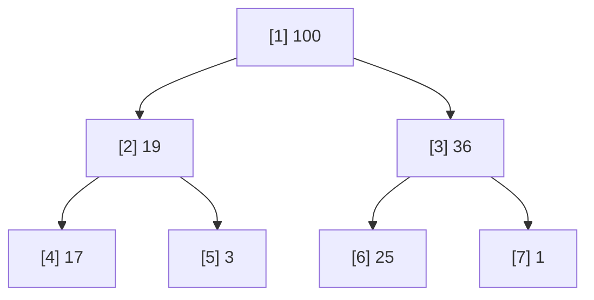
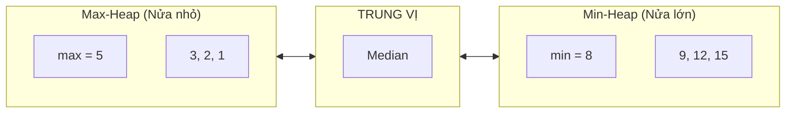
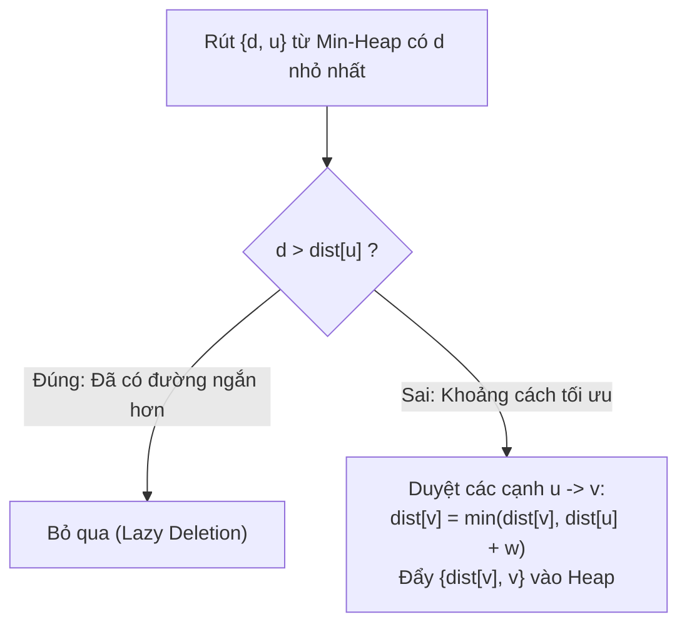

```mermaid
flowchart TD
    Root["Hệ thống Kiến thức: Priority Queue & Binary Heap"]

    Root --> HeapCore["1. Cấu trúc Đống Nhị phân (Binary Heap)"]
    HeapCore --> CBT["Cây nhị phân gần hoàn chỉnh & Ánh xạ mảng 1D (2i, 2i+1)"]
    HeapCore --> Ops["Thao tác Swim (vun lên) & Sink (vun xuống) O(log N)"]
    HeapCore --> BuildHeap["Thuật toán Build Heap tuyến tính O(N)"]
    HeapCore --> HeapSort["Thuật toán HeapSort O(N log N) in-place"]

    Root --> STLPQ["2. Khai thác std::priority_queue trong C++"]
    STLPQ --> MaxMinPQ["Max-Heap mặc định vs Min-Heap (greater<T>)"]
    STLPQ --> CustomCmp["Cạm bẫy đảo chiều so sánh trong Custom Comparator"]
    STLPQ --> LazyErase["Kỹ thuật Xóa trễ (Lazy Deletion) trong Priority Queue"]

    Root --> ClassicApps["3. Các Kỹ thuật & Bài toán Kinh điển"]
    ClassicApps --> Median["Duy trì Trung vị Động bằng 2 Heaps đối đỉnh O(log N)"]
    ClassicApps --> KMerge["Hợp nhất K dãy sắp xếp (K-Way Merge) O(N log K)"]
    ClassicApps --> TopK["Tìm K phần tử lớn nhất/nhỏ nhất (Top-K) O(N log K)"]
    ClassicApps --> Dijkstra["Thuật toán Dijkstra tìm đường đi ngắn nhất O((V+E) log V)"]
    ClassicApps --> Huffman["Nối que gỗ tham lam & Mã hóa Huffman O(N log N)"]

    Root --> Pitfalls["4. Cạm bẫy Phòng thi & Tối ưu"]
    Pitfalls --> EmptyTop["Truy cập top()/pop() khi PQ rỗng (Undefined Behavior)"]
    Pitfalls --> DijkstraDups["Bẫy tràn bộ nhớ do lặp đỉnh thừa trong Dijkstra"]
    Pitfalls --> Overflow["Tràn số nguyên 64-bit khi liên tục cộng gộp các phần tử min"]
```

# ⚡ Chuyên đề: Hàng đợi Ưu tiên (Priority Queue) & Cấu trúc Đống (Binary Heap)

> **Tác giả:** Duc-Minh Vu | **Đơn vị:** SLSCM Lab — Faculty of Data Science and Artificial Intelligence (FDA), Đại học Kinh tế Quốc dân (NEU)  
> **Biên soạn:** Được hỗ trợ và soạn thảo bởi Agentic AI tool  
> **Bản quyền © 2026 Duc-Minh Vu.** Mọi quyền được bảo lưu. Tài liệu đào tạo và bồi dưỡng sinh viên Olympic Tin học / ICPC.

---



---

# 📖 PHẦN I: CẤU TRÚC ĐỐNG NHỊ PHÂN (BINARY HEAP)

## 1. Định nghĩa & Ánh xạ Mảng Tuyệt đẹp

Đống nhị phân (Binary Heap) là một **Cây nhị phân gần hoàn chỉnh (Complete Binary Tree)**: Mọi tầng của cây đều được lấp đầy hoàn toàn, ngoại trừ tầng cuối cùng có thể khuyết ở phía bên phải.

Nhờ tính chất này, Binary Heap có thể được biểu diễn hoàn hảo trên một **Mảng $1$ chiều** liên tục trong bộ nhớ mà **không cần bất kỳ con trỏ nào**:



### Công thức Ánh xạ Chỉ số (1-indexed):
Với nút tại chỉ số $i$:
- **Nút cha (Parent)**: $\lfloor i / 2 \rfloor$ (dịch bit: `i >> 1`)
- **Nút con trái (Left Child)**: $2i$ (dịch bit: `i << 1`)
- **Nút con phải (Right Child)**: $2i + 1$ (dịch bit: `(i << 1) | 1`)

### Phân loại:
1. **Max-Heap (Đống cực đại)**: Giá trị của mọi nút cha đều $\ge$ giá trị các nút con của nó:
   $$\forall i > 1: A[\text{Parent}(i)] \ge A[i]$$
   $\implies$ Phần tử lớn nhất luôn nằm tại **Gốc** ($A[1]$).
2. **Min-Heap (Đống cực tiểu)**: Giá trị của mọi nút cha đều $\le$ giá trị các nút con của nó:
   $$\forall i > 1: A[\text{Parent}(i)] \le A[i]$$
   $\implies$ Phần tử nhỏ nhất luôn nằm tại **Gốc** ($A[1]$).

---

## 2. Hai Thao tác Cốt lõi: Vun Lên (Swim) & Vun Xuống (Sink)

### 2.1. Vun Lên (Heapify Up / Swim) — Khi Thêm Phần tử
- **Tình huống**: Chèn phần tử mới vào cuối mảng ($A[N]$).
- **Thuật toán**: So sánh phần tử với nút cha. Nếu vi phạm tính chất Heap (ví dụ $A[i] > A[\text{parent}]$ trong Max-Heap), tráo đổi hai phần tử và tiếp tục nổi lên trên cho đến khi thỏa mãn tính chất Heap hoặc chạm gốc.
- **Độ phức tạp**: $O(\log N)$ (bằng chiều cao cây).

```cpp
void swim(int k) {
    while (k > 1 && heap[k / 2] < heap[k]) {
        swap(heap[k / 2], heap[k]);
        k = k / 2;
    }
}
```

---

### 2.2. Vun Xuống (Heapify Down / Sink) — Khi Xóa Đỉnh
- **Tình huống**: Cần loại bỏ phần tử ở gốc ($A[1]$).
- **Thuật toán**:
  1. Đưa phần tử cuối cùng $A[N]$ lên thay thế vị trí gốc $A[1]$, giảm kích thước heap đi $1$.
  2. So sánh nút hiện tại với hai nút con (chọn con lớn nhất trong Max-Heap). Nếu nút hiện tại nhỏ hơn nút con lớn nhất, tráo đổi với nút con đó và tiếp tục chìm xuống dưới.
- **Độ phức tạp**: $O(\log N)$.

```cpp
void sink(int k, int n) {
    while (2 * k <= n) {
        int j = 2 * k; // Con trái
        if (j < n && heap[j] < heap[j + 1]) ++j; // j trở thành con lớn nhất
        if (heap[k] >= heap[j]) break;           // Đã thỏa tính chất Heap
        swap(heap[k], heap[j]);
        k = j;
    }
}
```

---

## 3. Thuật toán Xây dựng Heap Tuyến tính $O(N)$ (Build Heap)

Làm thế nào để biến một mảng ngẫu nhiên $N$ phần tử thành một Heap?
- **Cách tiếp cận ngây thơ**: Lần lượt `insert` từng phần tử $\implies N \times O(\log N) = O(N \log N)$.
- **Thuật toán Vun từ Đáy lên (Bottom-up Build Heap)**:
  - Các nút từ $\lfloor N / 2 \rfloor + 1$ đến $N$ đều là **nút lá** $\to$ Bản thân chúng đã là các Heap hợp lệ có chiều cao $0$.
  - Ta chỉ cần duyệt từ nút cha cuối cùng $\lfloor N / 2 \rfloor$ lùi về gốc $1$, gọi `sink(i, N)` cho từng nút:
  ```cpp
  void buildHeap(int n) {
      for (int i = n / 2; i >= 1; --i) {
          sink(i, n);
      }
  }
  ```

### Chứng minh Toán học Độ phức tạp $O(N)$:
Số lượng nút tại độ cao $h$ tối đa là $\lceil N / 2^{h+1} \rceil$. Chi phí vun một nút tại độ cao $h$ là $O(h)$.
Tổng số thao tác:
$$T(N) = \sum_{h=0}^{\lfloor \log_2 N \rfloor} \frac{N}{2^{h+1}} O(h) = \frac{N}{2} \sum_{h=0}^{\infty} \frac{h}{2^h}$$
Chuỗi hình học đạo hàm:
$$\sum_{h=0}^{\infty} \frac{h}{2^h} = 2$$
$$\implies T(N) \le \frac{N}{2} \times 2 = O(N)$$
Thuật toán hoàn thành trong **thời gian tuyến tính $O(N)$**!

---

# 📖 PHẦN II: KHAI THÁC `std::priority_queue` TRONG C++ STL

Trong C++ STL, Hàng đợi ưu tiên được đóng gói sẵn trong thư viện `<queue>`:

```cpp
#include <queue>
```

## 1. Khai báo Cơ bản

```cpp
// 1. Max-Heap mặc định (phần tử lớn nhất nằm ở top)
priority_queue<int> max_pq;

// 2. Min-Heap (phần tử nhỏ nhất nằm ở top)
priority_queue<int, vector<int>, greater<int>> min_pq;

// 3. Min-Heap lưu cặp (khoảng cách, đỉnh) dùng trong Dijkstra
priority_queue<pair<int, int>, vector<pair<int, int>>, greater<pair<int, int>>> pq;
```

---

## 2. Cạm bẫy Đảo chiều So sánh (Custom Comparator Trap)

Đây là điểm gây nhầm lẫn nhiều nhất giữa `std::sort` và `std::priority_queue`:

> [!CAUTION]
> - Trong `std::sort(a, b)`: Trả về `true` khi $a$ đứng trước $b$ (toán tử `<` sinh dãy tăng dần).
> - Trong `std::priority_queue`: Hàm so sánh `comp(a, b)` mang ý nghĩa: *"Phần tử $a$ có độ ưu tiên THẤP HƠN phần tử $b$ hay không?"*
>   - Nếu `comp(a, b) == true`, phần tử $b$ sẽ được đẩy lên phía trước (gần đỉnh hơn $a$).
>   - Vì vậy, để tạo **Min-Heap**, ta phải dùng toán tử lớn hơn `>` (tức `greater<T>`)!

### Cách viết Custom Comparator Chuẩn xác:
```cpp
struct Edge {
    int u, v, weight;
};

// Ưu tiên cạnh có trọng số NHỎ NHẤT nổi lên top
struct CompareEdge {
    bool operator()(const Edge& a, const Edge& b) const {
        return a.weight > b.weight; // > tạo Min-Heap
    }
};

priority_queue<Edge, vector<Edge>, CompareEdge> pq;
```

---

## 3. Kỹ thuật Xóa Trễ (Lazy Deletion) trong Priority Queue

`std::priority_queue` không hỗ trợ xóa một phần tử bất kỳ nằm giữa hàng đợi trong $O(\log N)$.  
Để giải quyết bài toán cần xóa động một phần tử $X$ (ví dụ: cập nhật khoảng cách trong Dijkstra, cửa sổ trượt), ta có hai giải pháp:

### Cách 1: Sử dụng 2 Priority Queues (Dual Heaps)
Duy trì `pq` chính chứa các phần tử thực và `del_pq` chứa các phần tử đã bị đánh dấu xóa:
```cpp
template<typename T>
struct RemovablePQ {
    priority_queue<T> pq, del_pq;

    void push(T x) { pq.push(x); }
    void erase(T x) { del_pq.push(x); }

    void clean() {
        while (!del_pq.empty() && pq.top() == del_pq.top()) {
            pq.pop();
            del_pq.pop();
        }
    }

    T top() { clean(); return pq.top(); }
    void pop() { clean(); pq.pop(); }
    bool empty() { clean(); return pq.empty(); }
    int size() { return pq.size() - del_pq.size(); }
};
```

---

# 📖 PHẦN III: CÁC DẠNG BÀI KINH ĐIỂN TRONG LẬP TRÌNH THI ĐẤU

## 1. Duy trì Trung vị Động bằng Hai Heaps (Running Median)

Cho luồng dữ liệu số nguyên liên tục, sau mỗi phần tử hãy trả về trung vị hiện tại của toàn bộ dãy số trong $O(\log N)$.



### Chiến thuật Phân bổ:
- `max_heap`: Lưu giữ nửa các số nhỏ hơn ($\le \text{median}$).
- `min_heap`: Lưu giữ nửa các số lớn hơn ($\ge \text{median}$).
- **Bất biến Cân bằng**:
  $$0 \le \text{size}(\text{max\_heap}) - \text{size}(\text{min\_heap}) \le 1$$
- **Tính toán Trung vị**:
  - Nếu tổng số phần tử lẻ: $\text{Median} = \text{max\_heap.top()}$.
  - Nếu tổng số phần tử chẵn: $\text{Median} = \frac{\text{max\_heap.top()} + \text{min\_heap.top()}}{2.0}$.

---

## 2. Hợp nhất $K$ Dãy đã Sắp xếp (K-Way Merge)

Cho $K$ mảng đã được sắp xếp tăng dần với tổng số $N$ phần tử. Hợp nhất chúng thành một mảng tăng dần duy nhất.

### Thuật toán Min-Heap:
1. Đưa phần tử đầu tiên của cả $K$ mảng vào Min-Heap: Lưu bộ ba `(giá trị, chỉ số mảng, chỉ số phần tử)`.
2. Lặp $N$ lần:
   - Rút phần tử nhỏ nhất từ Heap, ghi nhận vào mảng kết quả.
   - Lấy phần tử kế tiếp trong cùng mảng vừa rút, đẩy vào Heap.
- **Độ phức tạp**: $O(N \log K)$ thời gian, $O(K)$ bộ nhớ phụ trợ.

---

## 3. Thuật toán Dijkstra Tìm Đường đi Ngắn nhất

Trên đồ thị có hướng với trọng số không âm, thuật toán Dijkstra sử dụng Min-Heap để luôn mở rộng đỉnh có khoảng cách tạm thời ngắn nhất:



> [!IMPORTANT]
> **Tối ưu Bắt buộc trong ICPC**: Khi đẩy `{dist[v], v}` vào heap, ta không thể sửa giá trị cũ trong `std::priority_queue`. Do đó, một đỉnh $v$ có thể xuất hiện nhiều lần trong Heap. Khi rút `{d, u}` ra, **bắt buộc phải kiểm tra**:
> ```cpp
> if (d > dist[u]) continue; // Bỏ qua bản ghi cũ đã lỗi thời
> ```
> Nếu không có dòng lệnh này, thuật toán có thể dính TLE hoặc bùng nổ bộ nhớ trên đồ thị dày!

---

## 4. Tham lam Ghép que gỗ & Cây Mã hóa Huffman

Cho $N$ thanh gỗ với độ dài khác nhau. Mỗi bước chọn 2 thanh gỗ bất kỳ ghép lại, chi phí bằng tổng độ dài của chúng. Tìm chi phí tối thiểu để ghép tất cả thành 1 thanh duy nhất.
- **Chiến lược Tham lam (Huffman)**: Luôn luôn ghép **2 thanh có độ dài nhỏ nhất** hiện có!
- Sử dụng Min-Heap: Rút 2 phần tử nhỏ nhất $A$ và $B$, cộng chi phí $A + B$, rồi đẩy lại $A + B$ vào Min-Heap.
- Lặp lại $N - 1$ lần. Tổng thời gian: $O(N \log N)$.

---

# ⚠️ PHẦN IV: CẠM BẪY PHÒNG THI & QUY TẮC BẤT BIẾN

### 1. Bẫy Lấy phần tử từ Priority Queue Rỗng
- Gọi `pq.top()` hoặc `pq.pop()` khi `pq.empty() == true` dẫn đến **Undefined Behavior (SIGSEGV / Phán quyết RE)**.
- Luôn kiểm tra: `if (!pq.empty())`.

### 2. Bẫy Tràn số Nguyên khi Ghép Đống (Integer Overflow)
- Trong bài toán nối que gỗ hoặc Huffman, dù các phần tử ban đầu $\le 10^9$ (vừa vặn kiểu `int`), tổng chi phí tích lũy sau $N$ lần cộng có thể vượt quá $2 \times 10^9$ rất xa.
- Luôn sử dụng `long long` cho mảng dữ liệu và `priority_queue<long long, vector<long long>, greater<long long>>`.

### 3. Phân biệt Bảng Tra cứu Cấu trúc Cực trị

| Cấu trúc | Lấy Min/Max | Thêm phần tử | Xóa Min/Max | Tìm kiếm phần tử $X$ | Bộ nhớ / Node |
| :--- | :---: | :---: | :---: | :---: | :---: |
| **`std::priority_queue`** | $O(1)$ | $O(\log N)$ | $O(\log N)$ | $O(N)$ (Không hỗ trợ) | $0$ byte overhead (Mảng phẳng) |
| **`std::set` / `multiset`** | $O(1)$ | $O(\log N)$ | $O(\log N)$ | $O(\log N)$ | $32-48$ bytes (Cây RBT) |
| **Monotonic Deque** | $O(1)$ | $O(1)$ amortized | $O(1)$ amortized | Không hỗ trợ | Dành riêng cho cửa sổ trượt cố định |

---

# 📚 TÀI LIỆU THAM KHẢO & ĐỌC THÊM

1. **Thomas H. Cormen et al. (CLRS)** — *Chapter 6: Heapsort (Binary Heaps & Priority Queues)*.
2. **Robert Sedgewick** — *Algorithms 4th Edition (Priority Queues & Index Min-Heap)*.
3. **CSES Problem Set**:
   - *Shortest Routes I & II (Dijkstra)*.
   - *Room Allocation*.
   - *Stick Lengths*.
4. **LeetCode Curated Problems**:
   - *Problem 295: Find Median from Data Stream*.
   - *Problem 23: Merge k Sorted Lists*.
   - *Problem 215: Kth Largest Element in an Array*.

---

<div align="center">

<a href="https://www.neu.edu.vn" target="_blank"></a>
&nbsp;&nbsp;&nbsp;&nbsp;&nbsp;&nbsp;&nbsp;&nbsp;&nbsp;&nbsp;&nbsp;&nbsp;
<a href="https://www.fda.neu.edu.vn" target="_blank"></a>
&nbsp;&nbsp;&nbsp;&nbsp;&nbsp;&nbsp;&nbsp;&nbsp;&nbsp;&nbsp;&nbsp;&nbsp;
<a href="https://www.facebook.com/slscm.lab" target="_blank"></a>

<br/><br/>

**Competitive Programming Handbook**  
*SLSCM Lab — Faculty of Data Science and Artificial Intelligence (FDA) — National Economics University (NEU)*  
*Tài liệu được soạn thảo và tối ưu bởi Agentic AI tool*  
© 2026 Duc-Minh Vu. Toàn bộ bản quyền được bảo lưu.

</div>
