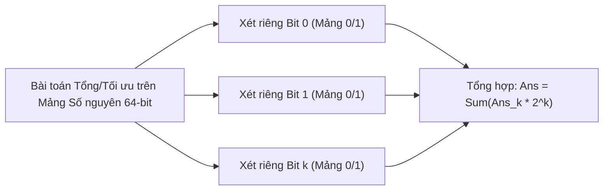
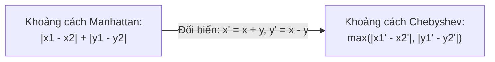

```mermaid
flowchart TD
    Root["Tư duy Thiết kế Thuật toán: Phân rã & Quy đổi"]

    Root --> Decomp["1. Kỹ thuật Phân rã (Problem Decomposition)"]
    Decomp --> DimIndep["Độc lập Chiều không gian: Tách 2D thành hai bài toán 1D"]
    Decomp --> BitIndep["Độc lập từng Bit: Xét độc lập 60 bits trong số học nhị phân"]
    Decomp --> Contrib["Kỹ thuật Tính Đóng góp (Contribution to the Sum) O(N)"]

    Root --> Reduction["2. Quy đổi về Bài toán Tương đương (Reduction)"]
    Reduction --> OptToDec["Tối ưu sang Quyết định: Chặt nhị phân trên tập nghiệm"]
    Reduction --> GraphRed["Quy đổi Đồ thị: Trạng thái trò chơi -> DAG, Hiệu -> Đường đi ngắn nhất"]
    Reduction --> MathTrans["Biến đổi Toán học: Xoay tọa độ 45 độ (Manhattan sang Chebyshev)"]
    Reduction --> BinaryTrans["Biến đổi Nhị phân Hóa: Thay mảng giá trị bằng tập {-1, +1}"]

    Root --> Invariants["3. Bất biến (Invariants) & Tính Đơn điệu"]
    Invariants --> Parity["Bất biến Tính Chẵn Lẻ (Parity Invariant / 15-Puzzle)"]
    Invariants --> Monotone["Bất biến Thứ tự & Cửa sổ Trượt mở rộng đơn điệu"]

    Root --> Pitfalls["4. Cạm bẫy Tư duy & Phương pháp Tiếp cận"]
    Pitfalls --> Overcomplicate["Bẫy phức tạp hóa: Cố giải trực tiếp bài toán tổng quát"]
    Pitfalls --> ExtremeCheck["Kiểm tra trường hợp suy biến (Degenerate / Edge Cases)"]
```

# ⚡ Chuyên đề: Chiến lược Phân tích & Thiết kế Thuật toán — Phân rã, Quy đổi & Biến đổi Tương đương

> **Tác giả:** Duc-Minh Vu | **Đơn vị:** SLSCM Lab — Faculty of Data Science and Artificial Intelligence (FDA), Đại học Kinh tế Quốc dân (NEU)  
> **Biên soạn:** Được hỗ trợ và soạn thảo bởi Agentic AI tool  
> **Bản quyền © 2026 Duc-Minh Vu.** Mọi quyền được bảo lưu. Tài liệu đào tạo và bồi dưỡng sinh viên Olympic Tin học / ICPC.

---

---

# 📖 PHẦN I: TRIẾT LÝ THIẾT KẾ THUẬT TOÁN — NGUYÊN LÝ PÓLYA

Trong giải quyết vấn đề đỉnh cao (ICPC, Olympic), **80% thời gian** dành cho việc phân tích, trừu tượng hóa và biến đổi đề bài trước khi dòng code đầu tiên được viết.  
Nhà toán học lừng danh George Pólya trong tác phẩm kinh điển *"How to Solve It"* đã đúc kết 4 bước vàng:

1. **Thấu hiểu vấn đề**: Dữ liệu vào là gì? Điều kiện biên là gì? Mục tiêu cần tìm là gì?
2. **Tìm mối liên hệ (Quy đổi & Biến đổi)**:
   - *"Bạn đã từng gặp bài toán này ở dạng tương tự chưa?"*
   - *"Bạn có thể giải được một bài toán con đơn giản hơn của nó không?"*
   - *"Nếu bỏ bớt một ràng buộc thì bài toán trở thành gì?"*
3. **Thực thi kế hoạch**: Hiện thực hóa giải thuật bằng code tối ưu.
4. **Nhìn lại & Đánh giá**: Kiểm tra phản ví dụ, độ phức tạp thời gian/không gian.

---

# 📖 PHẦN II: KỸ THUẬT PHÂN RÃ BÀI TOÁN (PROBLEM DECOMPOSITION)

Khi một bài toán có quá nhiều chiều biến thiên hoặc dữ liệu tương tác phức tạp, kỹ thuật **Phân rã (Decomposition)** chia tách bài toán lớn thành các bài toán con **hoàn toàn độc lập** với nhau.

## 1. Độc lập Chiều Không gian (Dimensional Independence)

Nhiều bài toán trên mặt phẳng 2D hoặc không gian 3D trông có vẻ phức tạp nhưng bản chất chuyển động hoặc khoảng cách trên các trục tọa độ lại **hoàn toàn độc lập**.

### Ví dụ Kinh điển: Điểm Hội tụ Tối ưu (Optimal Meeting Point)
Cho $N$ ngôi nhà tại các tọa độ $(x_i, y_i)$. Tìm một điểm $(X, Y)$ sao cho tổng khoảng cách Manhattan tới tất cả các ngôi nhà là nhỏ nhất:
$$\min_{(X, Y)} \sum_{i=1}^N \Big( \lvert x_i - X \rvert + \lvert y_i - Y \rvert \Big)$$

- **Quan sát Phân rã**:
  $$\sum_{i=1}^N \Big( \lvert x_i - X \rvert + \lvert y_i - Y \rvert \Big) = \left( \sum_{i=1}^N \lvert x_i - X \rvert \right) + \left( \sum_{i=1}^N \lvert y_i - Y \rvert \right)$$
- Hai biểu thức con hoàn toàn độc lập với nhau!
- Bài toán 2D tách rời thành **hai bài toán 1D độc lập**:
  - Tìm $X$ tối thiểu hóa $\sum \lvert x_i - X \rvert \implies X$ chính là **Trung vị (Median)** của dãy $x_i$!
  - Tìm $Y$ tối thiểu hóa $\sum \lvert y_i - Y \rvert \implies Y$ chính là **Trung vị (Median)** của dãy $y_i$!
- **Độ phức tạp**: Từ thử mọi tọa độ $O(Grid)$ giảm xuống chỉ còn $O(N \log N)$ (do sắp xếp).

---

## 2. Kỹ thuật Độc lập từng Bit (Bitwise Independence)

Trong các bài toán liên quan đến phép toán bit (`AND`, `OR`, `XOR`), giá trị của mỗi bit thứ $k$ ($0 \le k \le 60$) trong kết quả **hoàn toàn không ảnh hưởng đến các bit khác**.

### Ví dụ: Tính tổng XOR của mọi cặp phần tử
Cho mảng $A$ gồm $N$ phần tử ($A_i \le 10^9$). Tính:
$$S = \sum_{i=1}^N \sum_{j=i+1}^N (A_i \oplus A_j)$$
- **Cách ngây thơ**: Duyệt mọi cặp $O(N^2) \to$ TLE khi $N = 2 \cdot 10^5$.
- **Phân rã Bit**: Với mỗi vị trí bit $k \in [0, 30]$:
  - Cặp $(A_i, A_j)$ có bit thứ $k$ của $A_i \oplus A_j$ bằng $1$ khi và chỉ khi một số có bit $k$ bằng $1$ và số kia có bit $k$ bằng $0$.
  - Đếm số lượng phần tử có bit $k$ bằng $1$ (gọi là $C_1$) và bit $k$ bằng $0$ (gọi là $C_0 = N - C_1$).
  - Số cặp đóng góp vào bit $k$ là $C_1 \times C_0$.
  - Giá trị đóng góp: $2^k \times (C_1 \times C_0)$.
  - Tổng đáp án:
    $$S = \sum_{k=0}^{30} 2^k \cdot \Big( C_1^{(k)} \cdot C_0^{(k)} \Big)$$
- **Độ phức tạp**: Giảm ngoạn mục từ $O(N^2)$ xuống **$O(30 \cdot N)$**!

---

## 3. Kỹ thuật Đổi Thứ tự Lấy Tổng — Tính Đóng góp (Contribution Technique)

Thay vì duyệt qua từng cấu hình (tất cả các mảng con, tập con, đường đi) rồi tính giá trị của chúng:
$$\text{Ans} = \sum_{\text{cấu hình } C} \text{Giá trị}(C)$$
Ta đổi góc nhìn: **Hỏi mỗi phần tử $X$ đóng góp vào bao nhiêu cấu hình hợp lệ?**
$$\text{Ans} = \sum_{\text{phần tử } X} \text{Giá trị}(X) \times \Big( \text{Số cấu hình chứa } X \Big)$$

### Ví dụ: Tổng Giá trị Nhỏ nhất của Mọi Mảng Con (Sum of Subarray Minimums)
Cho mảng $A$ gồm $N$ số. Tính tổng phần tử nhỏ nhất của mọi mảng con liên tiếp:
$$S = \sum_{1 \le L \le R \le N} \min(A[L \dots R])$$
- Có $O(N^2)$ mảng con $\implies$ Tính trực tiếp mất $O(N^2)$ hoặc $O(N^3)$.
- **Góc nhìn Đóng góp**: Phần tử $A[i]$ là phần tử nhỏ nhất trong những mảng con nào?
  - Gọi $L_i$ là khoảng cách từ $i$ sang trái tới phần tử nhỏ hơn gần nhất.
  - Gọi $R_i$ là khoảng cách từ $i$ sang phải tới phần tử nhỏ hơn gần nhất.
  - Số lượng mảng con nhận $A[i]$ làm phần tử nhỏ nhất là $L_i \times R_i$.
  - Đóng góp của $A[i]$ vào tổng là:
    $$\text{Contrib}(A[i]) = A[i] \times (L_i \times R_i)$$
  - Dùng **Monotone Stack** tìm $L_i, R_i$ trong $O(1)$ khấu hao $\implies$ Tổng thời gian **$O(N)$**!

---

# 📖 PHẦN III: KỸ THUẬT QUY ĐỔI BÀI TOÁN TƯƠNG ĐƯƠNG (PROBLEM REDUCTION)

Quy đổi bài toán (Reduction) là nghệ thuật chuyển đổi một bài toán lạ, chưa biết cách giải $P_1$ về một bài toán quen thuộc $P_2$ đã có lời giải tối ưu.

## 1. Chuyển Tối ưu hóa sang Quyết định (Optimization to Decision)

Bài toán: *"Tìm giá trị $X$ nhỏ nhất/lớn nhất thỏa mãn điều kiện."*  
Kỹ thuật: Nếu bài toán có **tính chất đơn điệu** (Monotonicity), ta quy đổi bài toán tối ưu thành bài toán quyết định:
$$\text{Hỏi: } \text{Với giá trị } X \text{ cố định, có phương án nào khả thi (VALID) hay không?}$$

- Bài toán kiểm tra tính khả thi `check(X)` thường chỉ cần thuật toán tham lam đơn giản trong $O(N)$.
- Áp dụng **Tìm kiếm Nhị phân trên Tập nghiệm (Binary Search on Answer)**:
  - Độ phức tạp: $O(N \log(\text{Max} - \text{Min}))$.

---

## 2. Phép Xoay Hệ Tọa độ 45 Độ: Manhattan sang Chebyshev

### Đặt vấn đề:
Khoảng cách Manhattan giữa hai điểm $A(x_1, y_1)$ và $B(x_2, y_2)$ là:
$$D_{\text{Manhattan}}(A, B) = \lvert x_1 - x_2 \rvert + \lvert y_1 - y_2 \rvert$$
Dấu giá trị tuyệt đối hai chiều phụ thuộc vào nhau, khiến việc tìm khoảng cách lớn nhất giữa $N$ điểm đòi hỏi $O(N^2)$.

### Biến đổi Toạ độ Vi diệu:
Thực hiện phép đổi biến xoay trục tọa độ một góc $45^\circ$ và phóng đại $\sqrt{2}$ lần:
$$x' = x + y$$
$$y' = x - y$$

### Đồng nhất thức Toán học:
$$\lvert x_1 - x_2 \rvert + \lvert y_1 - y_2 \rvert = \max\Big( \lvert x_1' - x_2' \rvert, \; \lvert y_1' - y_2' \rvert \Big)$$

### Ứng dụng: Tìm Khoảng cách Manhattan Lớn nhất giữa $N$ điểm trong $O(N)$
$$\max_{i, j} D_{\text{Manhattan}}(P_i, P_j) = \max \Big( \max(x') - \min(x'), \; \max(y') - \min(y') \Big)$$
Chỉ cần tìm $\max, \min$ của mảng tọa độ mới trong đúng **$O(N)$** một lượt duyệt!

---

## 3. Kỹ thuật Nhị phân Hóa Giá trị: Quy đổi về Mảng $\{-1, +1\}$

### Đặt vấn đề:
Tìm đoạn con có **Trung vị (Median)** $\ge X$. Vì các giá trị số nguyên trong mảng phân tán, việc tính toán trung vị trên từng đoạn con rất nặng.

### Kỹ thuật Biến đổi:
So sánh từng phần tử của mảng $A$ với ngưỡng $X$:
$$B[i] = \begin{cases} +1 & \text{nếu } A[i] \ge X \\ -1 & \text{nếu } A[i] < X \end{cases}$$

### Định lý Tương đương:
$$\text{Trung vị của đoạn } A[L \dots R] \ge X \iff \sum_{i=L}^R B[i] \ge 0$$
- Bài toán tìm trung vị phức tạp được quy đổi hoàn toàn về **Bài toán tìm đoạn con có tổng lớn hơn hoặc bằng $0$ trên mảng số nguyên $\{-1, +1\}$**!
- Bài toán trên mảng hiệu này có thể giải trong $O(N)$ bằng Mảng tiền tố (Prefix Sums) và Min Prefix Sum.

---

# 📖 PHẦN IV: NGUYÊN LÝ BẤT BIẾN (INVARIANTS)

Trong nhiều bài toán biến đổi trò chơi hoặc kiểm tra trạng thái đích, việc mô phỏng từng bước sẽ dính TLE hoặc vòng lặp vô tận.  
**Nguyên lý Bất biến**: Tìm một đại lượng $I(S)$ không bao giờ thay đổi sau bất kỳ thao tác biến đổi hợp lệ nào.

### Ví dụ: Bài toán Trò chơi 15-Puzzle & Nghịch thế
Cho bảng số $4 \times 4$. Mỗi bước được trượt ô trống cạnh một ô số. Trạng thái $A$ có thể chuyển thành trạng thái $B$ được hay không?
- **Đại lượng Bất biến**:
  $$I = (\text{Số lượng nghịch thế của mảng các ô số}) + (\text{Chỉ số hàng của ô trống}) \pmod 2$$
- Dù bạn trượt ô trống theo bất kỳ cách nào, giá trị $I \pmod 2$ **luôn luôn không đổi**!
- Hai trạng thái có thể chuyển đổi được cho nhau khi và chỉ khi chúng có cùng tính chẵn lẻ của $I$.
- Kiểm tra tính khả thi trong $O(16 \log 16) = O(1)$ mà không cần chạy bất kỳ thuật toán tìm kiếm nào!

---

# ⚠️ PHẦN V: CÁC DẠNG QUY ĐỔI ĐỒ THỊ KINH ĐIỂN TRONG ICPC

| Bài toán Ban đầu | Quy đổi về Bài toán Đồ thị | Thuật toán Giải |
| :--- | :--- | :---: |
| Trò chơi hai người luân phiên (Nim, DAG games) | Đồ thị có hướng không chu trình (DAG) | Trò chơi Sprague-Grundy / Mex |
| Hệ bất phương trình hiệu: $X_u - X_v \le W$ | Tìm đường đi ngắn nhất đồ thị có hướng | Bellman-Ford / SPFA |
| Ghép cặp hai tập hợp tối ưu | Đồ thị hai phía (Bipartite Matching) | Hopcroft-Karp / Max Flow Dinic |
| Phủ tập hợp với ràng buộc logic mệnh đề (2-SAT) | Thành phần liên thông mạnh (SCC) | Thuật toán Tarjan / Kosaraju |

---

# 📚 TÀI LIỆU THAM KHẢO & ĐỌC THÊM

1. **George Pólya (1945)** — *How to Solve It: A New Aspect of Mathematical Method*.
2. **Thomas H. Cormen et al. (CLRS)** — *Chapter 34: NP-Completeness & Reduction Techniques*.
3. **Codeforces Edu**:
   - [Manhattan to Chebyshev Transformation](https://codeforces.com/blog/entry/57534).
   - [Binary Search on Answer & Medians Transformation](https://codeforces.com/blog/entry/75765).
4. **CSES Problem Set**:
   - *Factory Machines (Binary Search on Answer)*.
   - *Array Division*.
   - *Flight Discount (Graph State Expansion)*.

---

&nbsp;&nbsp;&nbsp;&nbsp;&nbsp;&nbsp;&nbsp;&nbsp;&nbsp;&nbsp;&nbsp;&nbsp;

&nbsp;&nbsp;&nbsp;&nbsp;&nbsp;&nbsp;&nbsp;&nbsp;&nbsp;&nbsp;&nbsp;&nbsp;

  

**Competitive Programming Handbook**  
*SLSCM Lab — Faculty of Data Science and Artificial Intelligence (FDA) — National Economics University (NEU)*  
*Tài liệu được soạn thảo và tối ưu bởi Agentic AI tool*  
© 2026 Duc-Minh Vu. Toàn bộ bản quyền được bảo lưu.

