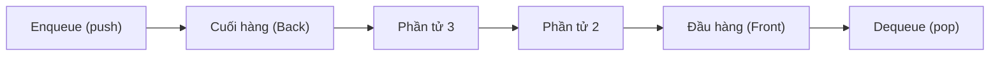
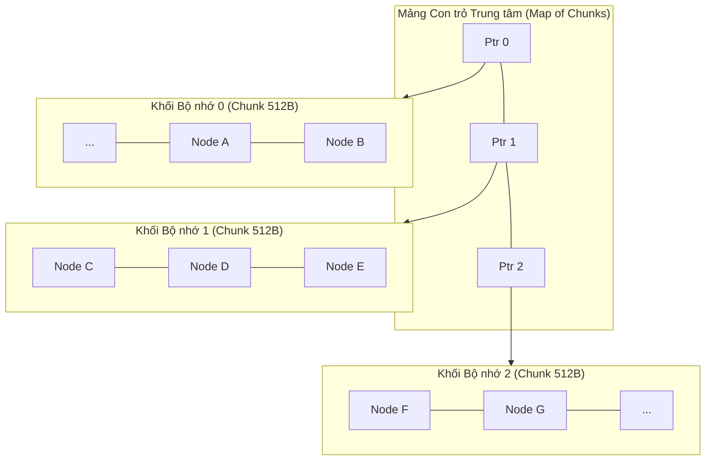
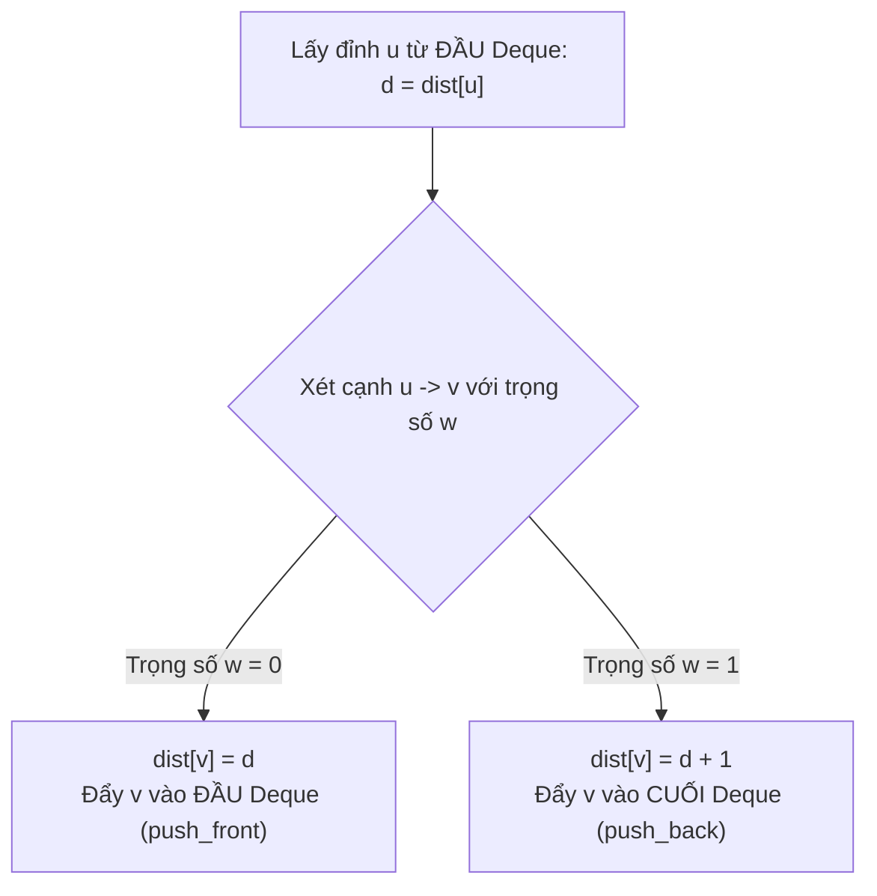
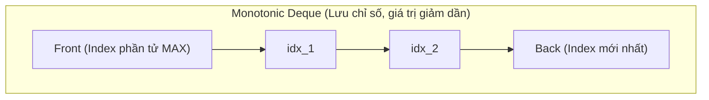

```mermaid
flowchart TD
    Root["Hệ thống Kiến thức: Queue, Deque & Monotonic Queue"]

    Root --> StdQueue["1. Hàng đợi Tiêu chuẩn (Standard Queue)"]
    StdQueue --> FIFO["Nguyên lý FIFO (First-In, First-Out) O(1)"]
    StdQueue --> StaticQ["Hàng đợi Vòng trên Mảng tĩnh (Circular Array Queue)"]
    StdQueue --> TwoStackQ["Mô phỏng Queue bằng 2 Stacks & Min-Queue O(1)"]
    StdQueue --> BFS["Thuật toán BFS: Đường đi ngắn nhất không trọng số"]

    Root --> StdDeque["2. Hàng đợi Hai đầu (Double-Ended Queue - Deque)"]
    StdDeque --> DequeArch["Bản chất Bộ nhớ: Mảng các khối liên tục (Chunk Map)"]
    StdDeque --> DequeOps["push_front, push_back, pop_front, pop_back O(1)"]
    StdDeque --> ZeroOneBFS["Kỹ thuật 0-1 BFS: Tối ưu đồ thị trọng số {0, 1} O(V + E)"]

    Root --> MonoQueue["3. Hàng đợi Đơn điệu (Monotonic Deque)"]
    MonoQueue --> Amortized["Độ phức tạp Khấu hao O(N): Mỗi phần tử vào/ra deque tối đa 1 lần"]
    MonoQueue --> SlidingMax["Sliding Window Maximum / Minimum O(N)"]
    MonoQueue --> StoreIdx["Kỹ thuật lưu trữ chỉ số (Index) quản lý độ dài cửa sổ"]

    Root --> DPOpt["4. Tối ưu Quy hoạch Động bằng Monotonic Deque"]
    DPOpt --> DPPattern["Dạng bài: DP[i] = max(DP[j] + C[j]) với i - K <= j < i"]
    DPOpt --> ReduceTime["Tối ưu từ O(N * K) xuống O(N) tuyến tính"]

    Root --> Pitfalls["5. Cạm bẫy Phòng thi & Tối ưu Bộ nhớ"]
    Pitfalls --> EmptyPop["Lỗi front()/pop() khi Queue rỗng (Undefined Behavior)"]
    Pitfalls --> ExpireCheck["Quên loại bỏ phần tử hết hạn cửa sổ (Out of Window)"]
    Pitfalls --> DequeMem["Nguy cơ MLE khi khai báo vector gồm nhiều deque rỗng"]
```

# ⚡ Chuyên đề: Hàng đợi (Queue), Hàng đợi Hai đầu (Deque) & Monotonic Queue

> **Tác giả:** Duc-Minh Vu | **Đơn vị:** SLSCM Lab — Faculty of Data Science and Artificial Intelligence (FDA), Đại học Kinh tế Quốc dân (NEU)  
> **Biên soạn:** Được hỗ trợ và soạn thảo bởi Agentic AI tool  
> **Bản quyền © 2026 Duc-Minh Vu.** Mọi quyền được bảo lưu. Tài liệu đào tạo và bồi dưỡng sinh viên Olympic Tin học / ICPC.

---



---

# 📖 PHẦN I: HÀNG ĐỢI TIÊU CHUẨN (STANDARD QUEUE)

## 1. Nguyên lý FIFO & Các Thao tác Cơ bản

Hàng đợi (Queue) là cấu trúc dữ liệu tuyến tính tuân thủ nguyên lý **FIFO (First-In, First-Out — Vào trước, Ra trước)**: Phần tử nào được thêm vào trước sẽ là phần tử đầu tiên được lấy ra.



### Các Thao tác trong C++ STL (`std::queue`)

| Thao tác | Cú pháp C++ | Ý nghĩa | Độ phức tạp |
| :--- | :--- | :--- | :---: |
| Thêm phần tử | `q.push(x)` | Đưa $x$ vào cuối hàng đợi (Back) | $O(1)$ |
| Xóa phần tử | `q.pop()` | Loại bỏ phần tử ở đầu hàng đợi (Front) | $O(1)$ |
| Lấy đầu | `q.front()` | Trả về tham chiếu tới phần tử đầu tiên | $O(1)$ |
| Lấy cuối | `q.back()` | Trả về tham chiếu tới phần tử cuối cùng | $O(1)$ |
| Kích thước | `q.size()` | Số lượng phần tử hiện có | $O(1)$ |
| Kiểm tra rỗng | `q.empty()` | Trả về `true` nếu rỗng | $O(1)$ |

---

## 2. Hàng đợi Vòng trên Mảng tĩnh (Circular Array Queue) trong ICPC

Trong các bài toán yêu cầu hàng triệu thao tác hoặc thời gian chạy cực kỳ gắt gao ($< 0.1$s), cài đặt Queue bằng mảng tĩnh với con trỏ xoay vòng (Circular Buffer) cho tốc độ vượt trội hơn `std::queue`:

```cpp
template<typename T, int MAXN>
struct FastQueue {
    T data[MAXN];
    int head = 0, tail = 0;

    void clear() { head = tail = 0; }
    bool empty() const { return head == tail; }
    int size() const { return tail - head; }
    void push(const T& val) { data[tail++] = val; }
    void pop() { ++head; }
    T front() const { return data[head]; }
};
```
*(Nếu kích thước mảng hữu hạn cần quay vòng, ta dùng phép chia dư `tail = (tail + 1) % MAXN`).*

---

## 3. Cài đặt Hàng đợi bằng 2 Ngăn xếp & Min-Queue $O(1)$

Làm thế nào để xây dựng một Hàng đợi hỗ trợ lấy giá trị nhỏ nhất `getMin()` trong thời gian **$O(1)$**?  
Ta sử dụng kỹ thuật kết hợp **2 Ngăn xếp Đơn điệu (Two Monotonic Stacks)**:
- `stack_in`: Nhận các phần tử mới được `push`. Mỗi phần tử lưu kèm giá trị $\min$ tính từ đáy stack lên.
- `stack_out`: Phục vụ thao tác `pop` và `front`.
- Khi `stack_out` rỗng, ta lần lượt `pop` toàn bộ phần tử từ `stack_in` và `push` sang `stack_out` (thứ tự tự động đảo ngược từ LIFO thành FIFO).
- **Độ phức tạp**: Khấu hao **Amortized $O(1)$** cho mọi thao tác (`push`, `pop`, `getMin`).

```cpp
struct MinQueue {
    stack<pair<int, int>> s_in, s_out; // Lưu {giá trị, min_hiện_tại}

    void push(int x) {
        int mn = s_in.empty() ? x : min(x, s_in.top().second);
        s_in.push({x, mn});
    }

    void transfer() {
        if (s_out.empty()) {
            while (!s_in.empty()) {
                int val = s_in.top().first;
                s_in.pop();
                int mn = s_out.empty() ? val : min(val, s_out.top().second);
                s_out.push({val, mn});
            }
        }
    }

    void pop() {
        transfer();
        if (!s_out.empty()) s_out.pop();
    }

    int front() {
        transfer();
        return s_out.top().first;
    }

    int getMin() {
        if (s_in.empty()) return s_out.top().second;
        if (s_out.empty()) return s_in.top().second;
        return min(s_in.top().second, s_out.top().second);
    }
};
```

---

# 📖 PHẦN II: HÀNG ĐỢI HAI ĐẦU (DOUBLE-ENDED QUEUE — DEQUE)

## 1. Bản chất Kiến trúc Bộ nhớ của `std::deque`

Nhiều lập trình viên lầm tưởng `std::deque` là danh sách liên kết đôi (Doubly Linked List). **Thực tế hoàn toàn không phải vậy!**



- `std::deque` gồm một **mảng con trỏ trung tâm** quản lý các **khối bộ nhớ liên tục cố định (Chunks/Pages, thường là 512 bytes)**.
- **Ưu điểm**:
  - `push_front` và `push_back` đều có chi phí $O(1)$ tuyệt đối, **không bao giờ phải sao chép toàn bộ dữ liệu** sang vùng nhớ mới như `std::vector`.
  - Truy cập ngẫu nhiên qua chỉ số `dq[i]` đạt $O(1)$ bằng công thức: `Chunk_Index = i / CHUNK_SIZE`, `Offset = i % CHUNK_SIZE`.
- **Nhược điểm & Cạm bẫy Bộ nhớ**:
  - Mỗi `std::deque` rỗng vẫn tốn khoảng $48 - 80$ bytes cho con trỏ quản lý map và chunks.
  - ❌ **Tránh tuyệt đối**: Khai báo `vector<deque<int>> adj(N)` với $N = 10^5$, dung lượng bộ nhớ sẽ bùng nổ lên hàng chục MB dù chưa có dữ liệu $\to$ Dễ dính lỗi **Memory Limit Exceeded (MLE)**!

---

## 2. Kỹ thuật 0-1 BFS (Breadth-First Search với Trọng số 0 và 1)

### Đặt vấn đề
Cho đồ thị có hướng hoặc vô hướng, trong đó trọng số của mỗi cạnh chỉ có thể là **$0$ hoặc $1$**. Hãy tìm đường đi ngắn nhất từ đỉnh nguồn $S$ tới mọi đỉnh.
- Nếu dùng Dijkstra: $O((V + E) \log V)$ với chi phí hàng đợi ưu tiên.
- **Kỹ thuật 0-1 BFS**: Đạt độ phức tạp tối ưu **$O(V + E)$** bằng cách thay thế Priority Queue bằng `std::deque`.



### Chứng minh Tính đúng đắn
Tại mọi thời điểm, các giá trị khoảng cách trong `deque` chỉ chênh lệch nhau tối đa $1$ đơn vị và luôn có dạng:
$$\underbrace{d, d, \dots, d}_{\text{ở đầu}}, \underbrace{d+1, d+1, \dots, d+1}_{\text{ở cuối}}$$
- Đi qua cạnh $0$: Khoảng cách mới là $d$, đẩy vào đầu $\implies$ Bảo toàn tính đơn điệu không giảm.
- Đi qua cạnh $1$: Khoảng cách mới là $d + 1$, đẩy vào cuối $\implies$ Bảo toàn tính đơn điệu không giảm.
$\implies$ Mỗi đỉnh được duyệt theo thứ tự khoảng cách tăng dần, đảm bảo đường đi tìm được là ngắn nhất trong $O(V + E)$.

### Cài đặt Chuẩn 0-1 BFS C++20:
```cpp
const int INF = 1e9;

vector<int> zeroOneBFS(int n, int src, const vector<vector<pair<int, int>>>& adj) {
    vector<int> dist(n + 1, INF);
    deque<int> dq;

    dist[src] = 0;
    dq.push_back(src);

    while (!dq.empty()) {
        int u = dq.front();
        dq.pop_front();

        for (auto& [v, w] : adj[u]) {
            if (dist[u] + w < dist[v]) {
                dist[v] = dist[u] + w;
                if (w == 0) {
                    dq.push_front(v); // Cạnh 0: ưu tiên xét ngay lập tức
                } else {
                    dq.push_back(v);  // Cạnh 1: xét ở lượt kế tiếp
                }
            }
        }
    }
    return dist;
}
```

---

# 📖 PHẦN III: HÀNG ĐỢI ĐƠN ĐIỆU (MONOTONIC DEQUE / MONOTONE QUEUE)

## 1. Bài toán Cửa sổ Trượt Cực trị (Sliding Window Maximum)

Cho mảng số nguyên $A$ gồm $N$ phần tử và số nguyên $K$ ($1 \le K \le N$). Với mỗi vị trí cửa sổ kích thước $K$ trượt từ trái sang phải, tìm giá trị lớn nhất trong cửa sổ đó.

### Ý tưởng Cốt lõi
Khi trượt cửa sổ sang phải, phần tử mới $A[i]$ đi vào cửa sổ:
- Nếu trong cửa sổ hiện tại có một phần tử $A[j]$ ($j < i$) mà $A[j] \le A[i]$, thì $A[j]$ **sẽ không bao giờ có cơ hội trở thành giá trị lớn nhất nữa**, vì:
  1. $A[j]$ nhỏ hơn hoặc bằng $A[i]$.
  2. $A[j]$ nằm ở vị trí cũ hơn, sẽ bị trượt ra khỏi cửa sổ trước $A[i]$!
- Vì vậy, ta có thể **loại bỏ vĩnh viễn** $A[j]$ ra khỏi cấu trúc dữ liệu!



### Thuật toán Duy trì Monotonic Deque
Duy trì một `deque<int>` lưu trữ **chỉ số (indices)** của các phần tử sao cho giá trị tương ứng trong mảng $A[\text{index}]$ luôn **giảm dần nghiêm ngặt**:
1. **Loại bỏ phần tử hết hạn (Out of Window)**:
   Nếu `dq.front() <= i - K`, phần tử đầu hàng đợi đã nằm ngoài phạm vi cửa sổ hiện tại $\to$ gọi `dq.pop_front()`.
2. **Duy trì tính đơn điệu giảm**:
   Trước khi đẩy $i$ vào cuối deque:
   ```cpp
   while (!dq.empty() && A[dq.back()] <= A[i]) {
       dq.pop_back(); // Loại bỏ các phần tử yếu thế hơn
   }
   dq.push_back(i);
   ```
3. **Lấy đáp án**: Khi $i \ge K - 1$, phần tử lớn nhất trong cửa sổ luôn nằm tại `A[dq.front()]`.

### Phân tích Độ phức tạp Khấu hao (Amortized Analysis)
- Mỗi chỉ số từ $0$ đến $N - 1$ được đưa vào deque đúng $1$ lần bằng `push_back`.
- Mỗi chỉ số bị loại khỏi deque tối đa $1$ lần (hoặc qua `pop_front` do hết hạn, hoặc qua `pop_back` do vi phạm tính đơn điệu).
- Tổng số thao tác trên deque trong toàn bộ thuật toán $\le 2N$.
- **Độ phức tạp thời gian**: **$O(N)$ tuyến tính tuyệt đối** (nhanh hơn $O(N \log K)$ của Segment Tree / Heap gấp nhiều lần)!
- **Độ phức tạp không gian**: $O(K)$ bộ nhớ phụ trợ.

---

# 📖 PHẦN IV: TỐI ƯU QUY HOẠCH ĐỘNG BẰNG MONOTONIC DEQUE

## 1. Dạng Truy hồi Kinh điển

Nhiều bài toán quy hoạch động trên dãy số có công thức trạng thái:
$$DP[i] = \max_{i - K \le j < i} \{ DP[j] + C[j] \} + W[i]$$
Trong đó:
- $K$ là giới hạn bước nhảy tối đa.
- $C[j]$ là giá trị chỉ phụ thuộc vào trạng thái trước $j$.
- $W[i]$ là chi phí tại bước hiện tại $i$.

### Đánh giá Độ phức tạp
- Nếu duyệt $j$ tuần tự: Mỗi bước tốn $O(K) \implies$ Tổng thời gian $O(N \cdot K)$ (Dễ dính TLE khi $N, K \le 10^5$).
- Nhận xét: Đại lượng cần tìm cực đại là $F(j) = DP[j] + C[j]$ với $j$ nằm trong một cửa sổ trượt có kích thước $K$ kết thúc tại $i - 1$.
- Áp dụng Monotonic Deque để duy trì $\max F(j)$ trong $O(1)$ mỗi bước $\implies$ **Thời gian giảm ngoạn mục xuống $O(N)$**!

---

# ⚠️ PHẦN V: CẠM BẪY PHÒNG THI & QUY TẮC BẤT BIẾN

### 1. Bẫy Truy cập Hàng đợi Rỗng (SIGSEGV / Undefined Behavior)
- Gọi `q.front()`, `q.back()` hoặc `q.pop()` khi `q.empty() == true` dẫn đến hành vi không xác định, gây phán quyết `Runtime Error (RE)` trên máy chấm.
- Luôn kiểm tra: `if (!q.empty())` trước khi truy cập hoặc xóa.

### 2. Bẫy Lưu Giá trị thay vì Lưu Chỉ số (Index)
- Trong Monotonic Deque cho cửa sổ trượt, **bắt buộc phải lưu chỉ số `i`** thay vì giá trị `A[i]`. Nếu chỉ lưu giá trị, bạn sẽ không thể kiểm tra xem phần tử ở đầu hàng đợi đã hết hạn trượt ra khỏi cửa sổ hay chưa (`dq.front() <= i - K`).

### 3. Dấu So sánh trong Monotonic Deque: `<` hay `<=`?
- Khi tìm **Max**: Dùng `A[dq.back()] <= A[i]` để loại bỏ các phần tử nhỏ hơn hoặc bằng. Giữ dấu `<=` giúp deque gọn hơn, loại bỏ các phần tử trùng lặp sớm hơn.
- Khi tìm **Min**: Dùng `A[dq.back()] >= A[i]`.

---

# 📚 TÀI LIỆU THAM KHẢO & ĐỌC THÊM

1. **CP-Algorithms**:
   - [Minimum stack / Minimum queue](https://cp-algorithms.com/data_structures/stack_queue_modification.html).
   - [0-1 BFS Shortest Path](https://cp-algorithms.com/graph/01_bfs.html).
2. **LeetCode Curated Problems**:
   - *Problem 239: Sliding Window Maximum*.
   - *Problem 1425: Constrained Subsequence Sum*.
   - *Problem 862: Shortest Subarray with Sum at Least K*.
3. **CSES Problem Set**:
   - *Labyrinth (BFS)*.
   - *Monsters (Multi-source BFS)*.

---

<div align="center">

<a href="https://www.neu.edu.vn" target="_blank"></a>
&nbsp;&nbsp;&nbsp;&nbsp;&nbsp;&nbsp;&nbsp;&nbsp;&nbsp;&nbsp;&nbsp;&nbsp;
<a href="https://www.fda.neu.edu.vn" target="_blank"></a>
&nbsp;&nbsp;&nbsp;&nbsp;&nbsp;&nbsp;&nbsp;&nbsp;&nbsp;&nbsp;&nbsp;&nbsp;
<a href="https://www.facebook.com/slscm.lab" target="_blank"></a>

<br/><br/>

**Competitive Programming Handbook**  
*SLSCM Lab — Faculty of Data Science and Artificial Intelligence (FDA) — National Economics University (NEU)*  
*Tài liệu được soạn thảo và tối ưu bởi Agentic AI tool*  
© 2026 Duc-Minh Vu. Toàn bộ bản quyền được bảo lưu.

</div>
