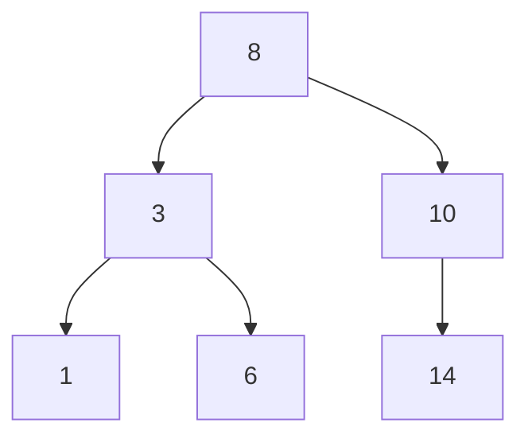
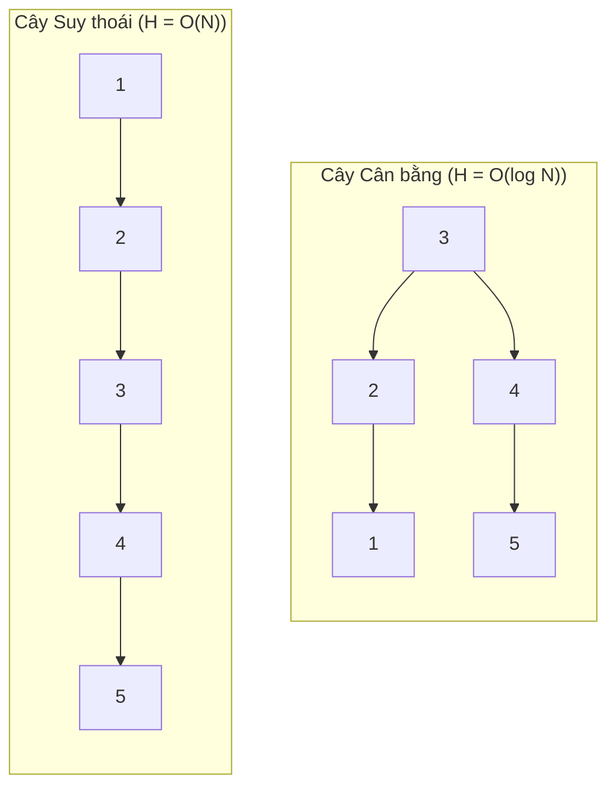
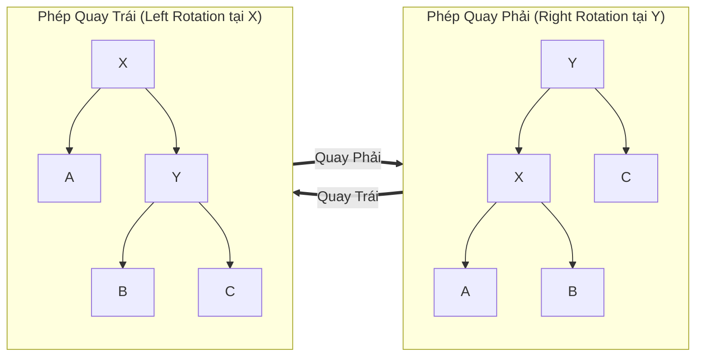
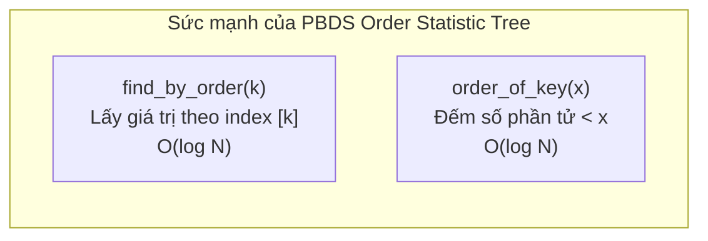

```mermaid
flowchart TD
    Root["Hệ thống Kiến thức: Set, Map & Balanced BST"]

    Root --> BSTCore["1. Cây Tìm kiếm Nhị phân (BST) & Giới hạn"]
    BSTCore --> Prop["Tính chất BST: Left < Node < Right, In-order ra dãy tăng"]
    BSTCore --> Degen["Hiện tượng Suy thoái O(N) khi dữ liệu có thứ tự"]
    BSTCore --> Rot["Phép quay cây (Left / Right Rotation) bảo toàn thứ tự O(1)"]

    Root --> BalancedTrees["2. Các Cấu trúc Cây Cân bằng (Balanced BST)"]
    BalancedTrees --> RBT["Cây Đỏ - Đen (Red-Black Tree): Nền tảng của std::set / map"]
    BalancedTrees --> AVL["Cây AVL: Cân bằng nghiêm ngặt chênh lệch chiều cao <= 1"]
    BalancedTrees --> Treap["Treap: Cây Cartesian ngẫu nhiên hóa (BST + Heap)"]

    Root --> STLUsage["3. Khai thác Chuyên sâu STL std::set & std::map"]
    STLUsage --> BoundTrap["Cạm bẫy lower_bound: s.lower_bound(x) O(log N) vs std::lower_bound O(N)"]
    STLUsage --> MultiErase["Bẫy multiset.erase: Xóa theo giá trị vs Xóa theo iterator"]
    STLUsage --> MapDefault["Bẫy map operator[] tự động chèn giá trị mặc định"]

    Root --> PBDS["4. GNU C++ PBDS: Order Statistic Tree"]
    PBDS --> FindOrder["find_by_order(k): Tìm phần tử nhỏ thứ k trong O(log N)"]
    PBDS --> OrderKey["order_of_key(x): Đếm số lượng phần tử < x trong O(log N)"]
    PBDS --> MultisetPBDS["Cài đặt PBDS Ordered Multiset chuẩn xác trong CP"]

    Root --> AntiHash["5. So sánh std::map vs std::unordered_map"]
    AntiHash --> WorstCase["O(log N) tuyệt đối vs O(1) trung bình nhưng dễ bị Hack O(N^2)"]
    AntiHash --> CustomHash["Kỹ thuật Custom Hash (splitmix64) chống Anti-hash Test Cases"]
```

# ⚡ Chuyên đề: Tập hợp (Set), Ánh xạ (Map) & Cây Tìm kiếm Nhị phân Cân bằng (Balanced BST)

> **Tác giả:** Duc-Minh Vu | **Đơn vị:** SLSCM Lab — Faculty of Data Science and Artificial Intelligence (FDA), Đại học Kinh tế Quốc dân (NEU)  
> **Biên soạn:** Được hỗ trợ và soạn thảo bởi Agentic AI tool  
> **Bản quyền © 2026 Duc-Minh Vu.** Mọi quyền được bảo lưu. Tài liệu đào tạo và bồi dưỡng sinh viên Olympic Tin học / ICPC.

---



---

# 📖 PHẦN I: CÂY TÌM KIẾM NHỊ PHÂN (BST) & NGUYÊN LÝ CÂN BẰNG

## 1. Cấu trúc Cây Tìm kiếm Nhị phân Thuần túy (Standard BST)

Cây tìm kiếm nhị phân (Binary Search Tree — BST) là cây nhị phân thỏa mãn tính chất:
$$\forall u \in \text{Cây con trái}(X): \text{Key}(u) < \text{Key}(X)$$
$$\forall v \in \text{Cây con phải}(X): \text{Key}(v) > \text{Key}(X)$$



### Tính chất Vàng
1. **Duyệt trung thứ tự (In-order Traversal: Left $\to$ Root $\to$ Right)** trên BST luôn sinh ra một dãy khóa **tăng dần nghiêm ngặt**.
2. Tìm giá trị nhỏ nhất: Rẽ trái liên tục đến node lá cùng bên trái.
3. Tìm giá trị lớn nhất: Rẽ phải liên tục đến node lá cùng bên phải.

---

## 2. Thảm họa Suy thoái (Degeneracy) và Động lực Cân bằng

Nếu ta lần lượt chèn một dãy số đã được sắp xếp tăng dần vào BST thuần túy ($1, 2, 3, 4, 5$):
- Cây không phân nhánh mà biến thành một **Danh sách liên kết đơn dài ngoằng**.
- Chiều cao cây: $H = N$.
- Độ phức tạp các thao tác `Search`, `Insert`, `Delete` rơi tự do từ lý tưởng $O(\log N)$ xuống thảm họa **$O(N)$**.
- Trong các kỳ thi CP, test cases độc hại (Anti-BST tests) sẽ ngay lập tức khiến giải thuật dính lỗi **Time Limit Exceeded (TLE)**.



---

## 3. Phép Quay Cây (Tree Rotations) — Chìa khóa Cân bằng

Phép quay là thao tác biến đổi cấu trúc cục bộ trong thời gian **$O(1)$**, làm thay đổi chiều cao các nhánh nhưng **bảo toàn tuyệt đối tính chất thứ tự của BST**:



Bất biến thứ tự được giữ nguyên trước và sau khi quay:
$$A < X < B < Y < C$$

---

# 📖 PHẦN II: CÂY ĐỎ - ĐEN (RED-BLACK TREE) — NỀN TẢNG CỦA C++ STL

Trong Thư viện Chuẩn C++ (STL), cả `std::set`, `std::map`, `std::multiset`, `std::multimap` đều được cài đặt dưới nền tảng là **Cây Đỏ - Đen (Red-Black Tree — RBT)**.

## 1. 5 Tính chất Bất biến của Cây Đỏ - Đen
1. Mỗi nút có màu hoặc **Đỏ (RED)** hoặc **Đen (BLACK)**.
2. Nút gốc (Root) luôn luôn có màu **Đen**.
3. Tất cả các lá ảo (`NIL` / `nullptr`) đều là nút **Đen**.
4. Nếu một nút có màu **Đỏ**, thì cả hai nút con của nó bắt buộc phải có màu **Đen** *(Không bao giờ xuất hiện hai nút Đỏ liền kề trên cùng một đường đi)*.
5. Với mọi nút $u$, mọi đường đi đơn từ $u$ xuống bất kỳ lá ảo `NIL` nào đều chứa **cùng một số lượng nút Đen** (gọi là *Black-Height* $bh(u)$).

### Định lý Chiều cao (Height Bound Theorem)
Nhờ tính chất (4) và (5), đường đi dài nhất từ gốc tới một lá (gồm xen kẽ Đỏ-Đen) không thể dài quá **gấp đôi** đường đi ngắn nhất (chỉ toàn nút Đen).
Một cây Đỏ - Đen chứa $N$ nút trong luôn có chiều cao:
$$H \le 2 \log_2(N + 1)$$
$\implies$ **Mọi thao tác tìm kiếm, chèn, xóa trên `std::set` và `std::map` đều được cam kết độ phức tạp trường hợp xấu nhất là $O(\log N)$**.

---

# 📖 PHẦN III: KHAI THÁC `std::set` & `std::map` VÀ CÁC CẠM BẪY PHÒNG THI

## 1. Tìm kiếm Nhị phân trên Set: Cạm bẫy $O(N)$ vs $O(\log N)$

Đây là một trong những lỗi kinh điển nhất khiến thí sinh bị TLE cay đắng:

> [!CAUTION]
> - ❌ **Tuyệt đối không dùng**: `std::lower_bound(s.begin(), s.end(), x)`
>   - Iterator của `std::set` là **Bidirectional Iterator** (không phải Random Access). Hàm thuật toán tự do `std::lower_bound` buộc phải duyệt tuần tự từng bước (`++it`), dẫn đến độ phức tạp **$O(N)$**!
> - ✅ **Bắt buộc phải dùng**: `s.lower_bound(x)` và `s.upper_bound(x)`
>   - Phương thức thành viên của chính `std::set` di chuyển trực tiếp trên các nhánh con trỏ của Red-Black Tree, đạt tốc độ chuẩn xác **$O(\log N)$**.

| Cú pháp | Ý nghĩa toán học | Độ phức tạp |
| :--- | :--- | :---: |
| `auto it = s.lower_bound(x);` | Tìm phần tử nhỏ nhất $\ge x$ | $O(\log N)$ |
| `auto it = s.upper_bound(x);` | Tìm phần tử nhỏ nhất $> x$ | $O(\log N)$ |
| `if (it != s.begin()) prev(it);` | Tìm phần tử lớn nhất $< x$ (hoặc $\le x$) | $O(1)$ bước lùi |

---

## 2. Cạm bẫy `multiset.erase()`: Xóa 1 phần tử hay Xóa sạch?

Trong `std::multiset`, một giá trị có thể xuất hiện nhiều lần. Sự khác biệt giữa truyền **giá trị** và truyền **iterator** là cực kỳ lớn:

```cpp
multiset<int> ms = {5, 5, 5, 2, 8};

// Cạm bẫy 1: Xóa theo GIÁ TRỊ -> XÓA SẠCH TOÀN BỘ CÁC BẢN SAO!
ms.erase(5); 
// Kết quả: ms chỉ còn {2, 8} (tất cả các số 5 bị xóa sạch, mất O(K + log N))

// Kỹ thuật Chuẩn: Chỉ xóa ĐÚNG 1 PHẦN TỬ (Single Instance)
auto it = ms.find(5);
if (it != ms.end()) {
    ms.erase(it); // Chỉ truyền iterator!
}
// Kết quả: ms còn {5, 5, 2, 8} trong thời gian O(log N)
```

---

## 3. Cạm bẫy `std::map`: Toán tử `operator[]` tự sinh phần tử

```cpp
map<int, int> mp;
// Chỉ muốn kiểm tra xem key 10 có tồn tại không:
if (mp[10] == 0) { ... } 
```
> [!WARNING]
> Khi gọi `mp[10]`, nếu khóa $10$ chưa có trong map, C++ sẽ **tự động chèn một node mới** với `key = 10` và `value = 0` vào cây RBT! Điều này:
> 1. Làm tăng kích thước map `mp.size()`.
> 2. Gây tốn thêm bộ nhớ và làm chậm các thao tác về sau.
> 3. Để kiểm tra sự tồn tại mà không chèn, luôn dùng: `if (mp.count(10))` hoặc `if (mp.find(10) != mp.end())`.

---

## 4. Kỹ thuật Quản lý Khoảng Động (Interval Set)

Trong nhiều bài toán ICPC/OLP (như bài phủ sóng, thêm đoạn, hợp nhất đoạn thẳng), ta cần lưu các đoạn rời rạc không giao nhau $[L_i, R_i]$.
Sử dụng `std::set<pair<int, int>>` sắp xếp theo đầu mút $L$, ta có thể tìm đoạn chứa điểm $x$ hoặc chèn một đoạn mới $[L, R]$ và gộp tất cả các đoạn bị giao nhau trong $O(\log N)$ khấu hao:

```cpp
struct IntervalSet {
    set<pair<int, int>> s; // Lưu (L, R) rời rạc

    void insert(int L, int R) {
        auto it = s.upper_bound({L, 2e9});
        if (it != s.begin() && prev(it)->second >= L) {
            --it; // Đoạn trước bị giao hoặc chạm
        }
        while (it != s.end() && it->first <= R) {
            L = min(L, it->first);
            R = max(R, it->second);
            it = s.erase(it); // Gỡ đoạn cũ trong O(1) amortized
        }
        s.insert({L, R});
    }
};
```

---

# 📖 PHẦN IV: GNU C++ PBDS — VŨ KHÍ BÍ MẬT: ORDER STATISTIC TREE

Hạn chế lớn nhất của `std::set` là: **Không hỗ trợ truy vấn phần tử theo thứ tự thứ hạng (Rank / Index)**:
- Muốn biết phần tử nhỏ thứ $k$ là gì? $\to$ `std::advance(s.begin(), k)` tốn $O(k)$ thời gian.
- Muốn biết có bao nhiêu phần tử nhỏ hơn $x$? $\to$ `std::distance(s.begin(), s.lower_bound(x))` tốn $O(N)$ thời gian!

Để khắc phục điều này trong $O(\log N)$, GNU C++ cung cấp thư viện **Policy-Based Data Structures (PBDS)**:

```cpp
#include <ext/pb_ds/assoc_container.hpp>
#include <ext/pb_ds/tree_policy.hpp>

using namespace __gnu_pbds;

// Khai báo Ordered Set lưu int tăng dần
typedef tree<
    int, 
    null_type, 
    less<int>, 
    rb_tree_tag, 
    tree_order_statistics_node_update
> ordered_set;
```

### 2 Hàm Thần thánh của PBDS:
1. `find_by_order(k)`: Trả về **iterator** trỏ tới phần tử nhỏ thứ $k$ (0-indexed) trong $O(\log N)$.
   - `*s.find_by_order(0)`: Phần tử nhỏ nhất.
   - `*s.find_by_order(s.size() - 1)`: Phần tử lớn nhất.
2. `order_of_key(x)`: Trả về **số lượng phần tử nghiêm ngặt nhỏ hơn $x$** trong $O(\log N)$.



### Kỹ thuật Cài đặt PBDS `ordered_multiset`
Nếu dùng `less_equal<int>`, hàm `lower_bound` của PBDS sẽ bị lỗi hành vi thành `upper_bound`, và `erase()` sẽ không hoạt động đúng.  
👉 **Chuẩn mực trong CP**: Lưu cặp `pair<int, int>` với thành phần thứ hai là ID duy nhất (hoặc timestamp):
```cpp
typedef tree<
    pair<int, int>, 
    null_type, 
    less<pair<int, int>>, 
    rb_tree_tag, 
    tree_order_statistics_node_update
> ordered_multiset;
```

---

# 📖 PHẦN V: `std::map` VS `std::unordered_map` & CHIẾN THUẬT ANTI-HASH

| Tiêu chí | `std::map` | `std::unordered_map` |
| :--- | :---: | :---: |
| **Cấu trúc dữ liệu** | Cây Đỏ - Đen (Balanced BST) | Bảng băm (Hash Table với Chaining) |
| **Thứ tự phần tử** | Luôn được sắp xếp theo khóa | Ngẫu nhiên, không xác định |
| **Thời gian Trung bình** | $O(\log N)$ | $O(1)$ |
| **Thời gian Xấu nhất** | $O(\log N)$ (Đảm bảo $100\%$) | **$O(N)$ khi dính trùng lặp băm (Hash Collision)** |
| **Bộ nhớ phụ trợ** | $32-48$ bytes / node | Mảng Bucket + Chaining nodes |

### Hiểm họa "Anti-Hash Test" trên Codeforces
Trên Codeforces, các bài toán có thể bị các thí sinh khác "hack" sau contest.
Hàm băm mặc định của `std::unordered_map<long long, int>` dùng toán tử chia dư với số nguyên tố cố định. Đối thủ có thể dễ dàng tạo ra $10^5$ số nguyên có cùng giá trị băm $\implies$ Bảng băm suy thoái thành danh sách liên kết $\implies$ Thời gian chạy vọt lên $O(N^2)$ và bị TLE!

### Giải pháp Custom Hash Chuẩn mực (Chống Hack Tuyệt đối):
```cpp
struct custom_hash {
    static uint64_t splitmix64(uint64_t x) {
        // Thuật toán băm ngẫu nhiên hóa phân phối đều
        x += 0x9e3779b97f4a7c15;
        x = (x ^ (x >> 30)) * 0xbf58476d1ce4e5b9;
        x = (x ^ (x >> 27)) * 0x94d049bb133111eb;
        return x ^ (x >> 31);
    }

    size_t operator()(uint64_t x) const {
        static const uint64_t FIXED_RANDOM = chrono::steady_clock::now().time_since_epoch().count();
        return splitmix64(x + FIXED_RANDOM);
    }
};

// Sử dụng an toàn tuyệt đối:
unordered_map<long long, int, custom_hash> safe_map;
```

---

# 📚 TÀI LIỆU THAM KHẢO & ĐỌC THÊM

1. **Thomas H. Cormen et al. (CLRS)** — *Chapter 12: Binary Search Trees & Chapter 13: Red-Black Trees*.
2. **GCC GNU Documentation** — *Policy-Based Data Structures (ext/pb_ds)*.
3. **Codeforces Edu**:
   - [Blowing up unordered_map with Anti-Hash Tests (by Neal Wu)](https://codeforces.com/blog/entry/62393).
4. **CSES Problem Set**:
   - *Sorting and Searching Track*: Concert Tickets, Traffic Lights, Room Allocation, Nested Ranges.

---

<div align="center">

<a href="https://www.neu.edu.vn" target="_blank"></a>
&nbsp;&nbsp;&nbsp;&nbsp;&nbsp;&nbsp;&nbsp;&nbsp;&nbsp;&nbsp;&nbsp;&nbsp;
<a href="https://www.fda.neu.edu.vn" target="_blank"></a>
&nbsp;&nbsp;&nbsp;&nbsp;&nbsp;&nbsp;&nbsp;&nbsp;&nbsp;&nbsp;&nbsp;&nbsp;
<a href="https://www.facebook.com/slscm.lab" target="_blank"></a>

<br/><br/>

**Competitive Programming Handbook**  
*SLSCM Lab — Faculty of Data Science and Artificial Intelligence (FDA) — National Economics University (NEU)*  
*Tài liệu được soạn thảo và tối ưu bởi Agentic AI tool*  
© 2026 Duc-Minh Vu. Toàn bộ bản quyền được bảo lưu.

</div>
