```mermaid
flowchart TD
    Root["Hệ thống Thuật toán Sắp xếp & Nghịch thế"]

    Root --> Classification["1. Phân loại Thuật toán Sắp xếp"]
    Classification --> Quad["Nhóm O(N^2): Bubble, Selection, Insertion"]
    Classification --> LogN["Nhóm O(N log N): Merge Sort, Quick Sort, Heap Sort"]
    Classification --> Linear["Nhóm Tuyến tính O(N): Counting Sort, Radix Sort"]
    Classification --> STL["Thư viện C++: std::sort (Introsort), nth_element"]

    Root --> Properties["2. Các Tính chất Cốt lõi"]
    Properties --> Stability["Tính Ổn định (Stability): Bảo toàn thứ tự khóa"]
    Properties --> InPlace["Không gian Tại chỗ (In-place): O(1) Memory"]
    Properties --> LowerBound["Giới hạn dưới Toán học: Omega(N log N) Decision Tree"]
    Properties --> StrictWeak["Strict Weak Ordering & Quy chuẩn Comparator"]

    Root --> Inversion["3. Chuyên đề Chuyên sâu: Nghịch thế (Inversions)"]
    Inversion --> Def["Định nghĩa: Cặp (i, j) với i < j và A[i] > A[j]"]
    Inversion --> Kendall["Khoảng cách Kendall tau: Số lần Swap liền kề tối thiểu"]
    Inversion --> Parity["Tính chẵn lẻ Hoán vị & Bài toán 15-Puzzle"]
    Inversion --> MergeCount["Đếm nghịch thế bằng Merge Sort O(N log N)"]
    Inversion --> BITCount["Đếm nghịch thế bằng Fenwick Tree (BIT) + Nén tọa độ"]

    Root --> Pitfalls["4. Cạm bẫy Phòng thi & Tối ưu"]
    Pitfalls --> TrapComp["Vi phạm Strict Weak Ordering (<= thay vì <)"]
    Pitfalls --> TrapOverflow["Tràn số 32-bit: Số nghịch thế đạt N(N-1)/2"]
    Pitfalls --> TrapPivot["QuickSort suy biến O(N^2) khi chọn Pivot xấu"]
```

# ⚡ Chuyên đề: Các Thuật toán Sắp xếp, Phân tích Tính chất & Thảo luận Chuyên sâu về Nghịch thế (Inversions)

> **Tác giả:** Duc-Minh Vu | **Đơn vị:** SLSCM Lab — Faculty of Data Science and Artificial Intelligence (FDA), Đại học Kinh tế Quốc dân (NEU)  
> **Biên soạn:** Được hỗ trợ và soạn thảo bởi Agentic AI tool  
> **Bản quyền © 2026 Duc-Minh Vu.** Mọi quyền được bảo lưu. Tài liệu đào tạo và bồi dưỡng sinh viên Olympic Tin học / ICPC.

---



---

# 📖 PHẦN I: PHÂN LOẠI & TỔNG QUAN CÁC THUẬT TOÁN SẮP XẾP

Sắp xếp (Sorting) là bài toán biến đổi một dãy $N$ phần tử $[A_0, A_1, \dots, A_{N-1}]$ thành một dãy hoán vị thỏa mãn $A_{\pi(0)} \le A_{\pi(1)} \le \dots \le A_{\pi(N-1)}$ theo một quan hệ thứ tự xác định.

---

## 1. Bảng So sánh Toàn diện các Thuật toán Sắp xếp Kinh điển

| Thuật toán | Thời gian Tốt nhất | Thời gian Trung bình | Thời gian Xấu nhất | Bộ nhớ phụ | Ổn định (Stable)? | Tại chỗ (In-place)? | Đặc điểm & Ứng dụng trong CP |
| :--- | :---: | :---: | :---: | :---: | :---: | :---: | :--- |
| **Bubble Sort** | $O(N)$ | $O(N^2)$ | $O(N^2)$ | $O(1)$ | ✅ Có | ✅ Có | Dễ nhớ, liên hệ trực tiếp với nghịch thế. |
| **Selection Sort** | $O(N^2)$ | $O(N^2)$ | $O(N^2)$ | $O(1)$ | ❌ Không | ✅ Có | Số lần hoán đổi ít nhất ($O(N)$ swaps). |
| **Insertion Sort** | $O(N)$ | $O(N^2)$ | $O(N^2)$ | $O(1)$ | ✅ Có | ✅ Có | Chạy cực nhanh trên mảng nhỏ ($N \le 16$). |
| **Merge Sort** | $O(N \log N)$ | $O(N \log N)$ | $O(N \log N)$ | $O(N)$ | ✅ Có | ❌ Không | Chia để trị, đếm nghịch thế, sắp xếp danh sách liên kết. |
| **Quick Sort** | $O(N \log N)$ | $O(N \log N)$ | $O(N^2)$ | $O(\log N)$ | ❌ Không | ✅ Có | Tốc độ thực tế nhanh nhất do tối ưu CPU Cache. |
| **Heap Sort** | $O(N \log N)$ | $O(N \log N)$ | $O(N \log N)$ | $O(1)$ | ❌ Không | ✅ Có | Đảm bảo $O(N \log N)$ không cần bộ nhớ phụ. |
| **Counting Sort** | $O(N + K)$ | $O(N + K)$ | $O(N + K)$ | $O(K)$ | ✅ Có | ❌ Không | Dành cho miền giá trị nhỏ $K \le 10^7$. |
| **Radix Sort** | $O(d(N + B))$ | $O(d(N + B))$ | $O(d(N + B))$ | $O(N + B)$ | ✅ Có | ❌ Không | Sắp xếp số nguyên 32/64-bit theo từng byte. |
| **std::sort (C++)** | $O(N \log N)$ | $O(N \log N)$ | $O(N \log N)$ | $O(\log N)$ | ❌ Không | ✅ Có | **Introsort**: Kết hợp QuickSort, HeapSort & InsertionSort. |
| **std::stable_sort**| $O(N \log N)$ | $O(N \log N)$ | $O(N \log N)$ | $O(N)$ | ✅ Có | ❌ Không | Merge Sort thích nghi khi cần bảo toàn thứ tự. |

---

## 2. Nhóm Thuật toán $O(N^2)$ (Quadratic Sorts)

1. **Bubble Sort (Sắp xếp nổi bọt):**
   - Quét qua mảng, liên tục hoán đổi hai phần tử kề nhau nếu chúng sai thứ tự. Sau vòng quét thứ $i$, phần tử lớn thứ $i$ sẽ "nổi" về đúng vị trí cuối cùng.
   - *Tính chất quan trọng:* Mỗi lần hoán đổi kề làm giảm chính xác **đúng 1 nghịch thế** trong mảng.
2. **Selection Sort (Sắp xếp chọn):**
   - Tại bước $i$, quét tìm phần tử nhỏ nhất trong đoạn $[i, N-1]$ rồi hoán đổi về vị trí $i$.
   - *Ưu điểm:* Thực hiện tối đa đúng $N - 1$ phép hoán đổi bộ nhớ.
3. **Insertion Sort (Sắp xếp chèn):**
   - Xây dựng dần dãy đã sắp xếp bằng cách chèn phần tử $A[i]$ vào đúng vị trí trong đoạn đã sắp $[0, i-1]$.
   - *Tính chất thích ứng (Adaptive):* Nếu mảng đã sắp xếp sẵn, thuật toán chỉ mất $O(N)$ so sánh và $0$ phép dịch chuyển.

---

## 3. Nhóm Thuật toán $O(N \log N)$ (Divide & Conquer / Heap)

### 3.1. Merge Sort (Sắp xếp trộn)
- **Tư tưởng:** Chia đôi mảng thành 2 nửa bằng nhau, đệ quy sắp xếp từng nửa, sau đó **trộn (merge)** 2 dãy đã sắp xếp lại thành 1 dãy duy nhất trong $O(N)$.
- **Phương trình đệ quy:** $T(N) = 2T(N/2) + O(N) \implies T(N) = O(N \log N)$.
- **Ưu điểm lớn nhất:** Luôn đảm bảo thời gian $O(N \log N)$ trong mọi trường hợp (không có trường hợp xấu nhất) và có **tính ổn định (Stable)**.

### 3.2. Quick Sort (Sắp xếp nhanh)
- **Tư tưởng:** Chọn một phần tử làm chốt (**Pivot**). Phân hoạch mảng sao cho tất cả các phần tử $\le \text{Pivot}$ nằm bên trái, và các phần tử $> \text{Pivot}$ nằm bên phải. Đệ quy sắp xếp hai nửa.
- **Kỹ thuật chọn Pivot ngẫu nhiên (Randomized Pivot):** Chọn ngẫu nhiên một chỉ số trong đoạn $[L, R]$ đổi chỗ với chốt để tránh trường hợp xấu nhất $O(N^2)$ khi dữ liệu bị đối thủ cố tình cấu trúc sẵn (Anti-quicksort test cases).

### 3.3. Introsort — Bí mật đằng sau `std::sort` của C++ STL
Thư viện chuẩn C++ `std::sort` không phải là QuickSort đơn thuần, mà là giải thuật lai **Introsort (Introspective Sort)**:
1. Ban đầu chạy **QuickSort** để đạt tốc độ tối đa nhờ CPU Cache.
2. Theo dõi độ sâu đệ quy: Nếu độ sâu vượt quá $2 \lfloor \log_2 N \rfloor$ (dấu hiệu QuickSort suy biến thành $O(N^2)$), thuật toán lập tức tự động chuyển sang **HeapSort** để bảo toàn cận trên $O(N \log N)$.
3. Khi kích thước đoạn con nhỏ hơn $16$ phần tử, thuật toán chuyển sang **InsertionSort** vì chi phí overhead hàm đệ quy lớn hơn phép chèn tuyến tính.

---

# 🧠 PHẦN II: CÁC TÍNH CHẤT GIẢI THUẬT & GIỚI HẠN TOÁN HỌC

## 1. Tính Ổn định (Stability) là gì và Khi nào Cần thiết?

Một thuật toán sắp xếp được gọi là **ổn định (Stable)** nếu nó **bảo toàn thứ tự xuất hiện ban đầu** của các phần tử có giá trị bằng nhau:
$$\text{Nếu } A[i] = A[j] \text{ và } i < j \implies \text{Sau khi sort, } A[i] \text{ vẫn đứng trước } A[j].$$

```text
Danh sách ban đầu:   [(An, 9), (Bình, 8), (Cường, 9), (Dũng, 7)]
Sort ổn định theo điểm: [(Dũng, 7), (Bình, 8), (An, 9), (Cường, 9)]  -> An vẫn trước Cường!
Sort KHÔNG ổn định:    [(Dũng, 7), (Bình, 8), (Cường, 9), (An, 9)]  -> Cường bị nhảy lên trước!
```

> [!IMPORTANT]
> **Ứng dụng của Sắp xếp Ổn định trong CP:**
> - Khi cần sắp xếp dữ liệu theo **nhiều tiêu chí kế tiếp nhau (Multi-key Sorting)**: Sắp xếp theo tiêu chí phụ trước, sau đó dùng thuật toán Stable Sort để sắp xếp theo tiêu chí chính.
> - Trong C++, khi cần tính ổn định, bắt buộc dùng **`std::stable_sort`** thay vì `std::sort`.

---

## 2. Chứng minh Giới hạn Dưới Toán học $\Omega(N \log N)$ (Decision Tree Lower Bound)

Một câu hỏi kinh điển: *Liệu có thể tạo ra một thuật toán sắp xếp dựa trên so sánh (Comparison Sort) có độ phức tạp $O(N)$ trong trường hợp xấu nhất hay không?*  
**Câu trả lời: KHÔNG THỂ!**

### Chứng minh bằng Cây Quyết định (Decision Tree):
1. Một mảng $N$ phần tử phân biệt có đúng **$N!$ hoán vị** có thể xảy ra. Thuật toán sắp xếp phải phân biệt được chính xác hoán vị nào trong số $N!$ hoán vị đó là dãy đã sắp xếp.
2. Mỗi phép so sánh $A[i] \le A[j]$ chỉ có đúng 2 kết quả: Đúng hoặc Sai (nhị phân).
3. Do đó, quá trình thực thi của mọi thuật toán so sánh có thể mô hình hóa thành một **Cây nhị phân quyết định (Binary Decision Tree)**, trong đó:
   - Mỗi nút trong là một phép so sánh.
   - Mỗi nút lá (leaf) đại diện cho một kết quả hoán vị đã sắp xếp.
4. Một cây nhị phân có độ cao $h$ (số phép so sánh trong trường hợp xấu nhất) có tối đa $2^h$ nút lá. Để bao phủ được toàn bộ $N!$ hoán vị khả dĩ:
   $$2^h \ge N! \iff h \ge \log_2(N!)$$
5. Áp dụng **Công thức xấp xỉ Stirling** ($\ln(N!) \approx N \ln N - N$):
   $$h \ge \sum_{i=1}^N \log_2 i \ge \sum_{i=\lceil N/2 \rceil}^N \log_2\left(\frac{N}{2}\right) = \frac{N}{2} (\log_2 N - 1) = \mathbf{\Omega(N \log N)}$$

$$\implies \text{Mọi thuật toán sắp xếp so sánh đều cần ít nhất } \mathbf{\Omega(N \log N)} \text{ phép so sánh!}$$

---

## 3. Quy tắc Thiết lập Hàm So sánh (Strict Weak Ordering trong C++)

Khi viết hàm so sánh (Comparator) tùy chỉnh cho `std::sort`, hàm `comp(a, b)` phải mô phỏng quan hệ toán học **nhỏ hơn nghiêm ngặt ($<$)**, tuân thủ 4 tiên đề của **Strict Weak Ordering**:
1. **Phản đối xứng (Irreflexive):** `comp(a, a) == false` (Một phần tử không thể nhỏ hơn chính nó).
2. **Bất đối xứng (Asymmetric):** Nếu `comp(a, b) == true` thì `comp(b, a) == false`.
3. **Bắc cầu (Transitive):** Nếu `comp(a, b)` và `comp(b, c)` thì `comp(a, c)`.
4. **Bắc cầu của tính tương đương (Transitivity of Equivalence):** Nếu `!comp(a, b) && !comp(b, a)` (tức $a \equiv b$) và $b \equiv c$ thì $a \equiv c$.

```cpp
// ❌ SAI NGHIÊM TRỌNG: Dùng <= vi phạm tiên đề 1 (comp(a, a) trả về true)
// Dẫn đến Undefined Behavior, tràn bộ nhớ hoặc Segmentation Fault trong std::sort!
bool badComp(int a, int b) {
    return a <= b; 
}

// ✅ ĐÚNG: Luôn dùng dấu < nghiêm ngặt
bool goodComp(int a, int b) {
    return a < b;
}
```

---

# 🔄 PHẦN III: THẢO LUẬN CHUYÊN SÂU VỀ NGHỊCH THẾ (INVERSIONS)

## 1. Định nghĩa và Bản chất Toán học của Nghịch thế

Cho một dãy số nguyên $A = [A_0, A_1, \dots, A_{N-1}]$. Một cặp chỉ số $(i, j)$ được gọi là một **cặp nghịch thế (Inversion Pair)** nếu:
$$i < j \quad \text{và} \quad A[i] > A[j]$$

```text
Xét mảng: A = [2, 4, 1, 3, 5]
Các cặp nghịch thế:
- (0, 2): A[0] = 2 > A[2] = 1
- (1, 2): A[1] = 4 > A[2] = 1
- (1, 3): A[1] = 4 > A[3] = 3
=> Tổng số cặp nghịch thế Inv(A) = 3.
```

- **Mảng đã sắp xếp tăng dần:** $\text{Inv}(A) = 0$ (Mức độ hỗn loạn bằng 0).
- **Mảng giảm dần hoàn toàn:** Đạt số nghịch thế cực đại:
  $$\text{Inv}_{max} = \binom{N}{2} = \frac{N(N - 1)}{2}$$
  Với $N = 10^5$, $\text{Inv}_{max} \approx \frac{10^{10}}{2} = 5 \times 10^9 > 2^{31} - 1 \implies$ **Bắt buộc dùng `long long` để lưu biến đếm!**

---

## 2. Khoảng cách Kendall Tau & Liên hệ với Bubble Sort

> [!TIP]
> **Định lý Số phép Hoán đổi Liền kề:**
> Số lần hoán đổi hai phần tử kề nhau tối thiểu để biến một mảng thành mảng sắp xếp tăng dần **chính xác bằng tổng số cặp nghịch thế $\text{Inv}(A)$ của mảng đó**!

### Chứng minh:
1. Khi hoán đổi hai phần tử kề nhau $A[k]$ và $A[k+1]$:
   - Mối quan hệ thứ tự giữa cặp $(A[k], A[k+1])$ và tất cả các phần tử khác trong mảng hoàn toàn không đổi.
   - Nếu $A[k] > A[k+1]$, phép hoán đổi này làm biến mất đúng $1$ cặp nghịch thế duy nhất là $(k, k+1)$.
2. Mục tiêu cuối cùng là mảng có $0$ nghịch thế. Do mỗi bước hoán đổi kề giảm tối đa $1$ nghịch thế, ta cần ít nhất $\text{Inv}(A)$ bước. Bubble Sort luôn chọn đúng cặp kề nghịch thế để hoán đổi, do đó số phép swap của Bubble Sort đúng bằng $\text{Inv}(A)$.

Khoảng cách này được gọi là **Khoảng cách Kendall Tau (Kendall Tau Distance)** trong thống kê học và lý thuyết sắp xếp.

---

## 3. Tính Chẵn Lẻ của Hoán vị & Ứng dụng Giải Bài toán 15-Puzzle

Mỗi phép hoán đổi vị trí hai phần tử bất kỳ (dù kề nhau hay không kề nhau) luôn **thay đổi tính chẵn lẻ của số lượng nghịch thế** (từ chẵn $\leftrightarrow$ lẻ).  
Dấu của một hoán vị $\pi$ được định nghĩa:
$$\text{sgn}(\pi) = (-1)^{\text{Inv}(\pi)}$$

### Ứng dụng: Bài toán Trò chơi Số trượt 15-Puzzle (Bảng $4 \times 4$ ô số)
Cho một trạng thái bảng $4 \times 4$ gồm các số từ $1 \to 15$ và 1 ô trống. Khi nào thì trạng thái ban đầu có thể dịch chuyển về trạng thái chuẩn $[1, 2, \dots, 15, \text{trống}]$?
- Gọi $\text{Inv}$ là số nghịch thế của 15 số (bỏ qua ô trống).
- Gọi $R$ là chỉ số hàng của ô trống (tính từ dưới lên, bắt đầu từ 1).
- **Định lý bất biến:** Trò chơi giải được khi và chỉ khi:
  $$\mathbf{(\text{Inv} + R) \equiv 0 \pmod 2} \quad \text{(tổng số nghịch thế và vị trí hàng ô trống phải cùng tính chẵn lẻ)}$$

---

## 4. Thuật toán Đếm Số Nghịch thế trong $O(N \log N)$ bằng Merge Sort

Ta tích hợp thao tác đếm trực tiếp vào quá trình trộn (Merge) của thuật toán Merge Sort:
1. Khi chia đoạn thành $[L, mid]$ và $[mid + 1, R]$:
   - Số nghịch thế trong mảng = (Nghịch thế trong nửa trái) + (Nghịch thế trong nửa phải) + **(Nghịch thế bắc cầu giữa nửa trái và nửa phải)**.
2. Hai nửa đã được sắp xếp tăng dần độc lập. Khi xét hai con trỏ $i$ (chạy trên nửa trái) và $j$ (chạy trên nửa phải):
   - Nếu $A[i] \le A[j]$: Phần tử $A[i]$ nhỏ hơn nên không tạo nghịch thế với $A[j]$. Ta đưa $A[i]$ vào mảng tạm.
   - **Nếu $A[i] > A[j]$:** Vì nửa trái đã sắp xếp tăng dần, nên toàn bộ các phần tử từ $A[i]$ đến $A[mid]$ đều lớn hơn $A[j]$!
   $$\implies \mathbf{\text{Số nghịch thế tăng thêm: } (mid - i + 1)}$$

```cpp
long long mergeAndCount(vector<int>& arr, vector<int>& temp, int left, int mid, int right) {
    int i = left;      // Con trỏ nửa trái [left..mid]
    int j = mid + 1;   // Con trỏ nửa phải [mid+1..right]
    int k = left;      // Con trỏ mảng tạm
    long long inv_count = 0;

    while (i <= mid && j <= right) {
        if (arr[i] <= arr[j]) {
            temp[k++] = arr[i++];
        } else {
            temp[k++] = arr[j++];
            // Toàn bộ các phần tử từ arr[i..mid] đều lớn hơn arr[j]
            inv_count += (mid - i + 1);
        }
    }
    while (i <= mid) temp[k++] = arr[i++];
    while (j <= right) temp[k++] = arr[j++];
    for (i = left; i <= right; ++i) arr[i] = temp[i];

    return inv_count;
}

long long mergeSortAndCount(vector<int>& arr, vector<int>& temp, int left, int right) {
    long long inv_count = 0;
    if (left < right) {
        int mid = left + (right - left) / 2;
        inv_count += mergeSortAndCount(arr, temp, left, mid);
        inv_count += mergeSortAndCount(arr, temp, mid + 1, right);
        inv_count += mergeAndCount(arr, temp, left, mid, right);
    }
    return inv_count;
}
```
- **Độ phức tạp:** Thời gian: **$O(N \log N)$**, Bộ nhớ: **$O(N)$**.

---

## 5. Thuật toán Đếm Số Nghịch thế bằng Fenwick Tree (BIT) + Nén Tọa độ

Thay vì chia để trị, ta có thể duyệt từ phải sang trái hoặc từ trái sang phải bằng Cây Chỉ số Nhị phân (Fenwick Tree / BIT):

### Ý tưởng:
1. **Duyệt từ phải sang trái ($i = N-1 \to 0$):**
   - Với mỗi phần tử $A[i]$, số phần tử đứng sau nó mà nhỏ hơn nó chính là số phần tử đã xuất hiện có giá trị trong đoạn $[1, A[i] - 1]$.
   - Sau khi đếm, ta chèn giá trị $A[i]$ vào cây BIT bằng lệnh `update(A[i], 1)`.
2. **Nén tọa độ (Coordinate Compression):**
   - Nếu $A[i]$ có giá trị lớn (lên tới $10^9$ hoặc số âm), ta sắp xếp mảng các giá trị phân biệt rồi gán lại mỗi phần tử thành thứ hạng của nó trong đoạn $[1, \text{rank}_{max} \le N]$.

```cpp
struct FenwickTree {
    int size;
    vector<long long> tree;
    FenwickTree(int n) : size(n), tree(n + 1, 0) {}

    void update(int idx, long long delta) {
        for (; idx <= size; idx += idx & (-idx)) tree[idx] += delta;
    }

    long long query(int idx) {
        long long sum = 0;
        for (; idx > 0; idx -= idx & (-idx)) sum += tree[idx];
        return sum;
    }
};

long long countInversionsBIT(vector<int>& a) {
    int n = a.size();
    // 1. Nén tọa độ
    vector<int> vals = a;
    sort(vals.begin(), vals.end());
    vals.erase(unique(vals.begin(), vals.end()), vals.end());

    auto getRank = [&](int x) {
        return lower_bound(vals.begin(), vals.end(), x) - vals.begin() + 1; // 1-indexed
    };

    // 2. Đếm nghịch thế duyệt từ phải sang trái
    FenwickTree bit(vals.size());
    long long inv_count = 0;
    for (int i = n - 1; i >= 0; --i) {
        int r = getRank(a[i]);
        inv_count += bit.query(r - 1); // Đếm số phần tử nhỏ hơn r đã xuất hiện bên phải
        bit.update(r, 1);
    }
    return inv_count;
}
```
- **Ưu điểm vượt trội của BIT:** Code cực kỳ ngắn gọn (~25 dòng), dễ mở rộng cho các bài toán động (cập nhật phần tử và đếm nghịch thế online).

---

# ⚠️ PHẦN IV: 7 CẠM BẪY PHÒNG THI & LỖI NGỚ NGẨN (COMMON PITFALLS)

### ⚠️ Bẫy 1: Tràn số kiểu dữ liệu khi đếm nghịch thế
Với $N = 2 \times 10^5$, một mảng giảm dần có số nghịch thế là:
$$\frac{2 \cdot 10^5 \times (2 \cdot 10^5 - 1)}{2} \approx 2 \times 10^{10} > 2 \times 10^9$$
Nếu dùng biến `int inv_count = 0`, kết quả sẽ bị tràn số thành số âm $\implies$ **Wrong Answer**.  
- **Khắc phục:** Luôn khai báo `long long inv_count = 0;` và kiểu trả về là `long long`.

### ⚠️ Bẫy 2: Vi phạm Strict Weak Ordering khi viết Comparator
```cpp
// ❌ SAI:
bool cmp(const pair<int, int>& a, const pair<int, int>& b) {
    if (a.first <= b.first) return true; // SAI: không được dùng <=
    return a.second < b.second;
}

// ✅ ĐÚNG:
bool cmp(const pair<int, int>& a, const pair<int, int>& b) {
    if (a.first != b.first) return a.first < b.first;
    return a.second < b.second;
}
```

### ⚠️ Bẫy 3: Quên `std::unique` sau khi sort trong Nén Tọa độ
Trong kỹ thuật nén tọa độ, nếu chỉ `sort(vals.begin(), vals.end())` mà không gọi:
`vals.erase(unique(vals.begin(), vals.end()), vals.end());`
thì mảng nén vẫn chứa các phần tử trùng lặp, khiến kích thước cây BIT bị phình to và thứ hạng rank bị phân tán sai lệch!

### ⚠️ Bẫy 4: Lỗi 0-indexed trong Cây Fenwick (BIT)
Chỉ số truyền vào Fenwick Tree bắt buộc phải $\ge 1$. Nếu giá trị rank nén bắt đầu từ $0$, câu lệnh `idx += idx & (-idx)` với `idx = 0` sẽ bị treo vòng lặp vô hạn ($0 + 0 = 0$) $\implies$ **Time Limit Exceeded (TLE)**!  
- **Khắc phục:** Luôn cộng $1$ để đảm bảo rank thuộc $[1, N]$.

### ⚠️ Bẫy 5: Nhầm lẫn giữa `std::sort` và `std::stable_sort` khi làm việc với chỉ số (Index)
Khi cần lưu vết chỉ số ban đầu của các phần tử bằng `pair<int, int> (value, original_index)`, nếu giá trị bằng nhau thì `pair` tự động so sánh sang trường `original_index`. Khi đó dùng `std::sort` là đủ, không cần thiết phải gọi `std::stable_sort` gây tốn thêm bộ nhớ.

### ⚠️ Bẫy 6: Chọn Pivot tồi khiến QuickSort rơi vào $O(N^2)$
Nếu tự cài QuickSort mà luôn chọn phần tử đầu tiên `pivot = a[left]` hoặc cuối cùng `pivot = a[right]`: Khi gặp test mảng đã sắp xếp sẵn hoặc toàn số bằng nhau, số phép so sánh sẽ đạt $\frac{N^2}{2}$ $\implies$ **TLE ngay lập tức**.  
- **Khắc phục:** Chọn phần tử chính giữa `(left + right) / 2` hoặc dùng `std::sort` của thư viện chuẩn.

### ⚠️ Bẫy 7: Quên trả lại mảng từ mảng phụ trong Merge Sort
Trong hàm `mergeAndCount`, sau khi trộn vào `temp`, nếu quên sao chép ngược lại:
`for (int i = left; i <= right; ++i) arr[i] = temp[i];`
thì mảng con ở các tầng đệ quy sau sẽ nhận dữ liệu chưa sắp xếp $\implies$ Kết quả đếm sai hoàn toàn.

---

# 📚 PHẦN V: TÀI LIỆU THAM KHẢO (REFERENCES)

1. **Introduction to Algorithms (CLRS 4th Edition)** — *Cormen, Leiserson, Rivest, Stein*:
   - *Chapter 2: Getting Started (Insertion Sort & Merge Sort)*.
   - *Chapter 7 & 8: Quicksort & Sorting in Linear Time*.
2. **Competitive Programmer's Handbook** — *Antti Laaksonen*:
   - *Chapter 3: Sorting (O(N log N) limit, Inversion counting)*.
3. **CP-Algorithms**:
   - [Inversion Count using Merge Sort and Fenwick Tree](https://cp-algorithms.com/data_structures/fenwick.html).
4. **Art of Computer Programming, Volume 3: Sorting and Searching** — *Donald E. Knuth*:
   - Lý thuyết chuyên sâu về cây quyết định và khoảng cách hoán vị.

---

<div align="center">

<a href="https://www.neu.edu.vn" target="_blank"></a>
&nbsp;&nbsp;&nbsp;&nbsp;&nbsp;&nbsp;&nbsp;&nbsp;&nbsp;&nbsp;&nbsp;&nbsp;
<a href="https://www.fda.neu.edu.vn" target="_blank"></a>
&nbsp;&nbsp;&nbsp;&nbsp;&nbsp;&nbsp;&nbsp;&nbsp;&nbsp;&nbsp;&nbsp;&nbsp;
<a href="https://www.facebook.com/slscm.lab" target="_blank"></a>

<br/><br/>

**Competitive Programming Handbook**  
*SLSCM Lab — Faculty of Data Science and Artificial Intelligence (FDA) — National Economics University (NEU)*  
*Tài liệu được soạn thảo và tối ưu bởi Agentic AI tool*  
© 2026 Duc-Minh Vu. Toàn bộ bản quyền được bảo lưu.

</div>
