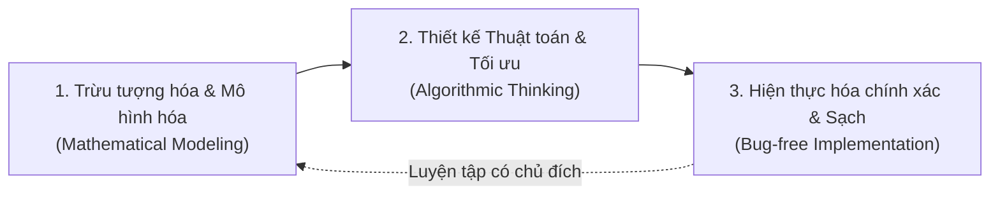
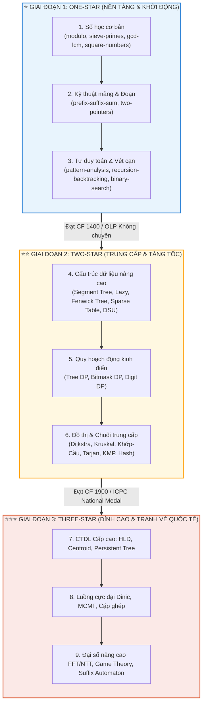
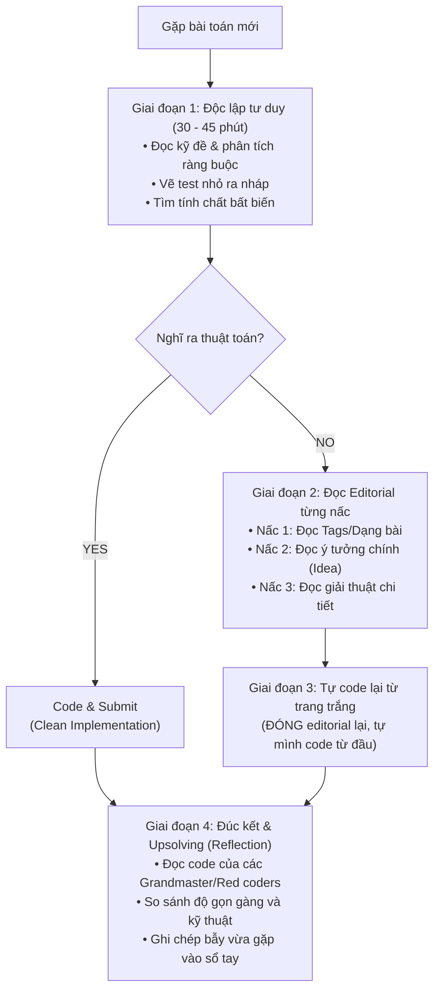
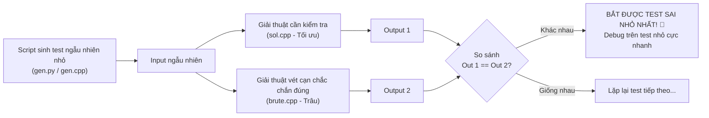

# 🚀 Cẩm nang Luyện tập & Phát triển Kỹ năng Lập trình Thi đấu (Competitive Programming Guide)

> **Tác giả:** Duc-Minh Vu | **Đơn vị:** SLSCM Lab — Faculty of Data Science and Artificial Intelligence (FDA), Đại học Kinh tế Quốc dân (NEU)  
> **Soạn thảo:** Được hỗ trợ và soạn thảo bởi Agentic AI tool  
> **Bản quyền © 2026 Duc-Minh Vu.** Mọi quyền được bảo lưu.


> **Dành cho**: Sinh viên ôn luyện **ICPC** (Vietnam National, Asia Regional, World Finals), **Olympic Tin học Sinh viên (OLP)**, và các đấu thủ trên **Codeforces, AtCoder, VNOJ, CSES**.  
> **Mục tiêu**: Định hình tư duy đúng đắn, xây dựng lộ trình học tập khoa học, làm chủ phương pháp luyện tập có chủ đích (*Deliberate Practice*) và tối ưu hóa hiệu suất thi đấu.

---

## 🧭 PHẦN 1: TƯ DUY ĐÚNG ĐẮN VỀ LẬP TRÌNH THI ĐẤU (THE CP MINDSET)

### 1.1. Bản chất của Competitive Programming là gì?
Rất nhiều bạn mới bắt đầu nhầm lẫn rằng CP đơn thuần là "học thuộc thuật toán" rồi "gõ code thật nhanh". Trên thực tế, một đấu thủ CP xuất sắc là người sở hữu **Bộ máy giải quyết vấn đề (Problem-Solving Engine)** gồm 3 mắt xích then chốt:



1. **Mô hình hóa (Modeling)**: Bóc tách câu chuyện đời thực trong đề bài để nhận diện bản chất toán học/đồ thị ẩn sau (quy về dòng cực đại, tìm kiếm nhị phân, quy hoạch động hay cấu trúc dữ liệu).
2. **Đánh giá độ phức tạp (Complexity Analysis)**: Nhìn vào ràng buộc dữ liệu ($N \le 10^5, N \le 20, N \le 10^{18}$) để biết trước thuật toán cần đạt mức $O(N \log N)$, $O(2^N \cdot N)$ hay $O(\log N)$ trước khi viết bất kỳ dòng code nào.
3. **Hiện thực chuẩn xác (Implementation Precision)**: Viết mã nguồn ngắn gọn, tối ưu, an toàn biên, không lỗi tràn số, tránh Undefined Behavior ngay từ lần nộp đầu tiên.

---

### 1.2. Quy tắc "Vùng phát triển gần" (Zone of Proximal Development)
- **Sai lầm phổ biến**: Giải hàng trăm bài quá dễ (thuộc vùng thoải mái) để lấy số lượng AC lớn. Điều này chỉ tạo ra "ảo tưởng tiến bộ" (*Illusion of Competence*).
- **Nguyên tắc luyện tập**: Chỉ giải các bài toán nằm ở ngưỡng **Rating hiện tại + 100 đến +200** (hoặc bài bạn phải vắt óc suy nghĩ 30-45 phút mới tìm ra hướng đi). Đó mới là nơi não bộ thực sự thích nghi và phát triển nếp nhăn tư duy mới.

```text
       [ Quá dễ: Vùng thoải mái ] ---> Không tiến bộ, lãng phí thời gian
                    │
                    ▼
       [ Rating +100 ~ +200: Vùng bứt phá ] ---> TIẾN BỘ BỀN VỮNG NHẤT
                    │
                    ▼
       [ Quá khó: Vùng hoang mang ] ---> Dễ nản lòng, bỏ cuộc
```

---

---

## 🗺️ PHẦN 2: LỘ TRÌNH ĐÀO TẠO & PHÁT TRIỂN NĂNG LỰC (THE CP ROADMAP)

Lộ trình được thiết kế bài bản theo **3 cấp bậc chuẩn mực (Star Levels)**, tích hợp trực tiếp với cấu trúc học liệu **Bộ 3 Tác chiến** trong repository:



---

### ⭐ Chặng 1: One-star — Làm chủ Kỹ năng Nền tảng (Rating 800 $\to$ 1400)
* **Đối tượng**: Sinh viên năm 1–2 mới bắt đầu tiếp cận lập trình thi đấu.
* **Định hướng kỳ thi**: Vòng loại trường ICPC, Olympic Tin học Sinh viên (Khối Không chuyên), Codeforces Div 3 / Div 2 A–B.
* **Thời lượng đề xuất**: 10 – 12 tuần (khoảng 15 – 20 giờ/tuần).

#### Các học phần cốt lõi trong Repo:
1. **Cụm Số học cơ bản**:
   - [`One-star/modulo/`](./One-star/modulo/): Đồng dư thức, lũy thừa nhị phân, nghịch đảo modulo bằng Fermat nhỏ & Euclid mở rộng, tiền xử lý tổ hợp $O(N)$.
   - [`One-star/sieve-primes/`](./One-star/sieve-primes/): Sàng Eratosthenes, sàng tuyến tính $O(N)$, mảng SPF phân tích thừa số trong $O(\log N)$, kiểm tra nguyên tố Miller-Rabin.
   - [`One-star/gcd-lcm/`](./One-star/gcd-lcm/): Thuật toán Euclid, giải phương trình Diophantine tuyến tính $ax + by = c$, bổ đề biến đổi hiệu $\gcd(a, b) = \gcd(a, |b-a|)$.
   - [`One-star/square-numbers/`](./One-star/square-numbers/): Định lý ước số lẻ, phân rã Square-free Core $n = s \cdot k^2$, hàm Möbius $\mu(n)$, đếm số square-free $\le N$ bằng bao hàm bù trừ trong $O(\sqrt{N})$.
2. **Cụm Kỹ thuật Mảng & Đoạn**:
   - [`One-star/prefix-suffix-sum/`](./One-star/prefix-suffix-sum/): Mảng cộng dồn 1D/2D, mảng hiệu 1D/2D cập nhật đoạn $O(1)$, Prefix XOR, Prefix/Suffix GCD & Max.
   - [`One-star/two-pointers/`](./One-star/two-pointers/): Tối ưu $O(N^2) \to O(N)$ trên mảng đơn điệu, mô hình đối hướng (2Sum, 3Sum), cửa sổ trượt (Sliding Window), kỹ thuật đếm đoạn con $\text{Exact}(K) = \text{AtMost}(K) - \text{AtMost}(K-1)$.
3. **Cụm Tư duy Toán rời rạc & Vét cạn**:
   - [`One-star/basic-math/`](./One-star/basic-math/): Phép chia trần/sàn không số thực, cấp số cộng/nhân, bài toán chia kẹo Euler (Stars & Bars), khoảng cách Manhattan & Chebyshev, công thức Dây giày (Shoelace).
   - [`One-star/pattern-analysis/`](./One-star/pattern-analysis/): Nhận dạng chu kỳ và quy luật ẩn, rút gọn công thức đóng $O(1)$, bảng số xoắn ốc (Spiral Numbers), Digit Queries.
   - [`One-star/recursion-backtracking/`](./One-star/recursion-backtracking/): Duyệt toàn bộ không gian trạng thái, sinh cấu hình, cắt tỉa nhánh cận, Bitwise N-Queens, Meet-in-the-middle cơ bản.
   - **Tìm kiếm nhị phân kết quả (Binary Search on Answer)**: Thiết kế hàm kiểm tra đơn điệu `check(mid)` để giải các bài toán tối ưu min-max trong $O(\log(\text{Range}))$.

> 🎯 **KPI Hoàn thành Chặng 1**:
> - Giải quyết trơn tru bài A, B trong mọi contest Codeforces Div 2 (hoặc A, B, C trong Div 3).
> - Hoàn thành 100% các bài tập phần *Sorting and Searching* & *Introductory Problems* trên CSES.
> - Đạt mốc **Rating 1300 – 1400 (Pupil $\to$ Specialist)** trên Codeforces.

---

### ⭐⭐ Chặng 2: Two-star — Tăng tốc Cấu trúc Dữ liệu & Quy hoạch Động (Rating 1400 $\to$ 1900)
* **Đối tượng**: Thành viên đội tuyển trường, sinh viên ôn thi Chung kết Quốc gia ICPC National và OLP Khối Chuyên tin.
* **Định hướng kỳ thi**: ICPC National, ICPC Regional Mid, OLP Khối Chuyên tin, Codeforces Div 2 C–E / Div 1 A–B.
* **Thời lượng đề xuất**: 16 – 20 tuần.

#### Các học phần cốt lõi:
1. **Cấu trúc dữ liệu nâng cao**:
   - **Segment Tree & Lazy Propagation**: Trả lời truy vấn đoạn động và cập nhật đoạn trong $O(\log N)$.
   - **Fenwick Tree (BIT 1D & 2D)**: Cây chỉ số nhị phân cài đặt siêu nhanh, đếm nghịch thế (inversions).
   - **Sparse Table & RMQ**: Trả lời truy vấn tĩnh min/max/gcd đoạn trong $O(1)$ sau $O(N \log N)$ tiền xử lý.
   - **Disjoint Set Union (DSU)**: Gộp tập hợp theo kích thước và nén đường đi trong $O(\alpha(N))$.
2. **Quy hoạch động chuyên sâu (Advanced DP)**:
   - Quy hoạch động trên cây (Tree DP): Rerooting DP, tính đường kính cây.
   - Quy hoạch động trạng thái (Bitmask DP): Bài toán người du lịch (TSP), chia việc, $N \le 20$.
   - Quy hoạch động chữ số (Digit DP): Đếm số lượng số trong khoảng $[A, B]$ thỏa mãn ràng buộc chữ số.
   - Tối ưu hóa QPĐ cơ bản: Bao lồi (Convex Hull Trick), Chia để trị (Divide & Conquer Optimization).
3. **Đồ thị & Thuật toán Chuỗi**:
   - Thành phần liên thông mạnh (Tarjan / Kosaraju), Khớp và Cầu (Bridges & Articulations), 2-SAT.
   - Đường đi ngắn nhất nâng cao: Dijkstra với heap, 0-1 BFS, Floyd-Warshall.
   - Thuật toán chuỗi: KMP (Knuth-Morris-Pratt), Z-Algorithm, Rolling Hash kép chống xung đột.
   - Hình học tính toán: Điểm, Vector, Tích có hướng, Bao lồi (Monotone Chain / Graham Scan).

> 🎯 **KPI Hoàn thành Chặng 2**:
> - Giải quyết ổn định các bài Div 2 C, D trong thời gian contest.
> - Đoạt giải tại kỳ thi Olympic Tin học Sinh viên Khối Chuyên tin hoặc đạt giải tại ICPC National.
> - Đạt mốc **Rating 1600 – 1900 (Expert $\to$ Candidate Master)** trên Codeforces.

---

### ⭐⭐⭐ Chặng 3: Three-star — Đỉnh cao Thuật toán & Tranh vé Quốc tế (Rating 1900+)
* **Đối tượng**: Đội tuyển nòng cốt tranh vé ICPC World Finals, sinh viên tranh giải Siêu Cúp OLP Sinh viên.
* **Định hướng kỳ thi**: ICPC Asia Regional Top, ICPC World Finals, OLP Khối Siêu Cúp, Codeforces Master / Grandmaster.

#### Các học phần cốt lõi:
1. **Cấu trúc dữ liệu cấp cao**:
   - Heavy-Light Decomposition (HLD) & Centroid Decomposition trên cây.
   - Persistent Segment Tree (Cây phân đoạn bền bỉ), Segment Tree Beats, Treap / Splay Tree.
2. **Luồng & Cặp ghép trên Đồ thị (Network Flow & Matching)**:
   - Thuật toán Dinic tìm luồng cực đại, Cắt cực tiểu (Min-Cut) và Định lý Min-Cut Max-Flow.
   - Luồng cực tiểu chi phí (Min-Cost Max-Flow - MCMF).
   - Cặp ghép cực đại đồ thị hai phía (Hopcroft-Karp) và Định lý Hall.
3. **Toán cao cấp & Đại số rời rạc**:
   - Biến đổi Fourier nhanh (FFT / NTT) nhân đa thức trong $O(N \log N)$.
   - Nhân ma trận giải đệ quy tuyến tính, Khử Gauss trên trường hữu hạn $\mathbb{F}_2$ (XOR Basis).
   - Lý thuyết trò chơi tổ hợp: Trò chơi Nim, Định lý Sprague-Grundy.
4. **Chuỗi nâng cao**:
   - Aho-Corasick Automaton (tìm kiếm đồng thời nhiều mẫu trong xâu).
   - Suffix Automaton / Suffix Array, Cây đối xứng (Palindromic Tree / Eertree).

---

## 📅 PHẦN 3: KẾ HOẠCH PHÂN BỔ THỜI GIAN HÀNG TUẦN (WEEKLY ROUTINE)

Để tiến bộ nhanh nhất mà không bị quá tải (*burnout*), hãy áp dụng thời gian biểu **3 khối tác chiến (15 – 20 giờ/tuần)**:

| Ngày trong tuần | Hoạt động trọng tâm | Phương pháp & Mục tiêu |
| :---: | :--- | :--- |
| **Thứ 2 – Thứ 4** | **Nghiên cứu Chuyên đề mới** | • Đọc bài giảng lý thuyết toàn diện tại [`theory.md`](./One-star/modulo/theory.md).<br>• Tự gõ lại mã nguồn mẫu tại [`template.cpp`](./One-star/modulo/template.cpp) và chạy kiểm thử.<br>• Giải 2–3 bài cấp độ 🟢 Cơ bản trong [`problems.md`](./One-star/modulo/problems.md). |
| **Thứ 5 – Thứ 6** | **Thực chiến Đào sâu** | • Giải 2–3 bài cấp độ 🟡 Trung cấp và 🔴 Nâng cao trong [`problems.md`](./One-star/modulo/problems.md).<br>• Tuân thủ nghiêm ngặt **Quy tắc 30–45 phút** (không mở lời giải sớm). |
| **Thứ 7** | **Thi đấu Cọ xát (Contest Day)** | • Tham gia contest trực tiếp trên **Codeforces / AtCoder**.<br>• Nếu không có contest trực tiếp, luyện tập **1 trận Virtual Contest** đúng 2 giờ trong môi trường yên tĩnh. |
| **Chủ Nhật** | **Upsolving & Tổng kết** | • **Upsolve**: Giải lại dứt điểm bài mình chưa làm được trong contest hôm trước.<br>• Đọc code của các Grandmaster để học kỹ thuật mới.<br>• Ghi lại các lỗi ngớ ngẩn vừa gặp vào **Mistake Log** cá nhân. |

---

## ✅ BẢNG TỰ ĐÁNH GIÁ NĂNG LỰC (BENCHMARK CHECKLIST)

Trước khi chuyển lên cấp độ tiếp theo, hãy tự kiểm tra xem bạn đã thực sự làm chủ các kỹ năng sau chưa:

- [ ] **Tư duy thời gian $O(1)$ giây**: Có thể nhìn vào ràng buộc $N$ ($10^5, 10^{18}$) và nói ngay độ phức tạp thuật toán cần đạt được không?
- [ ] **An toàn tràn số**: Luôn dùng `(a / gcd(a, b)) * b` thay vì `(a * b) / gcd(a, b)`? Luôn ép kiểu `1LL * a * b` khi nhân?
- [ ] **Kỹ năng gõ không cần nhìn mẫu**: Có thể tự viết thuật toán Euclid mở rộng, Sàng số nguyên tố hay Two Pointers từ một file trắng trong chưa đầy 5 phút không?
- [ ] **Kỹ năng tự Debug**: Khi bị WA ở test ẩn, có biết cách viết script sinh test nhỏ ngẫu nhiên để tìm phản ví dụ trong 5 phút không?
- [ ] **Thói quen Upsolving**: Sau mỗi contest, có bao giờ bỏ qua bài mình suýt làm được mà không làm lại cho đến khi AC không?

---

## 🛠️ PHẦN 4: HỌC & LUYỆN TẬP NHƯ THẾ NÀO? (HOW TO PRACTICE)

Phương pháp học quyết định 80% tốc độ tiến bộ của bạn. Dưới đây là quy trình đã được kiểm chứng bởi các lập trình viên đạt huy chương ICPC thế giới:

### 4.1. Quy trình "Vòng đời một bài toán" (The Problem Lifecycle)



#### Quy tắc 30 - 45 phút:
- **Không bao giờ mở lời giải trước 30 phút**: Nếu đọc lời giải quá sớm, bạn chỉ rèn luyện kỹ năng đọc hiểu chứ không hề kích hoạt khả năng suy luận sáng tạo.
- **Không sa lầy quá 60 phút khi bế tắc hoàn toàn**: Nếu sau 45-60 phút bạn vẫn không có bất kỳ ý tưởng nào, việc ngồi nhìn màn hình thêm 2 tiếng là lãng phí năng lượng. Hãy mở Editorial theo từng nấc!

---

### 4.2. Triệt tiêu tư duy "Đọc code chép lại"
Một trong những căn bệnh nguy hiểm nhất là: *Đọc editorial $\to$ Nhìn code mẫu $\to$ Gõ lại y hệt để lấy AC*.  
Cách duy nhất để kiến thức thuộc về bạn:
1. Đọc hiểu ý tưởng trong Editorial.
2. **Đóng toàn bộ tab trình duyệt chứa lời giải**.
3. Mở file trắng trong IDE và tự code lại từ đầu đến cuối bằng chính tư duy của bạn.
4. Nếu gặp lỗi `Compile Error` hoặc `WA`, hãy tự debug dựa trên tư duy, tuyệt đối không mở lại code mẫu để so từng dòng.

---

### 4.3. Kỹ năng Debugging & Viết Stress-test tự động
Khi nộp bài bị `Wrong Answer` (WA) ở test lớn mà hệ thống giấu test, đừng "ngồi đoán mò". Hãy lập tức áp dụng **Kỹ thuật Stress-testing**:



> [!TIP]
> Việc tìm ra một phản ví dụ chỉ có 4-5 phần tử sẽ giúp bạn trace bằng tay và sửa bug trong vòng 3 phút, thay vì mất cả buổi tối nhìn vào test hàng vạn dòng của ban tổ chức.

---

### 4.4. Chiến thuật phân bổ thời gian trong phòng thi (Contest Tactics)

| Thời gian | Hành động chiến lược |
| :--- | :--- |
| **00:00 - 00:10** | **Quét toàn bộ đề (Problem Scanning)**: Cả đội/cá nhân đọc lướt qua toàn bộ các bài. Phân loại ngay bài nào là bài cơ bản (free point) để làm trước. |
| **00:10 - 01:30** | **Thu hoạch bài dễ (Low-hanging fruits)**: Giải quyết dứt điểm các bài dễ với tốc độ cao và độ chính xác 100% (tránh nộp vội để dính Penalty). |
| **01:30 - 04:00** | **Giai đoạn then chốt (The Battle Zone)**: Tập trung vào 2-3 bài trung bình/khó quyết định thứ hạng.  <br>• Với ICPC: Người này code trên máy, 2 người kia phải giải quyết thuật toán hoàn chỉnh trên giấy. Không bao giờ ngồi gõ code khi thuật toán còn mơ hồ! |
| **04:00 - 05:00** | **Giai đoạn đóng băng (The Freeze)**: Giữ bình tĩnh, không manh động đổi hướng thuật toán nếu chưa chắc chắn. Tập trung debug bài có cơ hội AC cao nhất. |

---

## 📓 PHẦN 5: VŨ KHÍ CÁ NHÂN & SỔ TAY THẤT BẠI (MISTAKE LOG)

Một lập trình viên xuất sắc khác người bình thường ở chỗ: **Họ không bao giờ phạm lại một lỗi sai đến lần thứ hai**.

Hãy duy trì một cuốn sổ tay (hoặc file Markdown cá nhân) ghi lại:
1. **Ngày tháng & Link bài bị WA/TLE**.
2. **Nguyên nhân cốt lõi gây lỗi**:
   - Do tràn số `int` (quên ép kiểu `long long` khi nhân)?
   - Do thứ tự thực hiện toán tử (`<<` có độ ưu tiên thấp hơn `+`)?
   - Do khởi tạo mảng `memset` bên trong vòng lặp nhiều test cases gây TLE?
   - Do trường hợp biên đặc biệt: $N = 1$, đồ thị không liên thông, dãy toàn số âm, cây là một đường thẳng rễ tre?
3. **Bài học rút ra trong 1 câu tóm tắt**.

---

## 📚 PHẦN 6: TÀI NGUYÊN HỌC TẬP KHUYÊN DÙNG

### Nền tảng luyện tập trực tuyến:
1. **[CSES Problem Set](https://cses.fi/problemset/)**: Bộ bài tập kinh điển chuẩn hóa cao nhất thế giới cho mọi chủ đề cốt lõi. Khuyên dùng để cày nền tảng One-star & Two-star.
2. **[Codeforces](https://codeforces.com/)**: Đấu trường contest số 1 toàn cầu. Luyện tập khả năng tư duy nhanh và chịu áp lực thời gian (khuyên dùng thi Virtual Contests 2-3 lần/tuần).
3. **[AtCoder (ABC / ARC)](https://atcoder.jp/)**: Đề bài cực kỳ trong sáng, giàu tính toán học, chất lượng test tuyệt vời.
4. **[VNOI](https://oj.vnoi.info/)**: Nền tảng hàng đầu Việt Nam, lưu trữ đề thi OLP Sinh viên, ICPC Quốc gia và Regional qua các năm kèm lời giải tiếng Việt chất lượng.

### Sách và Tài liệu gối đầu giường:
- *Guide to Competitive Programming* – Antti Laaksonen (Tác giả nền tảng CSES).
- *Competitive Programming 4 (CP4)* – Steven Halim & Felix Halim.
- *Introduction to Algorithms (CLRS)* – Nền tảng cấu trúc dữ liệu và giải thuật chuẩn mực thế giới.
- *Concrete Mathematics* – Graham, Knuth, Patashnik (Toán rời rạc đỉnh cao).
- *[USACO Guide](https://usaco.guide/)*: Giáo trình miễn phí phân cấp xuất sắc nhất hiện nay.
- *[CP-Algorithms](https://cp-algorithms.com/)*: Bách khoa toàn thư giải thuật trực tuyến có sẵn code mẫu C++.

---

> [!NOTE]
> *"Sự kiên trì đều đặn mỗi ngày quan trọng hơn sự bùng nổ trong một tuần. Giải quyết 2 bài tập một cách thấu đáo mỗi ngày sẽ đưa bạn tiến xa hơn việc nộp 20 bài chép code trong một đêm."*  
> **Chúc bạn kiên định trên con đường chinh phục các đỉnh cao thuật toán!**

---

<div align="center">

<a href="https://www.neu.edu.vn" target="_blank"></a>
&nbsp;&nbsp;&nbsp;&nbsp;&nbsp;&nbsp;&nbsp;&nbsp;&nbsp;&nbsp;&nbsp;&nbsp;
<a href="https://www.fda.neu.edu.vn" target="_blank"></a>
&nbsp;&nbsp;&nbsp;&nbsp;&nbsp;&nbsp;&nbsp;&nbsp;&nbsp;&nbsp;&nbsp;&nbsp;
<a href="https://www.facebook.com/slscm.lab" target="_blank"></a>

<br/><br/>

**Competitive Programming Handbook**  
*SLSCM Lab — Faculty of Data Science and Artificial Intelligence (FDA) — National Economics University (NEU)*  
*Tài liệu được soạn thảo và tối ưu bởi Agentic AI tool*  
© 2026 Duc-Minh Vu. Toàn bộ bản quyền được bảo lưu.

</div>

